# PRD SmartTour (Bản đầy đủ mô hình chức năng)

| Thuộc tính | Giá trị |
| --- | --- |
| Phiên bản | 6.1 |
| Ngày cập nhật | 2026-04-09 |
| Mục tiêu tài liệu | Giữ đúng 22 mục và mô hình chi tiết cho đầy đủ chức năng đồ án |

## Mục lục nhanh
1. [Giới thiệu](#1-giới-thiệu)
2. [Mục tiêu sản phẩm](#2-mục-tiêu-sản-phẩm)
3. [Personas](#3-personas)
4. [Tính năng chi tiết](#4-tính-năng-chi-tiết)
5. [User stories](#5-user-stories)
6. [Luồng người dùng chính](#6-luồng-người-dùng-chính)
7. [Kiến trúc hệ thống](#7-kiến-trúc-hệ-thống)
8. [CSDL](#8-csdl)
9. [Thiết kế analytics](#9-thiết-kế-analytics)
10. [Yêu cầu phi chức năng (NFR)](#10-yêu-cầu-phi-chức-năng-nfr)
11. [Sơ đồ Use Case](#11-sơ-đồ-use-case)
12. [Sequence diagram](#12-sequence-diagram)
13. [Activity diagram](#13-activity-diagram)
14. [Data Flow Diagram (DFD Level 1)](#14-data-flow-diagram-dfd-level-1)
15. [UI wireframe (MVP)](#15-ui-wireframe-mvp)
16. [API thực tế](#16-api-thực-tế)
17. [Bảo mật](#17-bảo-mật)
18. [Roadmap](#18-roadmap)
19. [Nghiệm thu](#19-nghiệm-thu)
20. [Future](#20-future)
21. [Danh mục tài liệu & mã tham chiếu](#21-danh-mục-tài-liệu--mã-tham-chiếu)
22. [Lịch sử phiên bản PRD](#22-lịch-sử-phiên-bản-prd)

---

## 1. Giới thiệu
SmartTour là hệ thống du lịch thông minh gồm 3 thành phần:
- **Mobile App (.NET MAUI):** bản đồ, POI, audio đa ngôn ngữ, offline map/audio, QR gate.
- **CMS Web (ASP.NET Core MVC):** quản trị POI/Tour/Translation, tạo audio, thống kê.
- **Backend API (ASP.NET Core + EF Core):** cung cấp dữ liệu, xử lý audio, lưu analytics.

Mục tiêu cốt lõi: giúp khách du lịch tự khám phá địa điểm bằng nội dung số đa ngôn ngữ, vận hành ổn định cả khi online lẫn offline.

## 2. Mục tiêu sản phẩm
### 2.1 Mục tiêu nghiệp vụ
- Số hóa hướng dẫn tham quan bằng POI + audio.
- Chuẩn hóa quy trình quản lý nội dung tập trung.
- Tăng mức độ tương tác người dùng thông qua bản đồ, tour và audio.
- Theo dõi hành vi để cải tiến nội dung bằng dữ liệu thực tế.

### 2.2 Mục tiêu kỹ thuật
- API nhất quán cho CMS và App.
- Dữ liệu POI/Tour có bản dịch theo ngôn ngữ, đồng bộ audio theo translation.
- Hỗ trợ bắt buộc quét QR khi vào hệ thống, kèm cơ chế phiên 7 ngày.
- Hỗ trợ hoạt động offline map/audio và đồng bộ lại khi online.

## 3. Personas
- **Traveler (Khách du lịch):** cần truy cập nhanh, xem bản đồ, nghe audio theo ngôn ngữ của mình, không bị gián đoạn khi mất mạng.
- **Vendor (Đơn vị nội dung):** tạo và quản lý POI/Tour trong phạm vi phụ trách, theo dõi nội dung và audio.
- **Admin (Quản trị hệ thống):** kiểm soát người dùng, phân quyền, giám sát chất lượng dữ liệu và analytics.

## 4. Tính năng chi tiết
### 4.1 Mobile App
- Đăng nhập luồng vào app qua **QR Gate** (quét QR hợp lệ mới vào hệ thống).
- Lưu phiên quét QR 7 ngày, hết hạn thì quét lại.
- Hỗ trợ deep link: `smarttour://poi/{id}`, `smarttour://tour/{id}`.
- Xem POI theo map/list, xem chi tiết và nghe audio theo translation.
- Theo dõi route, gửi log nghe, thống kê hành vi.
- Chạy offline với cache map tile và audio local.
- Đồng bộ dữ liệu pending sau khi có mạng.

### 4.2 CMS
- CRUD POI đầy đủ (thông tin, mô tả, tọa độ, ảnh, danh mục).
- CRUD Tour, gán/đổi thứ tự POI trong tour.
- Tự sinh translation theo bảng `Languages` khi tạo POI.
- Sinh audio theo từng translation (từ `TtsScript`/`Description`).
- Regenerate audio theo POI hoặc từng translation.
- Hiển thị QR cho POI/Tour để mở trực tiếp app.
- Màn hình translation để nghe kiểm thử audio từng ngôn ngữ.
- Dashboard Heatmap và route phổ biến.

### 4.3 Backend API
- Cụm API POI/Tour/Food/Translation.
- Cụm API Audio: xem, sinh, sinh lại.
- Cụm API analytics: playlog, heatmap, route session.
- Tích hợp Azure Speech để tổng hợp giọng nói.
- Tích hợp Cloudinary để lưu audio và trả URL.

## 5. User stories
- **US-01:** Là Traveler, tôi muốn quét QR để mở app trực tiếp và vào nhanh màn hình chính.
- **US-02:** Là Traveler, tôi muốn nghe thuyết minh theo ngôn ngữ đang chọn.
- **US-03:** Là Traveler, tôi muốn app vẫn dùng được khi mất mạng.
- **US-04:** Là Traveler, tôi muốn quét mã của POI/Tour và đi thẳng đến nội dung đó.
- **US-05:** Là Vendor, tôi muốn tạo POI một lần và hệ thống tự tạo translation + audio.
- **US-06:** Là Vendor, tôi muốn regenerate audio cho bản dịch bị thiếu/lỗi.
- **US-07:** Là Admin, tôi muốn xem heatmap và route để đánh giá mức độ quan tâm.
- **US-08:** Là Admin, tôi muốn phân quyền rõ ràng cho người vận hành.

## 6. Luồng người dùng chính
### Journey 1: Tạo POI và tự động sinh audio
1. Vendor/Admin tạo POI trên CMS.
2. Backend lấy danh sách ngôn ngữ, tạo `PoiTranslation`.
3. Hệ thống gọi TTS để tạo file âm thanh cho từng bản dịch.
4. Upload audio lên Cloudinary, lưu `AudioUrl`.
5. CMS hiển thị trạng thái tạo thành công.

### Journey 2: Nghe audio POI
1. Traveler mở app, chọn POI trên map/list.
2. App lấy translation đúng ngôn ngữ.
3. App phát audio cloud hoặc audio local cache.
4. App gửi playlog về backend.

### Journey 3: QR Gate + Deep Link
1. App khởi động, kiểm tra phiên QR còn hạn hay không.
2. Nếu hết hạn: mở trang quét QR.
3. Quét hợp lệ: lưu phiên 7 ngày.
4. Nếu QR chứa deep link POI/Tour: điều hướng đúng màn hình đích.

### Journey 4: Offline và đồng bộ lại
1. App tải trước map tile + audio.
2. Khi offline: đọc dữ liệu local.
3. Log phát audio/route được queue lại.
4. Khi online: đẩy pending queue lên API.

## 7. Kiến trúc hệ thống
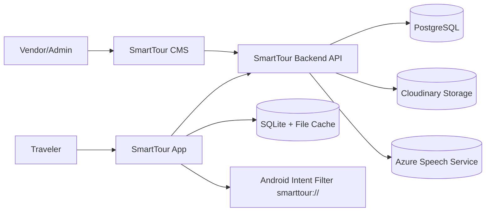
```mermaid
flowchart LR
    Traveler[Traveler] --> App[SmartTour App]
    Vendor[Vendor/Admin] --> CMS[SmartTour CMS]
    App --> API[SmartTour Backend API]
    CMS --> API
    API --> PG[(PostgreSQL)]
    API --> Cloud[(Cloudinary Storage)]
    API --> Azure[(Azure Speech Service)]
    App --> Local[(SQLite + File Cache)]
    App --> Android[Android Intent Filter smarttour://]
```

## 8. CSDL
### 8.1 Nhóm bảng nghiệp vụ
- `Poi`
- `PoiTranslation`
- `PoiImage`
- `Category`
- `Language`
- `Tour`
- `TourPoi`
- `TourTranslation`
- `Food`
- `PlayLog`
- `HeatmapEntry`
- `RouteSession`
- `RouteSessionPoi`
- `QrCode` (nếu đang dùng trong nhánh hiện tại)

### 8.2 Nhóm bảng Identity
- `AspNetUsers`
- `AspNetRoles`
- `AspNetUserRoles`
- `AspNetUserClaims`
- `AspNetRoleClaims`
- `AspNetUserLogins`
- `AspNetUserTokens`

### 8.3 ERD chi tiết (đầy đủ chức năng chính)

```mermaid
erDiagram
    CATEGORY {
      int Id PK
      string Name
      string Description
    }

    POI {
      int Id PK
      string Name
      string Description
      decimal Latitude
      decimal Longitude
      int CategoryId FK
      datetime CreatedAt
      datetime UpdatedAt
    }

    POI_IMAGE {
      int Id PK
      int PoiId FK
      string ImageUrl
      bool IsPrimary
    }

    LANGUAGE {
      int Id PK
      string Code
      string Name
      bool IsActive
    }

    POI_TRANSLATION {
      int Id PK
      int PoiId FK
      int LanguageId FK
      string Title
      string Description
      string TtsScript
      string AudioUrl
      datetime UpdatedAt
    }

    TOUR {
      int Id PK
      string Name
      string Description
      bool IsActive
      datetime CreatedAt
    }

    TOUR_POI {
      int Id PK
      int TourId FK
      int PoiId FK
      int SortOrder
    }

    TOUR_TRANSLATION {
      int Id PK
      int TourId FK
      int LanguageId FK
      string Name
      string Description
    }

    FOOD {
      int Id PK
      string Name
      string Description
      decimal Latitude
      decimal Longitude
    }

    PLAY_LOG {
      int Id PK
      int PoiId FK
      string DeviceId
      string LanguageCode
      datetime PlayedAt
      int DurationSec
    }

    HEATMAP_ENTRY {
      int Id PK
      int PoiId FK
      decimal Latitude
      decimal Longitude
      datetime CreatedAt
    }

    ROUTE_SESSION {
      long Id PK
      string DeviceId
      datetime StartedAt
      datetime EndedAt
      double TotalDistanceKm
    }

    ROUTE_SESSION_POI {
      long Id PK
      long RouteSessionId FK
      int PoiId FK
      datetime VisitedAt
      int OrderNo
    }

    ASPNET_USERS {
      string Id PK
      string UserName
      string Email
    }

    ASPNET_ROLES {
      string Id PK
      string Name
    }

    ASPNET_USER_ROLES {
      string UserId FK
      string RoleId FK
    }

    ASPNET_USER_CLAIMS {
      int Id PK
      string UserId FK
      string ClaimType
      string ClaimValue
    }

    ASPNET_ROLE_CLAIMS {
      int Id PK
      string RoleId FK
      string ClaimType
      string ClaimValue
    }

    ASPNET_USER_LOGINS {
      string LoginProvider PK
      string ProviderKey PK
      string UserId FK
    }

    ASPNET_USER_TOKENS {
      string UserId FK
      string LoginProvider PK
      string Name PK
      string Value
    }

    CATEGORY ||--o{ POI : groups
    POI ||--o{ POI_IMAGE : has
    POI ||--o{ POI_TRANSLATION : has
    LANGUAGE ||--o{ POI_TRANSLATION : localizes
    TOUR ||--o{ TOUR_POI : contains
    POI ||--o{ TOUR_POI : included_in
    TOUR ||--o{ TOUR_TRANSLATION : has
    LANGUAGE ||--o{ TOUR_TRANSLATION : localizes
    POI ||--o{ PLAY_LOG : generates
    POI ||--o{ HEATMAP_ENTRY : contributes
    ROUTE_SESSION ||--o{ ROUTE_SESSION_POI : tracks
    POI ||--o{ ROUTE_SESSION_POI : visited
    ASPNET_USERS ||--o{ ASPNET_USER_ROLES : maps
    ASPNET_ROLES ||--o{ ASPNET_USER_ROLES : maps
    ASPNET_USERS ||--o{ ASPNET_USER_CLAIMS : has
    ASPNET_ROLES ||--o{ ASPNET_ROLE_CLAIMS : has
    ASPNET_USERS ||--o{ ASPNET_USER_LOGINS : has
    ASPNET_USERS ||--o{ ASPNET_USER_TOKENS : has
```

### 8.4 Đặc tả CRUD chi tiết theo bảng
| Bảng | Thêm (Create) | Sửa (Update) | Xóa (Delete) | Ai thao tác | Ghi chú |
| --- | --- | --- | --- | --- | --- |
| `Category` | Tạo danh mục | Sửa tên/mô tả | Xóa khi không còn POI | Admin | Nên chặn xóa nếu còn liên kết |
| `Poi` | Tạo POI mới | Sửa thông tin/tọa độ/mô tả | Xóa POI | Admin, Vendor | Xóa POI cần xử lý bảng con |
| `PoiImage` | Upload ảnh mới | Đổi ảnh chính | Xóa ảnh | Admin, Vendor | Bắt buộc còn >=1 ảnh nếu quy định |
| `PoiTranslation` | Tự sinh theo `Language` | Sửa `Title`, `Description`, `TtsScript` | Xóa bản dịch theo ngôn ngữ | Admin, Vendor | Xóa translation nên xóa luôn audio liên quan |
| `Language` | Thêm ngôn ngữ | Đổi tên/trạng thái | Ngừng dùng (soft delete) | Admin | Không nên hard delete |
| `Tour` | Tạo tour | Sửa tên/mô tả/trạng thái | Xóa tour | Admin, Vendor | Xóa tour cần xóa `TourPoi` |
| `TourPoi` | Thêm POI vào tour | Sửa `SortOrder` | Gỡ POI khỏi tour | Admin, Vendor | Bảng mapping N-N |
| `TourTranslation` | Tạo bản dịch tour | Sửa nội dung | Xóa bản dịch tour | Admin, Vendor | Tương tự POI translation |
| `Food` | Tạo điểm ăn uống | Sửa nội dung/vị trí | Xóa | Admin, Vendor | Có thể mở rộng translation sau |
| `PlayLog` | Ghi log nghe | Không sửa | Không xóa thủ công | System | Dữ liệu thống kê |
| `HeatmapEntry` | Ghi điểm nhiệt | Không sửa | Không xóa thủ công | System | Dữ liệu thống kê |
| `RouteSession` | Tạo phiên route | Cập nhật thời gian kết thúc | Không xóa thủ công | System | Đồng bộ từ app |
| `RouteSessionPoi` | Ghi điểm đi qua | Không sửa | Không xóa thủ công | System | Chi tiết route |
| `AspNetUsers` | Tạo user | Sửa profile/trạng thái | Khóa hoặc xóa user | Admin | Nên khóa thay vì hard delete |
| `AspNetRoles` | Tạo role | Sửa tên role | Xóa role | Admin | Chỉ xóa khi role không còn gán |
| `AspNetUserRoles` | Gán role cho user | Đổi role | Thu hồi role | Admin | Quản trị phân quyền |

### 8.5 Quy tắc xóa dữ liệu (Delete Policy)
- **Xóa POI:** bắt buộc xóa/gỡ dữ liệu phụ thuộc (`PoiImage`, `PoiTranslation`, `TourPoi`) trước khi xóa bản ghi `Poi`.
- **Xóa Tour:** bắt buộc xóa mapping `TourPoi` trước.
- **Xóa Language:** ưu tiên chuyển trạng thái `IsActive=false`, không hard delete để tránh mồ côi translation.
- **Xóa User:** ưu tiên khóa tài khoản thay vì xóa cứng để giữ lịch sử thao tác.
- **Analytics (`PlayLog`, `HeatmapEntry`, `RouteSession*`):** không cho xóa thủ công trong luồng vận hành thường ngày.

## 9. Thiết kế analytics
### 9.1 Chỉ số theo dõi
- Lượt nghe theo POI, theo ngôn ngữ, theo khung giờ.
- Điểm nóng truy cập theo tọa độ (heatmap).
- Lộ trình phổ biến theo route session.
- Tỷ lệ dùng offline và đồng bộ thành công.

### 9.2 Nguồn dữ liệu
- `PlayLog` cho hành vi nghe audio.
- `HeatmapEntry` cho mật độ quan tâm khu vực.
- `RouteSession` + `RouteSessionPoi` cho hành trình.

### 9.3 Dashboard đề xuất
- Top POI theo ngày/tuần/tháng.
- Biểu đồ ngôn ngữ được nghe nhiều nhất.
- Heatmap theo mốc thời gian.
- Top tour có tỷ lệ hoàn thành cao.

## 10. Yêu cầu phi chức năng (NFR)
- **Hiệu năng API:** truy vấn phổ biến < 2 giây.
- **Độ ổn định app:** không ANR khi quét QR liên tục.
- **Khả dụng offline:** map/audio dùng được khi không có mạng.
- **Đồng bộ:** retry queue an toàn khi mạng chập chờn.
- **Bảo mật:** secrets lưu env, phân quyền theo role.
- **Khả năng mở rộng:** thêm ngôn ngữ mới không cần đổi kiến trúc.

## 11. Sơ đồ Use Case
### 11.1 Use Case tổng quan đầy đủ chức năng
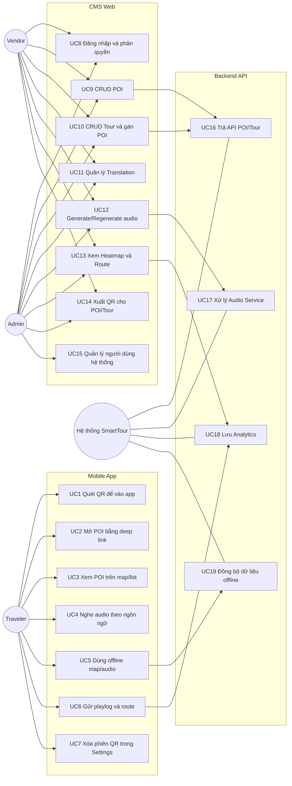
```mermaid
flowchart LR
    Traveler((Traveler))
    Vendor((Vendor))
    Admin((Admin))
    System((Hệ thống SmartTour))

    subgraph MobileApp[Mobile App]
      UC1[UC1 Quét QR để vào app]
      UC2[UC2 Mở POI bằng deep link]
      UC3[UC3 Xem POI trên map/list]
      UC4[UC4 Nghe audio theo ngôn ngữ]
      UC5[UC5 Dùng offline map/audio]
      UC6[UC6 Gửi playlog và route]
      UC7[UC7 Xóa phiên QR trong Settings]
    end

    subgraph CMSWeb[CMS Web]
      UC8[UC8 Đăng nhập và phân quyền]
      UC9[UC9 CRUD POI]
      UC10[UC10 CRUD Tour và gán POI]
      UC11[UC11 Quản lý Translation]
      UC12[UC12 Generate/Regenerate audio]
      UC13[UC13 Xem Heatmap và Route]
      UC14[UC14 Xuất QR cho POI/Tour]
      UC15[UC15 Quản lý người dùng hệ thống]
    end

    subgraph BackendAPI[Backend API]
      UC16[UC16 Trả API POI/Tour]
      UC17[UC17 Xử lý Audio Service]
      UC18[UC18 Lưu Analytics]
      UC19[UC19 Đồng bộ dữ liệu offline]
    end

    Traveler --> UC1
    Traveler --> UC2
    Traveler --> UC3
    Traveler --> UC4
    Traveler --> UC5
    Traveler --> UC6
    Traveler --> UC7

    Vendor --> UC8
    Vendor --> UC9
    Vendor --> UC10
    Vendor --> UC11
    Vendor --> UC12
    Vendor --> UC13
    Vendor --> UC14

    Admin --> UC8
    Admin --> UC9
    Admin --> UC10
    Admin --> UC11
    Admin --> UC12
    Admin --> UC13
    Admin --> UC14
    Admin --> UC15

    UC9 --> UC16
    UC10 --> UC16
    UC12 --> UC17
    UC6 --> UC18
    UC5 --> UC19
    UC13 --> UC18

    System --- UC16
    System --- UC17
    System --- UC18
    System --- UC19
```

### 11.2 Use Case CRUD cho nhóm quản trị nội dung (chi tiết)

```mermaid
flowchart TB
    Admin((Admin))
    Vendor((Vendor))

    subgraph POI_Module[POI Module]
      C1[Create POI]
      R1[Read POI]
      U1[Update POI]
      D1[Delete POI]
      C2[Create POI Translation]
      U2[Update POI Translation]
      D2[Delete POI Translation]
      C3[Upload POI Image]
      U3[Set Primary Image]
      D3[Delete POI Image]
    end

    subgraph TOUR_Module[Tour Module]
      C4[Create Tour]
      R4[Read Tour]
      U4[Update Tour]
      D4[Delete Tour]
      C5[Add POI to Tour]
      U5[Reorder TourPoi]
      D5[Remove POI from Tour]
    end

    subgraph FOOD_Module[Food Module]
      C6[Create Food]
      R6[Read Food]
      U6[Update Food]
      D6[Delete Food]
      C7[Gắn vị trí Food trên bản đồ]
      U7[Cập nhật ảnh/mô tả Food]
    end

    Vendor --> C1
    Vendor --> R1
    Vendor --> U1
    Vendor --> D1
    Vendor --> C2
    Vendor --> U2
    Vendor --> D2
    Vendor --> C3
    Vendor --> U3
    Vendor --> D3
    Vendor --> C4
    Vendor --> R4
    Vendor --> U4
    Vendor --> D4
    Vendor --> C5
    Vendor --> U5
    Vendor --> D5
    Vendor --> C6
    Vendor --> R6
    Vendor --> U6
    Vendor --> D6
    Vendor --> C7
    Vendor --> U7

    Admin --> C1
    Admin --> R1
    Admin --> U1
    Admin --> D1
    Admin --> C4
    Admin --> R4
    Admin --> U4
    Admin --> D4
    Admin --> C6
    Admin --> R6
    Admin --> U6
    Admin --> D6
```

### 11.3 Use Case CRUD cho quản trị hệ thống
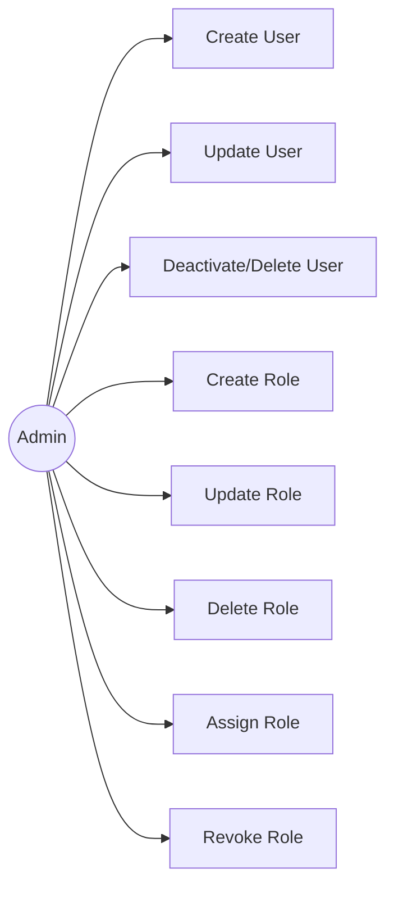
```mermaid
flowchart LR
    Admin((Admin))
    U1[Create User]
    U2[Update User]
    U3[Deactivate/Delete User]
    R1[Create Role]
    R2[Update Role]
    R3[Delete Role]
    M1[Assign Role]
    M2[Revoke Role]

    Admin --> U1
    Admin --> U2
    Admin --> U3
    Admin --> R1
    Admin --> R2
    Admin --> R3
    Admin --> M1
    Admin --> M2
```

## 12. Sequence diagram
### 12.1 Sequence: Tạo POI -> sinh translation -> sinh audio
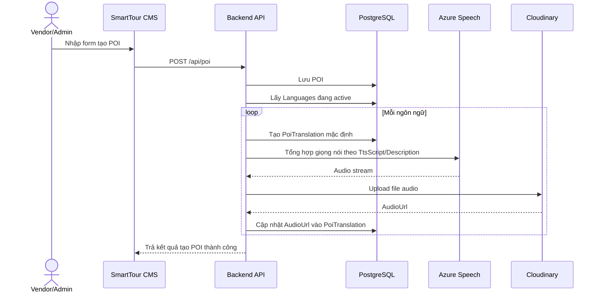
```mermaid
sequenceDiagram
    actor VA as Vendor/Admin
    participant CMS as SmartTour CMS
    participant API as Backend API
    participant DB as PostgreSQL
    participant TTS as Azure Speech
    participant CLD as Cloudinary

    VA->>CMS: Nhập form tạo POI
    CMS->>API: POST /api/poi
    API->>DB: Lưu POI
    API->>DB: Lấy Languages đang active
    loop Mỗi ngôn ngữ
        API->>DB: Tạo PoiTranslation mặc định
        API->>TTS: Tổng hợp giọng nói theo TtsScript/Description
        TTS-->>API: Audio stream
        API->>CLD: Upload file audio
        CLD-->>API: AudioUrl
        API->>DB: Cập nhật AudioUrl vào PoiTranslation
    end
    API-->>CMS: Trả kết quả tạo POI thành công
```

### 12.2 Sequence: Người dùng nghe audio (online/offline fallback)
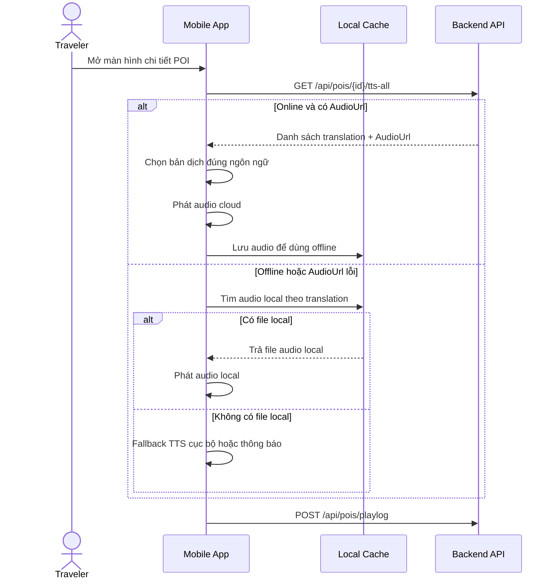
```mermaid
sequenceDiagram
    actor U as Traveler
    participant APP as Mobile App
    participant CACHE as Local Cache
    participant API as Backend API

    U->>APP: Mở màn hình chi tiết POI
    APP->>API: GET /api/pois/{id}/tts-all
    alt Online và có AudioUrl
        API-->>APP: Danh sách translation + AudioUrl
        APP->>APP: Chọn bản dịch đúng ngôn ngữ
        APP->>APP: Phát audio cloud
        APP->>CACHE: Lưu audio để dùng offline
    else Offline hoặc AudioUrl lỗi
        APP->>CACHE: Tìm audio local theo translation
        alt Có file local
            CACHE-->>APP: Trả file audio local
            APP->>APP: Phát audio local
        else Không có file local
            APP->>APP: Fallback TTS cục bộ hoặc thông báo
        end
    end
    APP->>API: POST /api/pois/playlog
```

### 12.3 Sequence: QR Gate + Deep Link POI/Tour
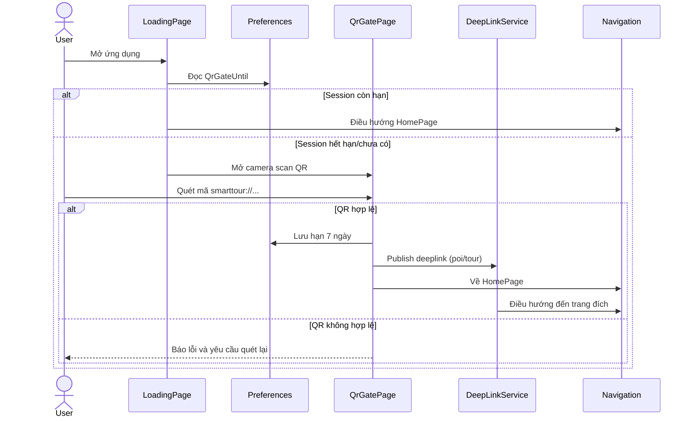
```mermaid
sequenceDiagram
    actor U as User
    participant LD as LoadingPage
    participant PREF as Preferences
    participant QR as QrGatePage
    participant DL as DeepLinkService
    participant NAV as Navigation

    U->>LD: Mở ứng dụng
    LD->>PREF: Đọc QrGateUntil
    alt Session còn hạn
        LD->>NAV: Điều hướng HomePage
    else Session hết hạn/chưa có
        LD->>QR: Mở camera scan QR
        U->>QR: Quét mã smarttour://...
        alt QR hợp lệ
            QR->>PREF: Lưu hạn 7 ngày
            QR->>DL: Publish deeplink (poi/tour)
            QR->>NAV: Về HomePage
            DL->>NAV: Điều hướng đến trang đích
        else QR không hợp lệ
            QR-->>U: Báo lỗi và yêu cầu quét lại
        end
    end
```

### 12.4 Sequence: Đồng bộ offline khi có mạng lại
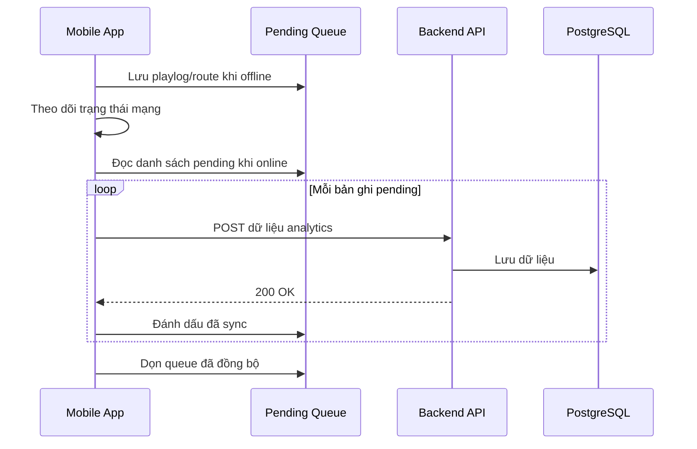
```mermaid
sequenceDiagram
    participant APP as Mobile App
    participant Q as Pending Queue
    participant API as Backend API
    participant DB as PostgreSQL

    APP->>Q: Lưu playlog/route khi offline
    APP->>APP: Theo dõi trạng thái mạng
    APP->>Q: Đọc danh sách pending khi online
    loop Mỗi bản ghi pending
        APP->>API: POST dữ liệu analytics
        API->>DB: Lưu dữ liệu
        API-->>APP: 200 OK
        APP->>Q: Đánh dấu đã sync
    end
    APP->>Q: Dọn queue đã đồng bộ
```

### 12.5 Sequence: Regenerate audio theo translation
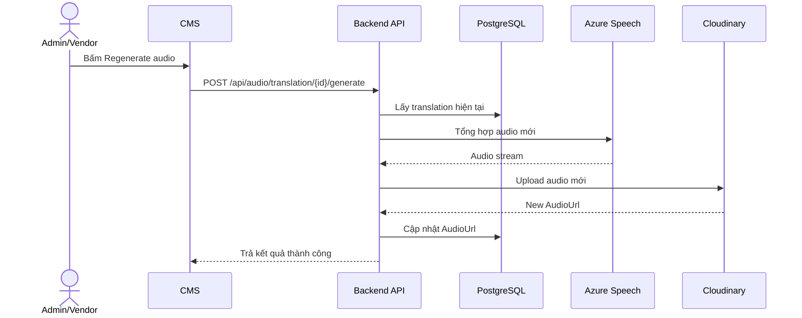
```mermaid
sequenceDiagram
    actor A as Admin/Vendor
    participant CMS as CMS
    participant API as Backend API
    participant DB as PostgreSQL
    participant TTS as Azure Speech
    participant CLD as Cloudinary

    A->>CMS: Bấm Regenerate audio
    CMS->>API: POST /api/audio/translation/{id}/generate
    API->>DB: Lấy translation hiện tại
    API->>TTS: Tổng hợp audio mới
    TTS-->>API: Audio stream
    API->>CLD: Upload audio mới
    CLD-->>API: New AudioUrl
    API->>DB: Cập nhật AudioUrl
    API-->>CMS: Trả kết quả thành công
```

### 12.6 Sequence: Sửa POI (Update đầy đủ)
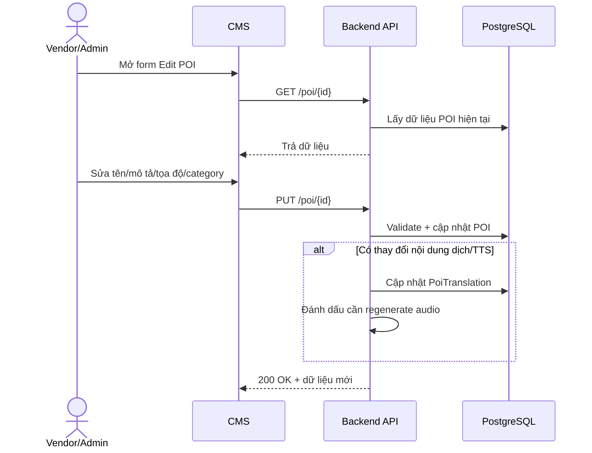
```mermaid
sequenceDiagram
    actor V as Vendor/Admin
    participant CMS as CMS
    participant API as Backend API
    participant DB as PostgreSQL

    V->>CMS: Mở form Edit POI
    CMS->>API: GET /poi/{id}
    API->>DB: Lấy dữ liệu POI hiện tại
    API-->>CMS: Trả dữ liệu
    V->>CMS: Sửa tên/mô tả/tọa độ/category
    CMS->>API: PUT /poi/{id}
    API->>DB: Validate + cập nhật POI
    alt Có thay đổi nội dung dịch/TTS
        API->>DB: Cập nhật PoiTranslation
        API->>API: Đánh dấu cần regenerate audio
    end
    API-->>CMS: 200 OK + dữ liệu mới
```

### 12.7 Sequence: Xóa POI (Delete có kiểm soát ràng buộc)
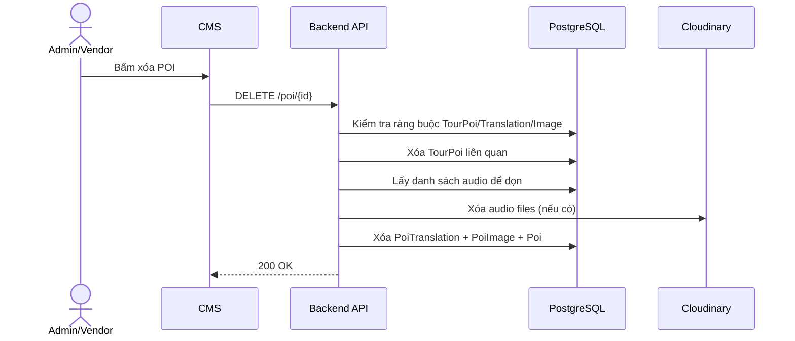
```mermaid
sequenceDiagram
    actor A as Admin/Vendor
    participant CMS as CMS
    participant API as Backend API
    participant DB as PostgreSQL
    participant CLD as Cloudinary

    A->>CMS: Bấm xóa POI
    CMS->>API: DELETE /poi/{id}
    API->>DB: Kiểm tra ràng buộc TourPoi/Translation/Image
    API->>DB: Xóa TourPoi liên quan
    API->>DB: Lấy danh sách audio để dọn
    API->>CLD: Xóa audio files (nếu có)
    API->>DB: Xóa PoiTranslation + PoiImage + Poi
    API-->>CMS: 200 OK
```

### 12.8 Sequence: CRUD Tour + TourPoi
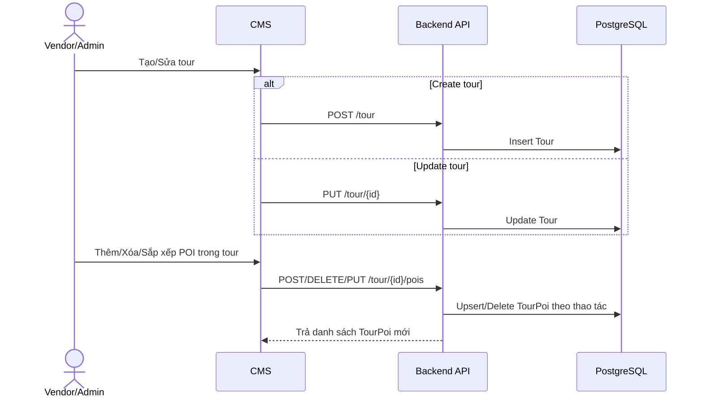
```mermaid
sequenceDiagram
    actor V as Vendor/Admin
    participant CMS as CMS
    participant API as Backend API
    participant DB as PostgreSQL

    V->>CMS: Tạo/Sửa tour
    alt Create tour
        CMS->>API: POST /tour
        API->>DB: Insert Tour
    else Update tour
        CMS->>API: PUT /tour/{id}
        API->>DB: Update Tour
    end
    V->>CMS: Thêm/Xóa/Sắp xếp POI trong tour
    CMS->>API: POST/DELETE/PUT /tour/{id}/pois
    API->>DB: Upsert/Delete TourPoi theo thao tác
    API-->>CMS: Trả danh sách TourPoi mới
```

### 12.9 Sequence: CRUD Food (thêm/sửa/xóa đầy đủ)
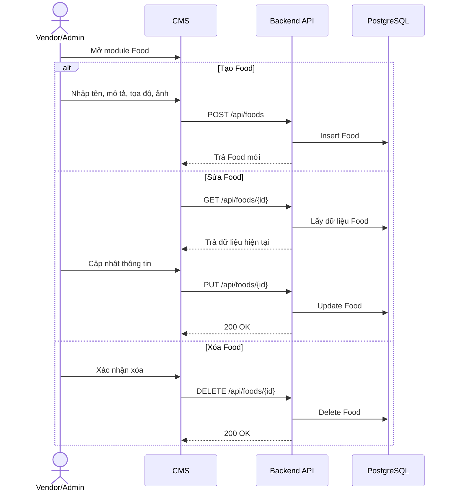
```mermaid
sequenceDiagram
    actor V as Vendor/Admin
    participant CMS as CMS
    participant API as Backend API
    participant DB as PostgreSQL

    V->>CMS: Mở module Food
    alt Tạo Food
        V->>CMS: Nhập tên, mô tả, tọa độ, ảnh
        CMS->>API: POST /api/foods
        API->>DB: Insert Food
        API-->>CMS: Trả Food mới
    else Sửa Food
        CMS->>API: GET /api/foods/{id}
        API->>DB: Lấy dữ liệu Food
        API-->>CMS: Trả dữ liệu hiện tại
        V->>CMS: Cập nhật thông tin
        CMS->>API: PUT /api/foods/{id}
        API->>DB: Update Food
        API-->>CMS: 200 OK
    else Xóa Food
        V->>CMS: Xác nhận xóa
        CMS->>API: DELETE /api/foods/{id}
        API->>DB: Delete Food
        API-->>CMS: 200 OK
    end
```

## 13. Activity diagram
### 13.1 Activity: Luồng vào app bằng QR Gate
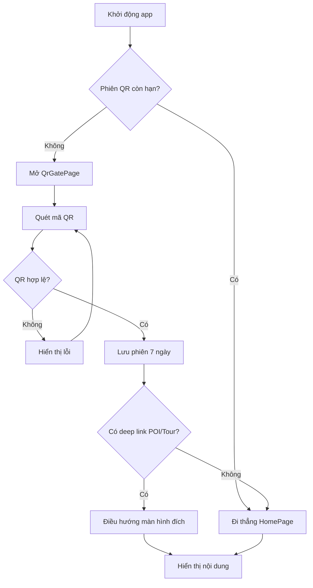
```mermaid
flowchart TD
    A[Khởi động app] --> B{Phiên QR còn hạn?}
    B -- Có --> C[Đi thẳng HomePage]
    B -- Không --> D[Mở QrGatePage]
    D --> E[Quét mã QR]
    E --> F{QR hợp lệ?}
    F -- Không --> G[Hiển thị lỗi]
    G --> E
    F -- Có --> H[Lưu phiên 7 ngày]
    H --> I{Có deep link POI/Tour?}
    I -- Có --> J[Điều hướng màn hình đích]
    I -- Không --> C
    J --> K[Hiển thị nội dung]
    C --> K
```

### 13.2 Activity: Nghe audio POI đầy đủ nhánh
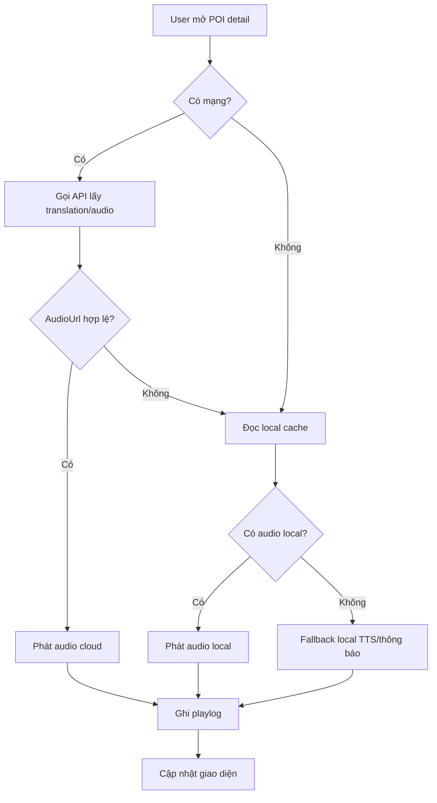
```mermaid
flowchart TD
    A[User mở POI detail] --> B{Có mạng?}
    B -- Có --> C[Gọi API lấy translation/audio]
    C --> D{AudioUrl hợp lệ?}
    D -- Có --> E[Phát audio cloud]
    D -- Không --> F[Đọc local cache]
    B -- Không --> F
    F --> G{Có audio local?}
    G -- Có --> H[Phát audio local]
    G -- Không --> I[Fallback local TTS/thông báo]
    E --> J[Ghi playlog]
    H --> J
    I --> J
    J --> K[Cập nhật giao diện]
```

### 13.3 Activity: Tạo POI trong CMS
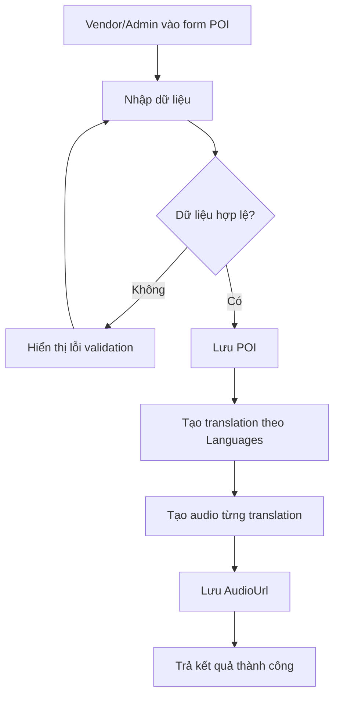
```mermaid
flowchart TD
    A[Vendor/Admin vào form POI] --> B[Nhập dữ liệu]
    B --> C{Dữ liệu hợp lệ?}
    C -- Không --> D[Hiển thị lỗi validation]
    D --> B
    C -- Có --> E[Lưu POI]
    E --> F[Tạo translation theo Languages]
    F --> G[Tạo audio từng translation]
    G --> H[Lưu AudioUrl]
    H --> I[Trả kết quả thành công]
```

### 13.4 Activity: Đồng bộ dữ liệu offline
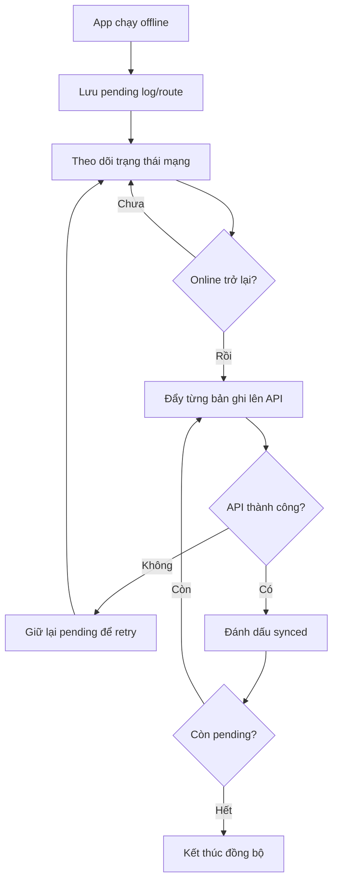
```mermaid
flowchart TD
    A[App chạy offline] --> B[Lưu pending log/route]
    B --> C[Theo dõi trạng thái mạng]
    C --> D{Online trở lại?}
    D -- Chưa --> C
    D -- Rồi --> E[Đẩy từng bản ghi lên API]
    E --> F{API thành công?}
    F -- Không --> G[Giữ lại pending để retry]
    G --> C
    F -- Có --> H[Đánh dấu synced]
    H --> I{Còn pending?}
    I -- Còn --> E
    I -- Hết --> J[Kết thúc đồng bộ]
```

### 13.5 Activity: Quản trị CRUD POI (thêm/sửa/xóa)
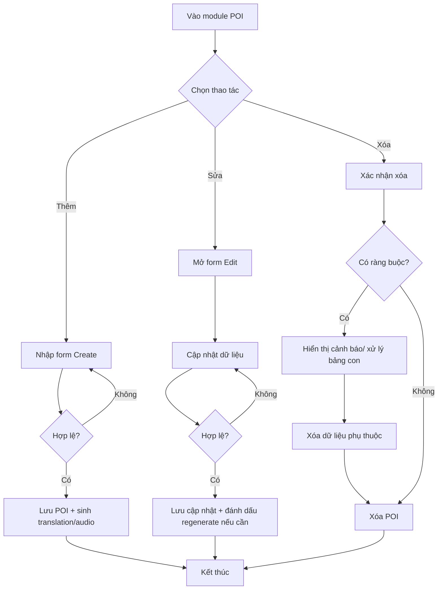
```mermaid
flowchart TD
    A[Vào module POI] --> B{Chọn thao tác}
    B -- Thêm --> C[Nhập form Create]
    C --> D{Hợp lệ?}
    D -- Không --> C
    D -- Có --> E[Lưu POI + sinh translation/audio]
    E --> Z[Kết thúc]

    B -- Sửa --> F[Mở form Edit]
    F --> G[Cập nhật dữ liệu]
    G --> H{Hợp lệ?}
    H -- Không --> G
    H -- Có --> I[Lưu cập nhật + đánh dấu regenerate nếu cần]
    I --> Z

    B -- Xóa --> J[Xác nhận xóa]
    J --> K{Có ràng buộc?}
    K -- Có --> L[Hiển thị cảnh báo/ xử lý bảng con]
    L --> M[Xóa dữ liệu phụ thuộc]
    M --> N[Xóa POI]
    K -- Không --> N
    N --> Z
```

### 13.6 Activity: CRUD Tour và gán POI
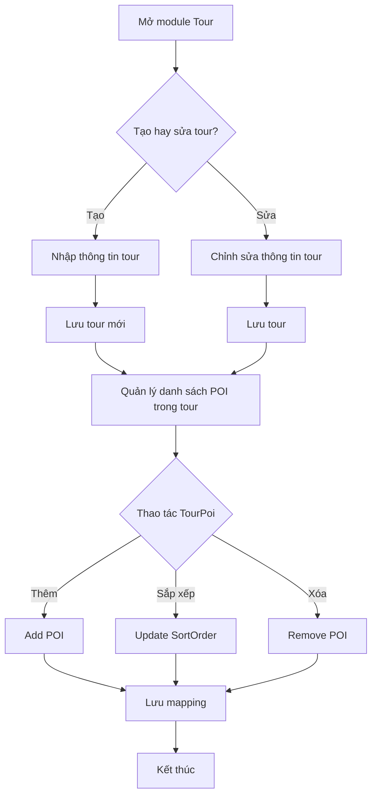
```mermaid
flowchart TD
    A[Mở module Tour] --> B{Tạo hay sửa tour?}
    B -- Tạo --> C[Nhập thông tin tour]
    C --> D[Lưu tour mới]
    B -- Sửa --> E[Chỉnh sửa thông tin tour]
    E --> F[Lưu tour]
    D --> G[Quản lý danh sách POI trong tour]
    F --> G
    G --> H{Thao tác TourPoi}
    H -- Thêm --> I[Add POI]
    H -- Sắp xếp --> J[Update SortOrder]
    H -- Xóa --> K[Remove POI]
    I --> L[Lưu mapping]
    J --> L
    K --> L
    L --> M[Kết thúc]
```

### 13.7 Activity: Quản trị User/Role (Admin)
```mermaid
flowchart TD
    A[Admin vào User Management] --> B{Thao tác}
    B -- Tạo user --> C[Nhập thông tin user]
    C --> D[Lưu user]
    B -- Sửa user --> E[Cập nhật profile/trạng thái]
    E --> F[Lưu user]
    B -- Khóa/Xóa user --> G[Xác nhận]
    G --> H[Khóa hoặc xóa]
    B -- Tạo role --> I[Nhập role]
    I --> J[Lưu role]
    B -- Gán role --> K[Chọn user + role]
    K --> L[Lưu AspNetUserRoles]
    D --> M[Kết thúc]
    F --> M
    H --> M
    J --> M
    L --> M
```

### 13.8 Activity: CRUD Food (đầy đủ thao tác)
```mermaid
flowchart TD
    A[Vào module Food] --> B{Chọn thao tác}
    B -- Thêm --> C[Nhập tên, mô tả, tọa độ, ảnh]
    C --> D{Hợp lệ?}
    D -- Không --> C
    D -- Có --> E[Lưu Food]
    E --> Z[Kết thúc]

    B -- Sửa --> F[Chọn Food cần sửa]
    F --> G[Cập nhật nội dung]
    G --> H{Hợp lệ?}
    H -- Không --> G
    H -- Có --> I[Lưu cập nhật]
    I --> Z

    B -- Xóa --> J[Chọn Food cần xóa]
    J --> K[Xác nhận xóa]
    K --> L[Xóa bản ghi Food]
    L --> Z
```

## 14. Data Flow Diagram (DFD Level 1)
```mermaid
flowchart LR
    Traveler[Traveler]
    Vendor[Vendor/Admin]

    P1((P1 Xác thực vào app bằng QR))
    P2((P2 Tiêu thụ nội dung POI/Tour))
    P3((P3 Ghi nhận analytics))
    P4((P4 Quản trị nội dung CMS))
    P5((P5 Tạo/Sinh lại audio))
    P6((P6 Đồng bộ dữ liệu offline))
    P7((P7 Quản lý Food))

    D1[(D1 Session QR 7 ngày)]
    D2[(D2 Master Data POI/Tour/Language)]
    D3[(D3 Audio URLs + Media)]
    D4[(D4 PlayLog/Heatmap/Route)]
    D5[(D5 Local cache map/audio)]
    D6[(D6 Master Data Food)]

    EXT1[(Azure Speech)]
    EXT2[(Cloudinary)]
    EXT3[(PostgreSQL)]

    Traveler --> P1
    Traveler --> P2
    Traveler --> P3
    Traveler --> P6
    Vendor --> P4
    Vendor --> P5
    Vendor --> P7

    P1 <--> D1
    P2 <--> D2
    P2 <--> D3
    P2 <--> D5
    P3 <--> D4
    P4 <--> D2
    P5 <--> D3
    P6 <--> D4
    P6 <--> D5
    P7 <--> D6

    P4 <--> EXT3
    P5 <--> EXT1
    P5 <--> EXT2
    P3 <--> EXT3
    P2 <--> EXT3
    P7 <--> EXT3
```

## 15. UI wireframe (MVP)
### 15.1 App Mobile
- **LoadingPage:** kiểm tra phiên QR và điều hướng đầu vào.
- **QrGatePage:** camera scan QR, thông báo hợp lệ/không hợp lệ.
- **HomePage:** vào nhanh map, tour, cài đặt.
- **MapPage:** bản đồ + marker POI + vị trí hiện tại.
- **PoiListPage:** danh sách POI có lọc/sắp xếp.
- **PoiDetailPage:** nội dung POI, bản dịch, play/pause audio.
- **TourPage:** danh sách tour, hỗ trợ mở tour theo deep link.
- **SettingsPage:** nút xóa phiên QR 7 ngày để test.

### 15.2 CMS Web
- **Login/Role UI:** đăng nhập, phân quyền.
- **POI/Index:** danh sách POI, QR code từng POI.
- **POI/Create/Edit:** thông tin chính, mô tả, tọa độ, ảnh.
- **Tour/Index & Details:** CRUD tour, số POI trong tour.
- **Food/Index & Food/Create/Edit:** CRUD điểm ăn uống, vị trí, mô tả, ảnh.
- **Translation/Details:** xem bản dịch và nghe audio từng ngôn ngữ.
- **Heatmap/Index:** bản đồ nhiệt và số liệu quan tâm.

## 16. API thực tế
### 16.1 POI
- `GET /api/pois`
- `GET /api/pois/{poiId}`
- `GET /api/pois/{poiId}/tts-all`
- `POST /api/pois/playlog`
- `GET /api/pois/stats`

### 16.2 Audio
- `GET /api/audio/poi/{poiId}`
- `POST /api/audio/poi/{poiId}/regenerate`
- `POST /api/audio/translation/{translationId}/generate`

### 16.3 Tour
- `GET /api/tours`
- `GET /api/tours/{id}`

### 16.4 Route/Heatmap
- `POST /api/routes/session`
- `GET /api/routes/popular`
- `POST /api/heatmap/entry`
- `GET /api/heatmap`

### 16.5 Food
- `GET /api/foods`
- `GET /api/foods/{id}`
- `POST /api/foods`
- `PUT /api/foods/{id}`
- `DELETE /api/foods/{id}`

## 17. Bảo mật
- Dùng Identity để xác thực và phân quyền role `Admin`, `Vendor`.
- Không commit key thật (`Cloudinary`, `Azure Speech`, DB).
- Dùng `.env`/biến môi trường theo từng máy.
- Validate dữ liệu đầu vào cho API (QR payload, ids, content).
- Hạn chế truy cập API nhạy cảm bằng role và policy.

## 18. Roadmap
- **P1 (Hoàn thành):** nền tảng CRUD POI/Tour/Translation.
- **P2 (Hoàn thành):** sinh audio tự động + regenerate.
- **P3 (Hoàn thành):** QR gate + deep link POI/Tour.
- **P4 (Hoàn thành):** offline map/audio + sync.
- **P5 (Kế tiếp):** tối ưu dashboard analytics và bộ lọc báo cáo.

## 19. Nghiệm thu
Checklist nghiệm thu theo chức năng:
- [ ] Tạo POI sinh đủ translation theo `Languages`.
- [ ] Audio được tạo và lưu `AudioUrl` cho từng translation.
- [ ] `GET /api/tours` trả đủ POI trong tour.
- [ ] QR hợp lệ mở app và vào HomePage ổn định.
- [ ] Session QR có hiệu lực 7 ngày, có thể xóa từ Settings.
- [ ] App không ANR khi quét QR.
- [ ] Offline map/audio chạy được khi tắt mạng.
- [ ] Pending queue được sync lại khi có mạng.
- [ ] CRUD Food hoạt động đủ thêm/sửa/xóa trên CMS.

## 20. Future
- Gợi ý lịch trình cá nhân hóa theo sở thích.
- Tải trước gói dữ liệu thông minh theo khu vực sắp đến.
- Đề xuất ngôn ngữ/voice profile theo người dùng.
- Chấm điểm chất lượng tour dựa trên analytics.

## 21. Danh mục tài liệu & mã tham chiếu
- Tài liệu chính: `PRD_SmartTour.md`
- Source code:
  - `SmartTourApp/`
  - `SmartTourCMS/`
  - `SmartTourBackend/`
  - `SmartTour.Shared/`

## 22. Lịch sử phiên bản PRD
| Phiên bản | Ngày | Nội dung cập nhật |
| --- | --- | --- |
| 5.0 | 2026-04-09 | Bản rút gọn để thuyết trình nhanh |
| 6.0 | 2026-04-09 | Chuẩn hóa 22 mục |
| 6.1 | 2026-04-09 | Khôi phục tiếng Việt có dấu + mở rộng đầy đủ mô hình ERD/Use Case/Sequence/Activity/DFD |
| 6.2 | 2026-04-09 | Bổ sung đầy đủ mô hình chức năng Food: CRUD ở Use Case, Sequence, Activity, DFD, UI, API và nghiệm thu |
