# PRD (Product Requirements Document) - SmartTour

| Thuộc tính | Giá trị |
| --- | --- |
| **Phiên bản tài liệu** | **7.9** |
| **Ngày cập nhật** | **2026-05-14** |
| **Trạng thái** | **Bám sát** các luồng lõi đã triển khai (visit + worker, ví/MoMo, Premium CMS, Geofence simulator, POI Vendor + trừ ví). **Không** coi là đã liệt kê/đồng bộ từng endpoint hoặc từng sơ đồ UML với code: §**16** và bảng API được rà soát theo đợt (xem **7.9**); một số diagram UC/Sequence/Activity vẫn mang tính tổng quan. |
| **Mục đích** | Mô tả yêu cầu sản phẩm; bám sát chức năng đã triển khai và chuẩn hóa tài liệu để báo cáo đồ án. |

### Mục lục nhanh
1. [Giới thiệu](#1-giới-thiệu)
2. [Mục tiêu sản phẩm](#2-mục-tiêu-sản-phẩm)
3. [Personas](#3-personas-và-nhu-cầu)
4. [Tính năng chi tiết](#4-tính-năng-và-yêu-cầu-chức-năng)
5. [User stories](#5-user-stories)
6. [Luồng người dùng chính](#6-luồng-người-dùng-chính)
7. [Kiến trúc hệ thống](#7-kiến-trúc-hệ-thống-system-architecture-overview)
8. [CSDL](#8-tổng-quan-cơ-sở-dữ-liệu-database-overview)
9. [Thiết kế analytics](#9-thiết-kế-analytics)
10. [Yêu cầu phi chức năng (NFR)](#10-yêu-cầu-phi-chức-năng-nfr)
11. [Sơ đồ Use Case](#11-sơ-đồ-use-case)
12. [Sequence diagram](#12-sequence-diagram)
13. [Activity diagram](#13-activity-diagram)
14. [Data Flow Diagram (DFD Level 1)](#14-data-flow-diagram-dfd-level-1)
15. [UI wireframe (MVP)](#15-ui-wireframe-mvp)
16. [API thực tế](#16-api-overview-đã-triển-khai-trong-repo)
17. [Bảo mật](#17-bảo-mật-và-phân-quyền)
18. [Roadmap](#18-kế-hoạch-triển-khai-roadmap-và-trạng-thái)
19. [Nghiệm thu](#19-tiêu-chí-nghiệm-thu-mvp)
20. [Future](#20-future-improvements)
21. **[Danh mục tài liệu & mã tham chiếu](#21-danh-mục-tài-liệu-và-tham-chiếu-mã-nguồn)**
22. **[Lịch sử phiên bản PRD](#22-lịch-sử-phiên-bản-prd)**

---

## 1. Giới thiệu
### 1.1 Mục tiêu tài liệu
Tài liệu mô tả yêu cầu sản phẩm SmartTour theo phạm vi MVP bám sát mã nguồn hiện tại, phục vụ báo cáo đồ án và bàn giao kỹ thuật.

### 1.2 Tổng quan dự án
SmartTour là hệ thống du lịch thông minh gồm 3 thành phần:
- **Mobile App (.NET MAUI):** bản đồ, POI, audio đa ngôn ngữ, offline map/audio, QR gate.
- **CMS Web (ASP.NET Core MVC):** quản trị POI/Food/Translation, tạo audio, thống kê; **Load test / Geofence Simulator** (Admin) để giả lập visit + log file.
- **Backend API (ASP.NET Core + EF Core):** cung cấp dữ liệu, xử lý audio, lưu analytics.

Mục tiêu cốt lõi: giúp khách du lịch tự khám phá địa điểm bằng nội dung số đa ngôn ngữ, vận hành ổn định cả khi online lẫn offline.

### 1.3 Phạm vi phiên bản
- **In scope:** QR gate, bản đồ POI, audio đa ngôn ngữ, offline map/audio, analytics (visit có **`speedKmh` tùy chọn**), device presence, **Premium + ví vendor** (nạp ví qua MoMo; Vendor mua Premium trừ ví; Admin áp dụng gói không qua MoMo trên CMS), **CMS Geofence Simulator + ILogRunner (append/đọc file log)**.
- **Out of scope:** loyalty, recommendation AI realtime, hệ thống thanh toán đa cổng ngoài MoMo.

## 2. Mục tiêu sản phẩm
### 2.1 Mục tiêu nghiệp vụ
- Số hóa hướng dẫn tham quan bằng POI + audio.
- Chuẩn hóa quy trình quản lý nội dung tập trung.
- Tăng mức độ tương tác người dùng thông qua bản đồ và audio.
- Theo dõi hành vi để cải tiến nội dung bằng dữ liệu thực tế.

### 2.2 Mục tiêu kỹ thuật
- API nhất quán cho CMS và App.
- Dữ liệu POI/Food có bản dịch theo ngôn ngữ, đồng bộ audio theo translation.
- Hỗ trợ bắt buộc quét QR khi vào hệ thống, kèm cơ chế phiên 7 ngày.
- Hỗ trợ hoạt động offline map/audio và đồng bộ lại khi online.

## 3. Personas và nhu cầu
- **Traveler (Khách du lịch):** cần truy cập nhanh, xem bản đồ, nghe audio theo ngôn ngữ của mình, không bị gián đoạn khi mất mạng.
- **Vendor (Đơn vị nội dung):** tạo và quản lý POI/Food trong phạm vi phụ trách, theo dõi nội dung và audio.
- **Admin (Quản trị hệ thống):** kiểm soát người dùng, phân quyền, giám sát chất lượng dữ liệu và analytics.

## 4. Tính năng và yêu cầu chức năng
### 4.1 Mobile App
- Đăng nhập luồng vào app qua **QR Gate** (quét QR hợp lệ mới vào hệ thống).
- Lưu phiên quét QR 7 ngày, hết hạn thì quét lại.
- Hỗ trợ deep link POI: `smarttour://poi/{id}`.
- Xem POI theo map/list, xem chi tiết và nghe audio theo translation.
- Theo dõi route, gửi log nghe, thống kê hành vi.
- Chạy offline với cache map tile và audio local.
- Đồng bộ dữ liệu pending sau khi có mạng.
- **Auto-play thuyết minh (geofence):** hàng đợi **FIFO**, không cắt ngang bản đang phát; cooldown **5 phút**/POI cho **một lần phát auto hoàn chỉnh** (`NarrationEngine`, `COOLDOWN_MINUTES`); không trùng POI đang phát hoặc đã có trong queue; khi bỏ qua do cooldown vẫn phát tín hiệu **`NarrationCompleted`** (để simulator / tích hợp không kẹt).
- **Chọn POI geofence (candidate trên bản đồ):** `GeofencingEngine` dùng cooldown **30 giây**/POI giữa các lần có thể “vào lại” cùng vòng (tránh nhấp nháy khi đứng trong radius); sau đó `NarrationEngine` vẫn áp dụng cooldown **5 phút** như trên cho chu kỳ phát.
- **Nghe chủ động (Home / thủ công):** **ưu tiên tuyệt đối** — hủy token, xóa hàng đợi, chờ vòng xử lý cũ dừng (tối đa ~1s), phát ngay POI được chọn.
- **Telemetry thuyết minh:** `NarrationCompleted` trên `NarrationEngine` đồng bộ với **`NarrationTelemetryBus`** (Shared) để công cụ console (ví dụ `OverlapLogRunner`) subscribe cùng contract.
- **Lượt ghé POI (visit analytics):** gửi `POST /api/analytics/visit` với `VisitType` — **Geofence** (đi kèm heatmap zone_enter/app_open), **MapClick** (chọn POI trên bản đồ), **QRCode** (QR cổng hợp lệ dạng `smarttour://poi/{id}`); payload có thể kèm **`speedKmh`** (km/h, tùy chọn). Backend enqueue, worker ghi batch vào `visit_logs` (cột `SpeedKmh`).

### 4.2 CMS
- CRUD POI đầy đủ (thông tin, mô tả, tọa độ, ảnh, danh mục).
- Tự sinh translation theo bảng `Languages` khi **Vendor** xác nhận tạo POI (sau trừ ví). **Admin** tạo POI từ form chỉ ghi `Poi` vào DB — sinh translation/audio có thể thực hiện qua sửa POI / regenerate sau.
- Sinh audio theo từng translation (từ `TtsScript`/`Description`).
- Regenerate audio theo POI hoặc từng translation.
- Màn hình translation để nghe kiểm thử audio từng ngôn ngữ.
- Dashboard Heatmap và route phổ biến.
- Dashboard thiết bị online theo thời gian thực (đếm + bảng chi tiết thiết bị).
- **Lịch sử nghe:** `Log/Plays` — phân trang `PlayLog` theo quyền; **`Log/Locations`** tắt (redirect + thông báo, không còn màn hình lịch sử vị trí).
- **Ví vendor** (menu chỉ **Vendor**): xem số dư; nạp tiền qua MoMo (`wallet_topup`, hàng đợi worker như Premium); cấu hình `PoiCreation:MinimumWalletTopUpVnd` (mặc định tối thiểu 20.000đ nếu thiếu key).
- **Nâng cấp Premium (`Premium/Index`):** giá gói tuần/tháng/năm đọc **`MoMo:PackagePrice:Weekly|Monthly|Yearly`** trên CMS, fallback trong code nếu thiếu/sai; **Admin** bấm **Áp dụng gói Premium** → cập nhật `Poi` trực tiếp (không MoMo); **Vendor** bấm **Thanh toán bằng ví** → Backend `purchase-premium-wallet-cms` (trừ `vendor_wallets`). Luồng MoMo tạo đơn **POI premium** qua CMS form này **không còn** — MoMo dùng chủ yếu cho **nạp ví** và vẫn có API `create-payment` / `create-payment-cms` cho client khác nếu cần.
- **Tạo POI (Vendor):** phí cố định **`PoiCreation:FixedVendorCreateChargeVnd`** (mặc định 100.000đ) trừ ví khi xác nhận tạo (`poi_create`).
- **Load test & Geofence Simulator (chỉ role Admin):** menu **Load test** → `LoadTest/Index` (có **Bulk visit (stress)**: `POST /LoadTest/RunBulkVisit`, nhiều request song song tới `api/analytics/visit`, `userId` dạng `SIM-BULK-###`, tọa độ `0,0`, `VisitType.MapClick`; phản hồi JSON gồm `httpStatusCounts` / `firstFailure` để minh chứng stress; chịu rate limit `DeviceTokenPolicy` trên API) → `LoadTest/GeofenceSimulator` (Leaflet): POI thật từ DB + bán kính/tâm giả lập trong **bbox Việt Nam**; nhiều thiết bị ảo `SIM-DEV-xx`; khi nằm trong **giao** tất cả vòng của cụm thì xếp hàng POI theo ưu tiên (Premium → popularity → khoảng cách) và mô phỏng log audio; **khoảng cách giữa hai dòng log POI liên tiếp = 5 giây**; dropdown cooldown (30s / 2 phút / 5 phút) chỉ cho **lặp lại visit/API** cùng POI/máy. Proxy `POST /api/analytics/visit` qua `LoadTest/FireGeofenceVisit` (yêu cầu `BackendApi:BaseUrl`); panel server log poll `LoadTest/RecentVisitLogs` (đọc `visit_logs` qua EF, lọc `userId` tiền tố `SIM-`). Ghi snapshot client log qua **`ILogRunner`** (`SaveSimulatorLog`: ghi đè hoặc `append: true`), tải/xem file trên **cùng trang** Geofence (`DownloadQueueLog`, `ReadQueueLog`). Các route phụ `AdminLogQueue/Download`, `Text`, `Overwrite` giữ cho link cũ/script; `GET /AdminLogQueue/Simulator` **chuyển hướng** về Geofence (không còn menu sidebar trùng).

### 4.3 Backend API
- Cụm API POI/Food/Translation.
- Cụm API Audio: xem, sinh, sinh lại.
- Cụm API analytics: playlog, heatmap, route session, **visit log** (lượt ghé POI qua queue + worker).
- Cụm API Presence: heartbeat/offline cho trạng thái thiết bị.
- Cụm API Premium: tạo giao dịch MoMo (POI premium / hàng đợi), nạp ví, mua Premium trừ ví, xác nhận trạng thái thanh toán / IPN.
- Tích hợp Azure Speech để tổng hợp giọng nói.
- Tích hợp Cloudinary để lưu audio và trả URL.

## 5. User stories
- **US-01:** Là Traveler, tôi muốn quét QR để mở app trực tiếp và vào nhanh màn hình chính.
- **US-02:** Là Traveler, tôi muốn nghe thuyết minh theo ngôn ngữ đang chọn.
- **US-03:** Là Traveler, tôi muốn app vẫn dùng được khi mất mạng.
- **US-04:** Là Traveler, tôi muốn quét mã của POI và đi thẳng đến nội dung đó.
- **US-05:** Là Vendor, tôi muốn tạo POI một lần và hệ thống tự tạo translation + audio.
- **US-06:** Là Vendor, tôi muốn regenerate audio cho bản dịch bị thiếu/lỗi.
- **US-07:** Là Admin, tôi muốn xem heatmap và route để đánh giá mức độ quan tâm.
- **US-08:** Là Admin, tôi muốn phân quyền rõ ràng cho người vận hành.
- **US-09:** Là **Admin**, tôi muốn **áp dụng gói Premium** cho POI của mình **không cần thanh toán** để demo/vận hành nhanh.
- **US-09b:** Là **Vendor**, tôi muốn **nạp ví** qua MoMo và **mua gói Premium bằng số dư ví** để tăng mức hiển thị mà không phụ thuộc form tạo đơn MoMo từng POI trên CMS.
- **US-10:** Là Admin, tôi muốn thấy danh sách thiết bị online/offline theo thời gian thực để theo dõi vận hành app.
- **US-11:** Là hệ thống, tôi muốn ghi nhận **lượt ghé** POI (geofence / bấm map / QR) tách khỏi **lượt nghe** (`PlayLog`) để thống kê hành vi với độ trễ API thấp.
- **US-12:** Là Admin, tôi muốn **giả lập geofence** nhiều thiết bị, xem visit vào DB và **lưu/xem/tải** log mô phỏng trên CMS (không cần sửa app) để kiểm thử và minh chứng đồ án.

## 6. Luồng người dùng chính
### Journey 1: Tạo POI và tự động sinh audio
1. **Vendor:** nhập form → trang xác nhận (phí **`PoiCreation:FixedVendorCreateChargeVnd`**, số dư ví) → POST xác nhận: transaction **trừ ví (`poi_create`) trước**, rồi insert `Poi`. **Admin:** POST form Create ghi `Poi` trực tiếp (không trừ ví trong bước này).
2. **Vendor (sau bước 1):** CMS lấy danh sách ngôn ngữ, tạo `PoiTranslation`, gọi TTS, upload Cloudinary trong cùng luồng xác nhận. **Admin:** bước sinh translation/audio không gắn chặt vào action Create — thường qua chỉnh sửa / regenerate khi cần.
3. Hệ thống gọi TTS để tạo file âm thanh cho từng bản dịch (khi luồng sinh translation chạy).
4. Upload audio lên Cloudinary, lưu `AudioUrl`.
5. CMS hiển thị trạng thái tạo thành công.

### Journey 2: Nghe audio POI
1. Traveler mở app, chọn POI trên map/list (hoặc bước vào vùng geofence khi bật auto-play).
2. App lấy translation đúng ngôn ngữ.
3. App phát audio cloud hoặc audio local cache (chuỗi fallback TTS/script/description khi cần).
4. App gửi playlog về backend.
5. **Auto-play nhiều POI gần nhau:** các kích hoạt geofence xếp **FIFO**; không cắt ngang bản đang phát; user bấm nghe thủ công thì **xóa queue và phát ngay** POI đó.
6. **Map:** khi user chọn POI trên bản đồ (`SelectPoi`), app gửi **visit** `MapClick` (fire-and-forget). **Geofence visit** đi kèm gửi heatmap `zone_enter` / `app_open`.

### Journey 3: QR Gate + Deep Link
1. App khởi động, kiểm tra phiên QR còn hạn hay không.
2. Nếu hết hạn: mở trang quét QR.
3. Quét hợp lệ: lưu phiên 7 ngày.
4. Nếu QR chứa deep link POI: điều hướng đúng màn hình đích.
5. Với URI dạng **`smarttour://poi/{id}`**, app gửi thêm **visit** `QRCode` (tọa độ lấy GPS nếu có; `userId` ẩn danh `dev_*` thống nhất với heatmap). QR **tour-only** không gửi visit POI đơn.

### Journey 4: Offline và đồng bộ lại
1. App tải trước map tile + audio.
2. Khi offline: đọc dữ liệu local.
3. Log phát audio/route được queue lại.
4. Khi online: đẩy pending queue lên API.

### Journey 5: Theo dõi thiết bị online
1. App mở và gửi heartbeat định kỳ.
2. Backend cập nhật `DevicePresence.LastSeenUtc` + thông tin thiết bị.
3. CMS Dashboard gọi API trạng thái thiết bị theo chu kỳ ngắn.
4. Khi app ngủ/tắt, app gửi offline để web cập nhật trạng thái nhanh.

### Journey 6: Premium trên CMS (Admin vs Vendor) + nạp ví
1. **Vendor — nạp ví:** vào **Ví vendor** → nhập số tiền (≥ min) → Backend tạo đơn `wallet_topup` → MoMo (queue worker) → IPN cộng số dư `vendor_wallets` + ghi `vendor_wallet_ledger`.
2. **Vendor — mua Premium:** **Nâng cấp Premium** → chọn POI + gói → **Thanh toán bằng ví** → API `purchase-premium-wallet-cms` trừ ví và gia hạn `Poi` (tuần = +7 ngày, tháng/năm theo `Months`).
3. **Admin — áp dụng gói:** cùng màn hình → **Áp dụng gói Premium** → cập nhật `Poi` trực tiếp trên DB (không tạo đơn MoMo).
4. **MoMo / return:** đơn nạp ví dùng chung trang return `/payment/return` với đơn premium legacy; IPN backend xử lý theo `OrderKind` (`wallet_topup` vs `premium`).

## 7. Kiến trúc hệ thống (System Architecture Overview)
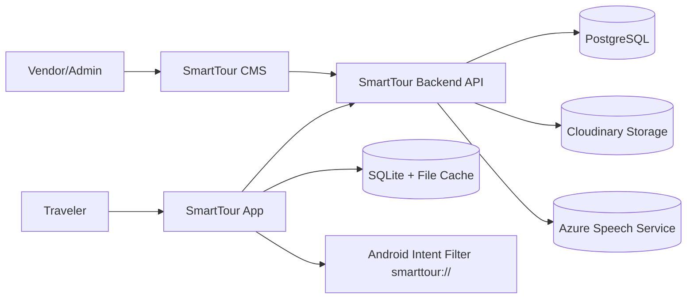

**Ghi chú triển khai:** CMS dùng **EF Core** đọc/ghi trực tiếp PostgreSQL (cùng DB với API cho phần quản trị) và **`IHttpClientFactory`** (`SmartTourApi`) để proxy một số thao tác tới Backend — đặc biệt **Geofence Simulator** gọi `POST /api/analytics/visit` qua `LoadTestController` (cookie Admin, không đi qua public `/api` route của app mobile).

## 8. Tổng quan cơ sở dữ liệu (Database Overview)
### 8.1 Nhóm bảng nghiệp vụ
- `Poi`
- `PoiTranslation`
- `PoiImage`
- `Language`
- `Food`
- `FoodTranslation`
- `PlayLog`
- `visit_logs` (entity `VisitLog`: lượt ghé POI theo `VisitType`, tùy chọn **`SpeedKmh`**, ghi theo lô từ worker)
- `vendor_wallets`, `vendor_wallet_ledger` (số dư + sổ cái ví Vendor)
- `HeatmapEntry`
- `RouteSession`
- `RouteSessionPoi`

### 8.2 Nhóm bảng Identity
- `AspNetUsers`
- `AspNetRoles`
- `AspNetUserRoles`
- `AspNetUserClaims`
- `AspNetRoleClaims`
- `AspNetUserLogins`
- `AspNetUserTokens`

### 8.3 ERD chi tiết theo DB đang dùng thực tế
```mermaid
erDiagram
    POI {
      int Id PK
      string Name
      string Description
      double Lat
      double Lng
      int Radius
      string VendorId
      string CreatedBy
      datetime OpenTime
      datetime CloseTime
    }

    POI_IMAGE {
      int Id PK
      int PoiId FK
      string ImageUrl
      bool IsPrimary
    }

    LANGUAGE {
      int Id PK
      string Code
      string Name
    }

    POI_TRANSLATION {
      int Id PK
      int PoiId FK
      int LanguageId FK
      string Title
      string Description
      string TtsScript
      string AudioUrl
    }

    TOUR {
      int Id PK
      string Name
      string Description
      string VendorId
      string CreatedBy
    }

    FOOD {
      int Id PK
      int PoiId FK
      string Name
      string Description
      decimal Price
      string ImageUrl
    }

    FOOD_TRANSLATION {
      int Id PK
      int FoodId FK
      int LanguageId FK
      string Name
      string Description
    }

    PLAY_LOG {
      int Id PK
      int PoiId FK
      string DeviceId
      string UserId
      datetime Time
      int DurationListened
      double Lat
      double Lng
    }

    VISIT_LOG {
      int Id PK
      int PoiId FK
      string UserId
      double Lat
      double Lng
      datetime VisitTime
      int VisitType
      double SpeedKmh nullable
    }

    HEATMAP_ENTRY {
      int Id PK
      int PoiId FK
      double Lat
      double Lng
      datetime CreatedAtUtc
      int AppOpenCount
      int ZoneEnterCount
    }

    ROUTE_SESSION {
      long Id PK
      string DeviceId
      string UserId
      datetime Date
      datetime StartedAt
      datetime EndedAt
    }

    ROUTE_SESSION_POI {
      long Id PK
      long RouteSessionId FK
      int PoiId FK
      datetime VisitedAt
      int OrderNo
    }

    ASPNET_USERS {
      string Id PK
      string UserName
      string Email
    }

    ASPNET_ROLES {
      string Id PK
      string Name
    }

    ASPNET_USER_ROLES {
      string UserId FK
      string RoleId FK
    }

    ASPNET_USER_CLAIMS {
      int Id PK
      string UserId FK
      string ClaimType
      string ClaimValue
    }

    ASPNET_ROLE_CLAIMS {
      int Id PK
      string RoleId FK
      string ClaimType
      string ClaimValue
    }

    ASPNET_USER_LOGINS {
      string LoginProvider PK
      string ProviderKey PK
      string UserId FK
    }

    ASPNET_USER_TOKENS {
      string UserId FK
      string LoginProvider PK
      string Name PK
      string Value
    }

    POI ||--o{ POI_IMAGE : has
    POI ||--o{ POI_TRANSLATION : has
    LANGUAGE ||--o{ POI_TRANSLATION : localizes
    POI ||--o{ FOOD : has_menu
    FOOD ||--o{ FOOD_TRANSLATION : has
    LANGUAGE ||--o{ FOOD_TRANSLATION : localizes
    POI ||--o{ PLAY_LOG : generates
    POI ||--o{ VISIT_LOG : visits
    POI ||--o{ HEATMAP_ENTRY : contributes
    ROUTE_SESSION ||--o{ ROUTE_SESSION_POI : tracks
    POI ||--o{ ROUTE_SESSION_POI : visited
    ASPNET_USERS ||--o{ ASPNET_USER_ROLES : maps
    ASPNET_ROLES ||--o{ ASPNET_USER_ROLES : maps
    ASPNET_USERS ||--o{ ASPNET_USER_CLAIMS : has
    ASPNET_ROLES ||--o{ ASPNET_ROLE_CLAIMS : has
    ASPNET_USERS ||--o{ ASPNET_USER_LOGINS : has
    ASPNET_USERS ||--o{ ASPNET_USER_TOKENS : has
```

### 8.4 Đặc tả CRUD chi tiết theo bảng
| Bảng | Thêm (Create) | Sửa (Update) | Xóa (Delete) | Ai thao tác | Ghi chú |
| --- | --- | --- | --- | --- | --- |
| `Poi` | Tạo POI mới | Sửa thông tin/tọa độ/mô tả | Xóa POI | Admin, Vendor | Xóa POI cần xử lý bảng con |
| `PoiImage` | Upload ảnh mới | Đổi ảnh chính | Xóa ảnh | Admin, Vendor | Bắt buộc còn >=1 ảnh nếu quy định |
| `PoiTranslation` | Tự sinh theo `Language` | Sửa `Title`, `Description`, `TtsScript` | Xóa bản dịch theo ngôn ngữ | Admin, Vendor | Xóa translation nên xóa luôn audio liên quan |
| `Language` | Thêm ngôn ngữ | Đổi tên/trạng thái | Ngừng dùng (soft delete) | Admin | Không nên hard delete |
| `Food` | Tạo món ăn theo POI | Sửa tên/mô tả/giá/ảnh | Xóa | Admin, Vendor | Không có tọa độ riêng |
| `FoodTranslation` | Tạo bản dịch tên + mô tả | Sửa nội dung dịch | Xóa bản dịch theo ngôn ngữ | Admin, Vendor | Dùng cho app đa ngôn ngữ |
| `PlayLog` | Ghi log nghe | Không sửa | Không xóa thủ công | System | Dữ liệu thống kê |
| `HeatmapEntry` | Ghi điểm nhiệt | Không sửa | Không xóa thủ công | System | Dữ liệu thống kê |
| `VisitLog` / `visit_logs` | Ghi lượt ghé POI (Geofence / MapClick / QRCode), tùy chọn **tốc độ** | Không sửa | Không xóa thủ công | System | Ingest qua channel + worker batch; cột `SpeedKmh` nullable |
| `RouteSession` | Tạo phiên route | Cập nhật thời gian kết thúc | Không xóa thủ công | System | Đồng bộ từ app |
| `RouteSessionPoi` | Ghi điểm đi qua | Không sửa | Không xóa thủ công | System | Chi tiết route |
| `AspNetUsers` | Tạo user | Sửa profile/trạng thái | Khóa hoặc xóa user | Admin | Nên khóa thay vì hard delete |
| `AspNetRoles` | Tạo role | Sửa tên role | Xóa role | Admin | Chỉ xóa khi role không còn gán |
| `AspNetUserRoles` | Gán role cho user | Đổi role | Thu hồi role | Admin | Quản trị phân quyền |
| `VendorWallet` / `vendor_wallets` | Tạo bản ghi khi cần | Cập nhật `BalanceVnd` qua service | Không xóa tay | System / Vendor | Một dòng / vendor |
| `VendorWalletLedgerEntry` / `vendor_wallet_ledger` | Ghi nhận giao dịch nạp/trừ | Không sửa | Không xóa tay | System | `momo_topup`, `premium_purchase`, `poi_create`, … |

### 8.5 Quy tắc xóa dữ liệu (Delete Policy)
- **Xóa POI:** bắt buộc xóa/gỡ dữ liệu phụ thuộc (`PoiImage`, `PoiTranslation`, `Food`, `FoodTranslation`) trước khi xóa bản ghi `Poi`.
- **Xóa Language:** ưu tiên chuyển trạng thái `IsActive=false`, không hard delete để tránh mồ côi translation.
- **Xóa User:** ưu tiên khóa tài khoản thay vì xóa cứng để giữ lịch sử thao tác.
- **Analytics (`PlayLog`, `VisitLog`, `HeatmapEntry`, `RouteSession*`):** không cho xóa thủ công trong luồng vận hành thường ngày.
- **Ví (`vendor_wallets`, `vendor_wallet_ledger`):** không xóa tay; số dư chỉ đổi qua service/API.

## 9. Thiết kế analytics
### 9.1 Chỉ số theo dõi
- Lượt nghe theo POI, theo ngôn ngữ, theo khung giờ.
- Điểm nóng truy cập theo tọa độ (heatmap).
- Lộ trình phổ biến theo route session.
- Tỷ lệ dùng offline và đồng bộ thành công.

### 9.2 Nguồn dữ liệu
- `PlayLog` cho hành vi nghe audio.
- `visit_logs` (`VisitLog`) cho **lượt ghé** POI (tách biệt với thời lượng nghe).
- `HeatmapEntry` cho mật độ quan tâm khu vực.
- `RouteSession` + `RouteSessionPoi` cho hành trình.

### 9.4 Visit log (lượt ghé) — đặc tả triển khai
- **Điểm vào:** `POST /api/analytics/visit` — trả **202 Accepted** sau khi enqueue (client không chờ INSERT DB).
- **Payload:** `poiId`, `lat`, `lng`, `visitType` (`Geofence` | `MapClick` | `QRCode`), `userId` tùy chọn khi ẩn danh; **`speedKmh`** (double, tùy chọn) — lưu xuống `visit_logs.SpeedKmh` nếu có.
- **Xác thực UserId:** nếu có JWT thì lấy từ claim (tránh giả mạo); không thì dùng `userId` trong body (app dùng tiền tố `dev_*` thống nhất với thiết bị heatmap).
- **Hàng đợi:** channel bounded **1000**, chế độ **DropOldest** khi đầy; `SingleReader`, nhiều writer.
- **Worker:** đọc tối thiểu 1 bản ghi; trong cửa sổ **500 ms** gom thêm tối đa **9** bản nữa (tối đa **10**/flush); `VisitTime` = **một** `DateTime.UtcNow` tại thời điểm flush cho cả batch; `SaveChanges` batch; lỗi batch → **insert từng dòng**, bản lỗi bỏ + log.
- **App:** Geofence đi cùng heatmap (`HeatmapService`); Map chọn POI → `MapClick`; QR POI hợp lệ → `QRCode`.
- **CMS (Admin — minh chứng / load test):** **Geofence Simulator** gửi visit qua `LoadTest/FireGeofenceVisit` tới cùng endpoint trên; `userId` bắt buộc tiền tố `SIM-` (máy ảo `SIM-DEV-xx`); body có thể kèm **`speedKmh`**. Đọc kết quả batch qua `LoadTest/RecentVisitLogs`. **Không** thay thế logic app MAUI; phục vụ demo và kiểm thử hàng đợi + DB. Chi tiết URL: mục [21.1](#211-geofence-simulator-cms--url-và-hai-luồng-log).

### 9.3 Dashboard đề xuất
- Top POI theo ngày/tuần/tháng.
- Biểu đồ ngôn ngữ được nghe nhiều nhất.
- Heatmap theo mốc thời gian.
- Top POI/Food có mức tương tác cao.

## 10. Yêu cầu phi chức năng (NFR)
- **Hiệu năng API:** truy vấn phổ biến < 2 giây.
- **Độ ổn định app:** không ANR khi quét QR liên tục.
- **Khả dụng offline:** map/audio dùng được khi không có mạng.
- **Đồng bộ:** retry queue an toàn khi mạng chập chờn.
- **Bảo mật:** secrets lưu env, phân quyền theo role.
- **Khả năng mở rộng:** thêm ngôn ngữ mới không cần đổi kiến trúc.

## 11. Sơ đồ Use Case
### 11.1 Use Case tổng quan (bám sát code hiện tại, có include/extend)
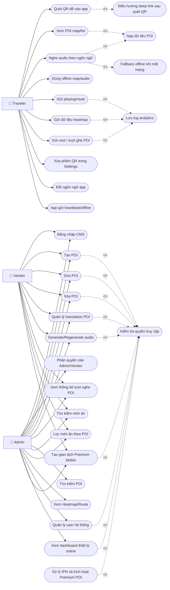

### 11.2 Use Case nhóm CMS (chi tiết theo vai trò)
```mermaid
flowchart TB
    V["👤 Vendor"]
    AD["👤 Admin"]

    C1([Create POI])
    C2([Update POI])
    C3([Delete POI])
    C4([Manage Translation])
    C5([Generate Audio])
    C6([Regenerate Audio])
    C7([Search Food])
    C8([Filter Food by POI])
    C9([View Play Logs])
    C10([View Heatmap/Route])
    C11([Manage Users])
    C12([Create Food])
    C13([Read Food])
    C14([Update Food])
    C15([Delete Food])
    C16([View Online Devices])
    C17([Create Premium Payment MoMo])
    C18([Handle MoMo Return and IPN])
    C19([Poll/Confirm Payment Order Status])
    C20([Queue MoMo Create Payment Worker])
    C21([Queue Audio Listen Ingestion])

    V --> C1
    V --> C2
    V --> C3
    V --> C4
    V --> C5
    V --> C6
    V --> C7
    V --> C8
    V --> C9
    V --> C12
    V --> C13
    V --> C14
    V --> C15
    V --> C17

    AD --> C1
    AD --> C2
    AD --> C3
    AD --> C4
    AD --> C5
    AD --> C6
    AD --> C7
    AD --> C8
    AD --> C9
    AD --> C10
    AD --> C11
    AD --> C12
    AD --> C13
    AD --> C14
    AD --> C15
    AD --> C16
    AD --> C17
    AD --> C18
    AD --> C19
    AD --> C20
    AD --> C21
    V --> C19
    V --> C20
```

## 12. Sequence diagram
### 12.1 Đăng nhập và phân quyền (Admin)
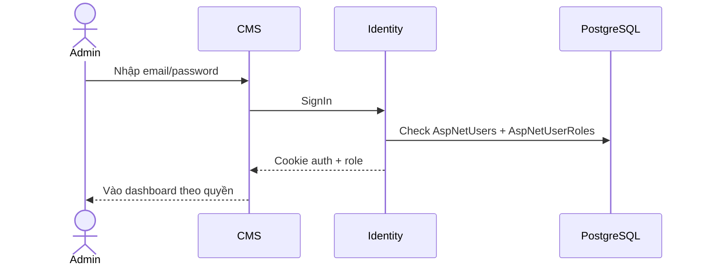

### 12.2 Tạo POI (Admin/Vendor)
Luồng **Vendor** trên CMS: sau form **Create**, hệ thống lưu **draft** vào session → trang **CreateConfirm** (phí `PoiCreation:FixedVendorCreateChargeVnd`, số dư ví) → **POST CreateConfirmPost** mở transaction: **`TryDebitAsync` (mã `poi_create`) trước**, chỉ khi trừ ví thành công mới **Insert `Poi`** rồi sinh translation + TTS + Cloudinary trong cùng transaction (đủ ví = “đã thanh toán phí” xong mới có bản ghi POI). **Admin** không qua ví: **POST Create** ghi `Poi` trực tiếp (không gọi `CreateTranslationsAndAudio` ngay trong action Create — khác Vendor).

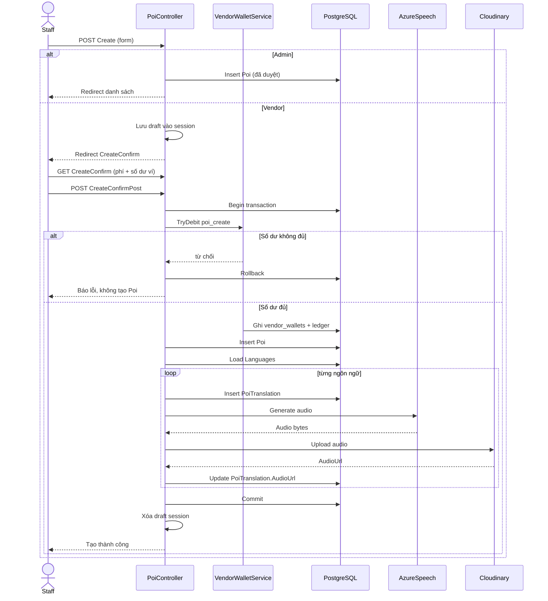

### 12.3 Sửa POI (Admin/Vendor)
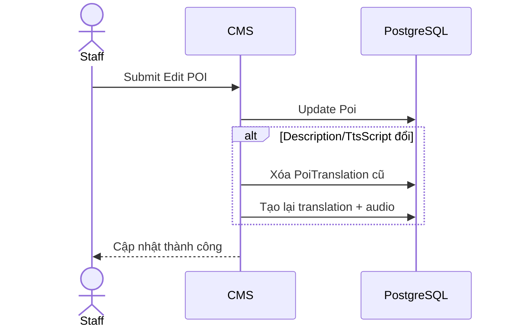

### 12.4 Xóa POI (Admin/Vendor)
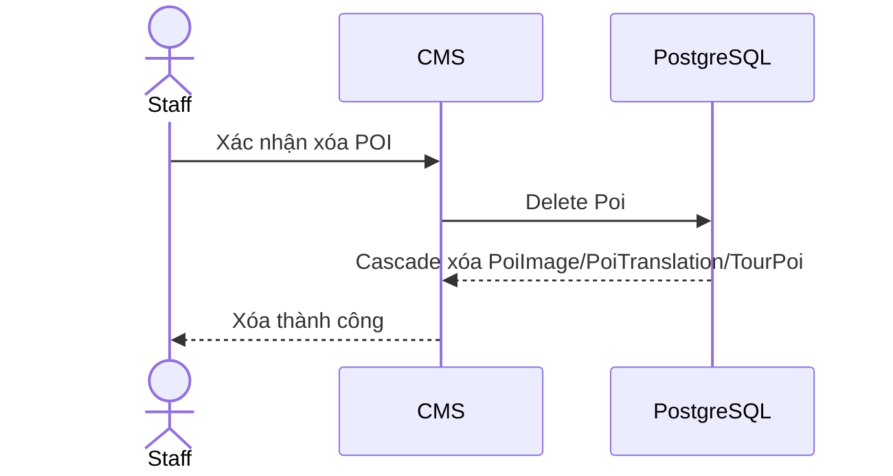

### 12.5 Quản lý translation POI
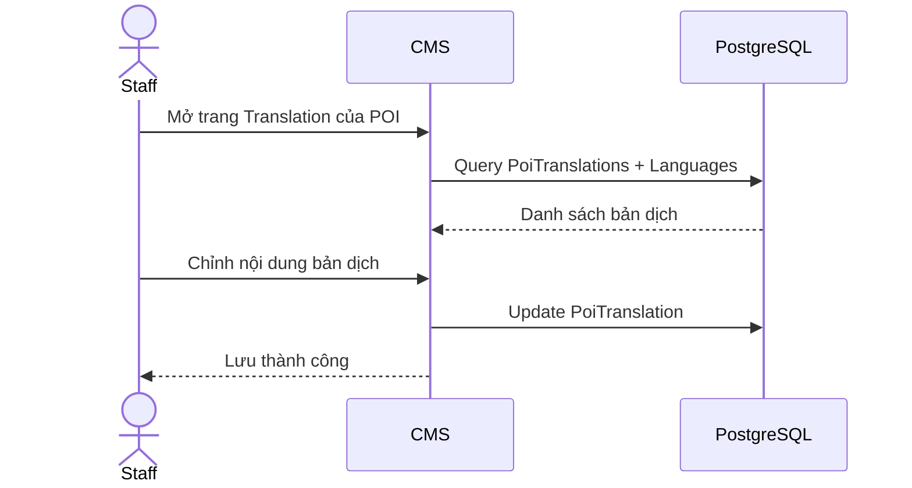

### 12.6 Generate/Regenerate audio
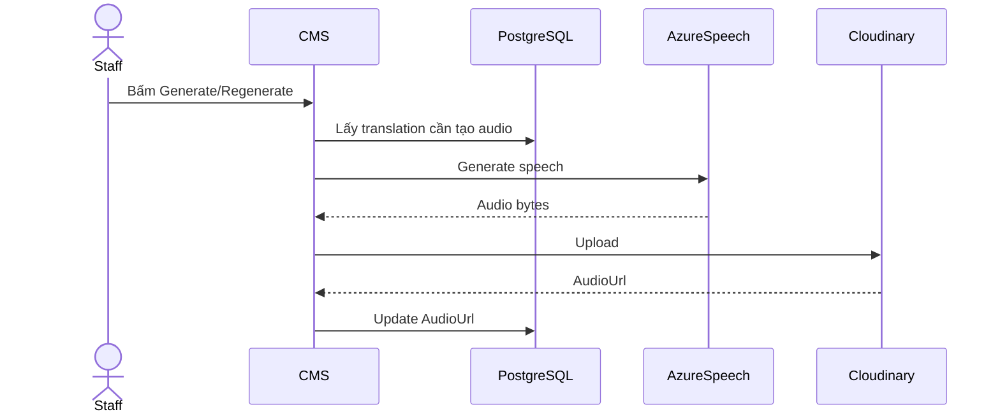

### 12.7 Xem lượt nghe POI (Admin/Vendor)
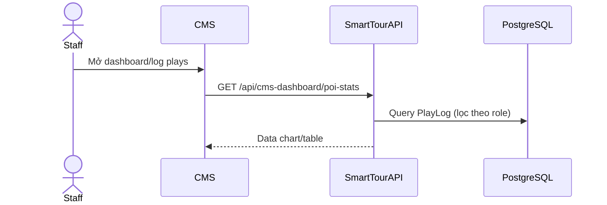

### 12.8 Tìm kiếm POI (Admin)
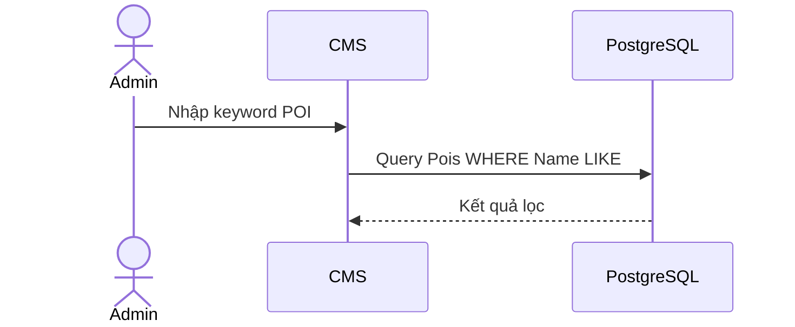

### 12.9 Tìm kiếm thức ăn (Admin/Vendor)
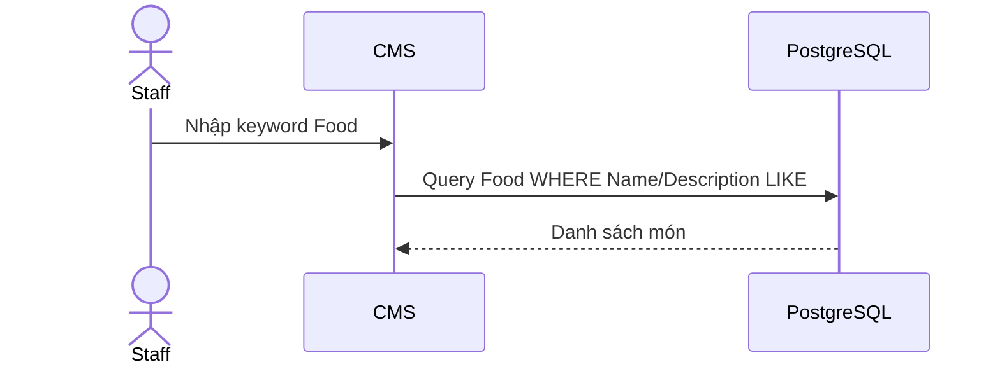

### 12.10 Lọc thức ăn theo POI (Admin/Vendor)
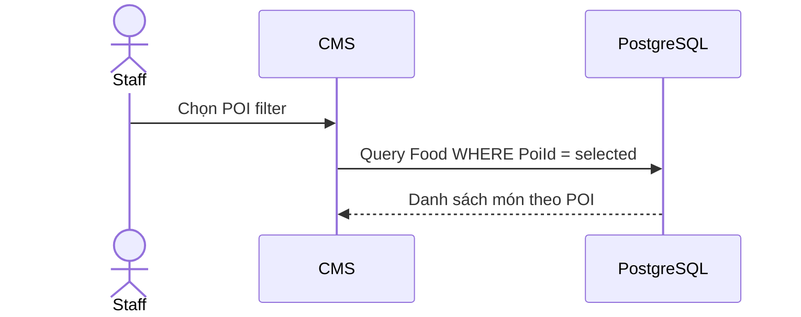

### 12.11 Xem Heatmap và Route (Admin)


### 12.12 Quản lý user hệ thống (Admin)
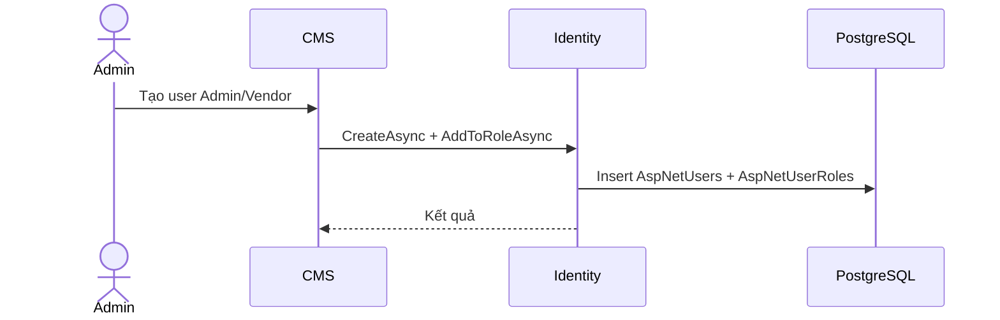

### 12.13 Quét QR để vào app (Traveler)
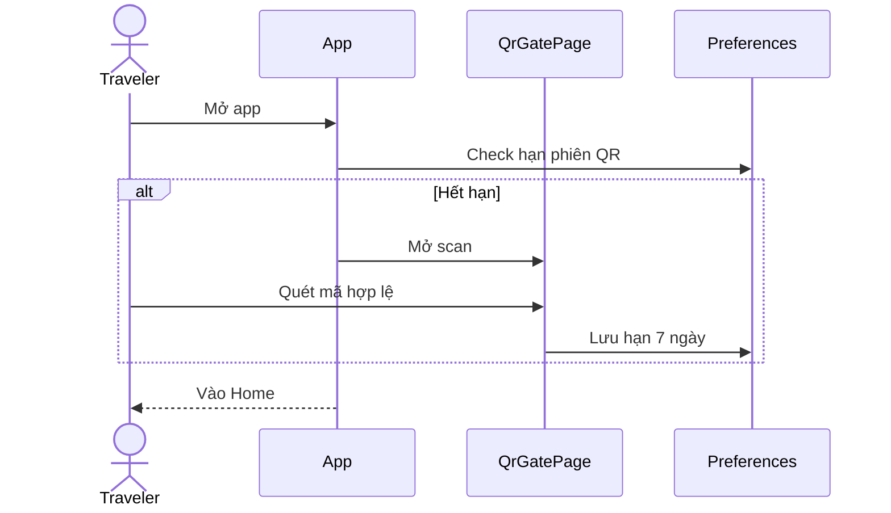

### 12.14 Xem POI trên map/list (Traveler)
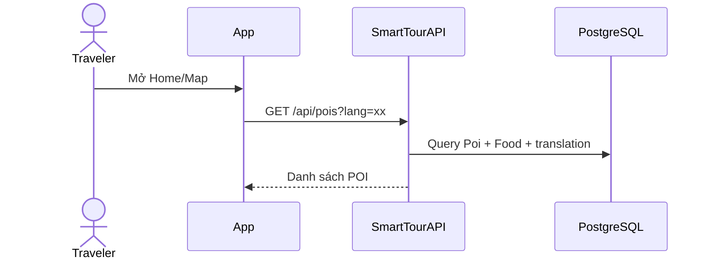

### 12.15 Nghe audio theo ngôn ngữ (Traveler)


### 12.16 Dùng offline map/audio (Traveler)
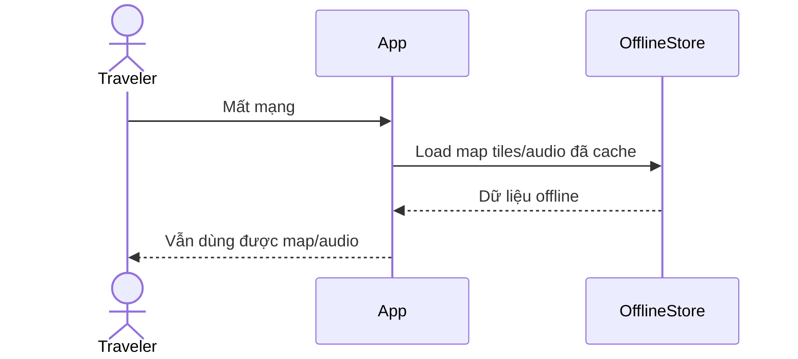

### 12.17 Gửi playlog và route (Traveler)
```mermaid
sequenceDiagram
    actor T as Traveler
    participant APP as App
    participant API as SmartTourAPI
    participant DB as PostgreSQL
    T->>APP: Nghe audio/di chuyển
    APP->>API: POST /api/pois/playlog
    APP->>API: POST /api/routes/session
    API->>DB: Insert PlayLog/RouteSession
```

### 12.17b Gửi visit lượt ghé POI (Traveler — async ingestion)
```mermaid
sequenceDiagram
    actor T as Traveler
    participant APP as App
    participant API as SmartTourAPI
    participant Q as VisitLogQueue
    participant W as VisitLogWorker
    participant DB as PostgreSQL
    T->>APP: Vào vùng / chọn POI map / quét QR POI
    APP->>API: POST /api/analytics/visit (visitType, lat, lng, userId)
    API->>Q: TryEnqueue
    API-->>APP: 202 Accepted (không chờ DB)
    loop Worker
      W->>Q: Read + gom batch ≤10 / 500ms
      W->>DB: Insert visit_logs (VisitTime theo lô)
    end
```

### 12.18 Create Food (Admin/Vendor)
```mermaid
sequenceDiagram
    actor U as Staff
    participant CMS as CMS
    participant DB as PostgreSQL
    U->>CMS: Nhập form tạo Food
    CMS->>DB: Insert Food
    CMS->>DB: Insert/Upsert FoodTranslation
    CMS-->>U: Tạo thành công
```

### 12.19 Read Food (Admin/Vendor)
```mermaid
sequenceDiagram
    actor U as Staff
    participant CMS as CMS
    participant DB as PostgreSQL
    U->>CMS: Mở màn hình Food
    CMS->>DB: Query Food + Poi
    DB-->>CMS: Danh sách Food
```

### 12.20 Update Food (Admin/Vendor)
```mermaid
sequenceDiagram
    actor U as Staff
    participant CMS as CMS
    participant DB as PostgreSQL
    U->>CMS: Sửa thông tin Food
    CMS->>DB: Update Food
    CMS->>DB: Upsert FoodTranslation
    CMS-->>U: Cập nhật thành công
```

### 12.21 Delete Food (Admin/Vendor)
```mermaid
sequenceDiagram
    actor U as Staff
    participant CMS as CMS
    participant DB as PostgreSQL
    U->>CMS: Bấm xóa Food
    CMS->>DB: Delete FoodTranslation theo FoodId
    CMS->>DB: Delete Food
    CMS-->>U: Xóa thành công
```

### 12.22 Xóa phiên QR trong Settings (Traveler)
```mermaid
sequenceDiagram
    actor T as Traveler
    participant APP as SettingsPage
    participant PREF as Preferences
    T->>APP: Bấm xóa phiên QR
    APP->>PREF: Clear QrGateUntil
    APP-->>T: Lần mở sau bắt buộc quét lại
```

### 12.23 Đổi ngôn ngữ app (Traveler)
```mermaid
sequenceDiagram
    actor T as Traveler
    participant APP as SettingsPage
    participant PREF as Preferences
    participant REPO as PoiRepository
    T->>APP: Chọn ngôn ngữ mới
    APP->>PREF: Save lang
    APP->>REPO: Clear cache POI
    APP-->>T: Reload UI theo ngôn ngữ mới
```

### 12.24 Theo dõi thiết bị online trên CMS (Admin)
```mermaid
sequenceDiagram
    actor U as Admin
    participant CMS as CMS
    participant API as SmartTourAPI
    participant DB as PostgreSQL
    U->>CMS: Mở Dashboard
    CMS->>API: GET /api/cms-dashboard/device-status
    API->>DB: Query DevicePresences + tính IsActive theo LastSeenUtc
    API-->>CMS: Online count + danh sách thiết bị
    loop mỗi 3 giây
      CMS->>API: Refresh device-status
      API-->>CMS: Dữ liệu mới
    end
```

### 12.25 App gửi heartbeat/offline (Traveler)
```mermaid
sequenceDiagram
    actor T as Traveler
    participant APP as App
    participant API as SmartTourAPI
    participant DB as PostgreSQL
    T->>APP: Mở app
    APP->>API: POST /api/presence/heartbeat
    API->>DB: Upsert DevicePresence + LastSeenUtc
    loop mỗi 10 giây
      APP->>API: POST /api/presence/heartbeat
      API->>DB: Update LastSeenUtc
    end
    T->>APP: Tắt app/OnSleep
    APP->>API: POST /api/presence/offline
    API->>DB: Set LastSeenUtc cũ để mark offline
```

### 12.26 Vendor mua Premium bằng ví (CMS → Backend API)
```mermaid
sequenceDiagram
    actor V as Vendor
    participant CMS as PremiumCMS
    participant API as VendorPremiumController
    participant PW as PremiumWalletPurchaseService
    participant DB as PostgreSQL
    V->>CMS: Chọn POI + gói, bấm Thanh toán bằng ví
    CMS->>API: POST /api/vendor/premium/purchase-premium-wallet-cms (+ X-Internal-Key)
    API->>PW: TryPurchaseWithWalletAsync
    PW->>DB: Debit vendor_wallets + ledger, gia hạn Poi Premium
    API-->>CMS: success + balanceVnd
    CMS-->>V: Thông báo thành công
```

### 12.27 Nhận IPN MoMo (API) — cập nhật đơn `VendorPremiumOrder`
```mermaid
sequenceDiagram
    participant MOMO as MoMoGateway
    participant API as VendorPremiumController
    participant DB as PostgreSQL
    MOMO->>API: POST /api/vendor/premium/momo-ipn
    API->>API: Verify signature
    alt Chữ ký hợp lệ và resultCode=0
      API->>DB: Update VendorPremiumOrder paid / credit wallet nếu wallet_topup
      API->>DB: Update Poi Premium nếu đơn premium POI
      API-->>MOMO: Ack ok
    else Sai chữ ký hoặc fail
      API->>DB: Update order failed + LastError
      API-->>MOMO: Ack signature invalid/fail
    end
```

### 12.28 Xếp hàng tạo thanh toán MoMo và xử lý nền (nạp ví / POI premium qua API)
```mermaid
sequenceDiagram
    actor U as User
    participant CL as CMS Wallet hoặc client tích hợp
    participant API as VendorPremiumController
    participant Q as MoMoPaymentQueue
    participant W as MoMoPaymentWorker
    participant MOMO as MoMoGateway
    participant DB as PostgreSQL
    alt Nạp ví vendor
      U->>CL: Bấm nạp ví (WalletController)
      CL->>API: POST /api/vendor/premium/wallet/create-topup-cms
    else POI premium qua MoMo (khi client gọi CMS proxy)
      U->>CL: Tích hợp gọi create-payment-cms
      CL->>API: POST /api/vendor/premium/create-payment-cms
    end
    API->>DB: Insert VendorPremiumOrder (queued / pending)
    API->>Q: TryEnqueue(orderId)
    alt Queue full
      API->>DB: Mark failed (queue_full)
      API-->>CL: 429 server busy
    else Enqueue thành công
      API-->>CL: 202 Accepted (queued=true)
      W->>Q: Read job
      W->>DB: Update status creating_provider
      W->>MOMO: POST create payment
      alt MoMo trả payUrl/deeplink/qrCodeUrl hợp lệ
        W->>DB: Update status awaiting_payment + lưu payload
      else MoMo lỗi
        W->>DB: Update status failed + LastError
      end
    end
```

### 12.29 CMS polling trạng thái đơn Premium và đối soát provider
```mermaid
sequenceDiagram
    actor U as Staff
    participant RET as Return/Checkout Page
    participant CMS as PremiumController
    participant API as VendorPremiumController
    participant MOMO as MoMoGateway
    participant DB as PostgreSQL
    loop Polling định kỳ
      RET->>CMS: GET /Premium/GetPaymentStatus?orderId=...
      CMS->>API: POST /api/vendor/premium/order-status-cms
      API->>DB: Load VendorPremiumOrder
      alt forceProviderCheck = true và chưa paid
        API->>MOMO: POST query status
        MOMO-->>API: resultCode + transId
        API->>DB: Sync trạng thái paid/failed
      end
      API->>DB: Đọc Poi premium state
      API-->>CMS: status + payUrl + premiumExpiresAt
      CMS-->>RET: JSON trạng thái mới
    end
```

### 12.30 Ghi nhận lượt nghe audio qua hàng đợi ingestion
```mermaid
sequenceDiagram
    actor APP as MobileApp
    participant API as AnalyticsController
    participant ING as AudioListenIngestionService
    participant Q as ChannelQueue
    participant W as AudioListenIngestionWorker
    participant DB as PostgreSQL
    APP->>API: POST /api/analytics/poi-audio-listen
    API->>API: Validate payload + threshold nghe
    API->>ING: TryEnqueue(poiId, duration, deviceId)
    alt duplicate_window_15s hoặc queue_full
      ING-->>API: accepted=false + reason
      API-->>APP: accepted=false
    else accepted
      ING->>Q: Push event
      API-->>APP: accepted=true, queued=true
      W->>Q: Read batch events
      W->>DB: Bulk insert PoiAudioListenEvents
    end
```

## 13. Activity diagram
### 13.1 Đăng nhập và phân quyền (Admin)
```mermaid
flowchart TD
    A[Nhap tai khoan] --> B[Xac thuc Identity]
    B --> C{Dung thong tin}
    C -- Không --> A
    C -- Có --> D[Load role]
    D --> E[Dieu huong dashboard theo role]
```

### 13.2 Tạo POI
```mermaid
flowchart TD
    A[Vào form Create] --> B[Nhập thông tin POI]
    B --> C{Hợp lệ?}
    C -- Không --> B
    C -- Có --> D{Admin?}
    D -- Có --> E[Lưu Poi vào DB]
    E --> Z[Kết thúc]
    D -->|Vendor| F[Lưu draft session]
    F --> G[Trang CreateConfirm: phí + số dư ví]
    G --> H{Đủ ví?}
    H -- Không --> I[Thông báo / nạp ví]
    I --> G
    H -- Có --> J[POST xác nhận: transaction]
    J --> K[Trừ ví poi_create]
    K --> L{Trừ thành công?}
    L -- Không --> M[Rollback: không có Poi]
    M --> G
    L -- Có --> N[Insert Poi + translation + TTS + Cloudinary]
    N --> O[Commit + xóa draft]
    O --> P[Kết thúc]
```

### 13.3 Sửa POI
```mermaid
flowchart TD
    A[Mở Edit] --> B[Sửa trường dữ liệu]
    B --> C{Dữ liệu hợp lệ?}
    C -- Không --> B
    C -- Có --> D[Update POI]
    D --> E{Mô tả đổi?}
    E -- Có --> F[Tạo lại translation/audio]
    E -- Không --> G[Giữ nguyên translation]
    F --> H[Kết thúc]
    G --> H
```

### 13.4 Xóa POI
```mermaid
flowchart TD
    A[Bấm xóa] --> B[Xác nhận]
    B --> C{Có quyền?}
    C -- Không --> D[Từ chối]
    C -- Có --> E[Delete POI]
    E --> F[Cascade xóa bản ghi liên quan]
    F --> G[Kết thúc]
```

### 13.5 Quản lý Translation
```mermaid
flowchart TD
    A[Mở trang Translation] --> B[Chọn ngôn ngữ]
    B --> C[Sửa Title/Description/TtsScript]
    C --> D[Save]
    D --> E[Kết thúc]
```

### 13.6 Generate/Regenerate audio
```mermaid
flowchart TD
    A[Bấm Generate/Regenerate] --> B[Lấy translation]
    B --> C[Gọi Azure Speech]
    C --> D[Upload Cloudinary]
    D --> E[Update AudioUrl]
    E --> F[Kết thúc]
```

### 13.7 Xem lượt nghe POI
```mermaid
flowchart TD
    A[Mở dashboard] --> B[Gọi API thống kê]
    B --> C[Lọc dữ liệu theo role]
    C --> D[Vẽ chart/table]
    D --> E[Kết thúc]
```

### 13.8 Tìm kiếm POI
```mermaid
flowchart TD
    A[Nhập từ khóa] --> B[Query POI theo tên]
    B --> C[Hiển thị kết quả]
    C --> D[Kết thúc]
```

### 13.9 Tìm kiếm thức ăn
```mermaid
flowchart TD
    A[Nhập từ khóa món ăn] --> B[Query Food Name/Description]
    B --> C[Render danh sách]
    C --> D[Kết thúc]
```

### 13.10 Lọc thức ăn theo POI
```mermaid
flowchart TD
    A[Chọn POI trong filter] --> B[Query Food theo PoiId]
    B --> C[Hiển thị danh sách lọc]
    C --> D[Kết thúc]
```

### 13.11 Xem Heatmap/Route
```mermaid
flowchart TD
    A[Admin mở Heatmap] --> B[Gọi API heatmap/route]
    B --> C[Nhận dữ liệu]
    C --> D[Vẽ map + chỉ số]
    D --> E[Kết thúc]
```

### 13.12 Quản lý user hệ thống
```mermaid
flowchart TD
    A[Admin mở User module] --> B{Tạo/Sửa role?}
    B -- Tạo --> C[Create user + assign role]
    B -- Sửa --> D[Update role/trạng thái]
    C --> E[Kết thúc]
    D --> E
```

### 13.13 Quét QR để vào app
```mermaid
flowchart TD
    A[App start] --> B{Phiên QR còn hạn?}
    B -- Có --> C[Vào Home]
    B -- Không --> D[Mở scanner]
    D --> E{QR hợp lệ?}
    E -- Không --> D
    E -- Có --> F[Lưu hạn 7 ngày]
    F --> C
```

### 13.14 Xem POI trên map/list
```mermaid
flowchart TD
    A[Mở Home/Map] --> B[Tải danh sách POI]
    B --> C[Render marker/list]
    C --> D[Chọn POI]
    D --> E[Kết thúc]
```

### 13.15 Nghe audio theo ngôn ngữ
```mermaid
flowchart TD
    A[Chọn POI] --> B[Lấy tracks theo ngôn ngữ]
    B --> C{Có audio cloud?}
    C -- Có --> D[Play cloud]
    C -- Không --> E[Play local/TTS fallback]
    D --> F[Kết thúc]
    E --> F
```

### 13.16 Dùng offline map/audio
```mermaid
flowchart TD
    A[Mất mạng] --> B[Đọc cache map/audio]
    B --> C[Hoạt động offline]
    C --> D[Kết thúc]
```

### 13.17 Gửi playlog/route
```mermaid
flowchart TD
    A[Nghe audio/di chuyển] --> B[Ghi dữ liệu]
    B --> C{Online?}
    C -- Có --> D[Gửi API ngay]
    C -- Không --> E[Queue pending]
    D --> F[Kết thúc]
    E --> F
```

### 13.18 Create Food
```mermaid
flowchart TD
    A[Mo form Create Food] --> B[Nhap du lieu]
    B --> C{Hop le}
    C -- Khong --> B
    C -- Co --> D[Luu Food + FoodTranslation]
    D --> E[Ket thuc]
```

### 13.19 Read Food
```mermaid
flowchart TD
    A[Mo trang Food] --> B[Query danh sach]
    B --> C[Hien thi bang Food]
    C --> D[Ket thuc]
```

### 13.20 Update Food
```mermaid
flowchart TD
    A[Mo Edit Food] --> B[Sua thong tin]
    B --> C{Hop le}
    C -- Khong --> B
    C -- Co --> D[Update Food + translation]
    D --> E[Ket thuc]
```

### 13.21 Delete Food
```mermaid
flowchart TD
    A[Bam xoa Food] --> B[Xac nhan]
    B --> C[Delete translation]
    C --> D[Delete Food]
    D --> E[Ket thuc]
```

### 13.22 Xóa phiên QR trong Settings
```mermaid
flowchart TD
    A[Vao Settings] --> B[Bam xoa phien QR]
    B --> C[Clear QrGateUntil]
    C --> D[Ket thuc]
```

### 13.23 Đổi ngôn ngữ app
```mermaid
flowchart TD
    A[Vao Settings] --> B[Chon ngon ngu]
    B --> C[Luu setting lang]
    C --> D[Clear cache]
    D --> E[Reload UI]
```

### 13.24 Theo dõi thiết bị online trên Dashboard
```mermaid
flowchart TD
    A[Admin mở Dashboard] --> B[Gọi API device-status]
    B --> C[Tính online theo LastSeenUtc]
    C --> D[Render số online + bảng thiết bị]
    D --> E[Tự refresh định kỳ]
    E --> F[Kết thúc]
```

### 13.25 Heartbeat/offline từ App
```mermaid
flowchart TD
    A[App khởi động] --> B[Gửi heartbeat]
    B --> C[Cập nhật LastSeenUtc]
    C --> D[Lặp heartbeat 10 giây]
    D --> E[App sleep/thoát]
    E --> F[Gửi offline]
    F --> G[Dashboard hiển thị offline]
```

### 13.26 Premium trên CMS (Admin vs Vendor)
```mermaid
flowchart TD
    A[Vào màn Premium] --> B[Chọn POI và gói]
    B --> C{Vai trò?}
    C -- Admin --> D[Áp dụng gói: cập nhật Poi trực tiếp]
    C -- Vendor --> E[Thanh toán bằng ví: gọi API purchase-premium-wallet-cms]
    D --> H[Kết thúc]
    E --> H
```

### 13.27 Nhận IPN MoMo (API) — đơn ví hoặc premium POI
```mermaid
flowchart TD
    A[MoMo gửi IPN tới API] --> B[Verify signature]
    B --> C{Hợp lệ và thành công?}
    C -- Không --> D[Đánh dấu order failed]
    C -- Có --> E[Đánh dấu order paid]
    E --> F{Có phải wallet_topup?}
    F -- Có --> G[Cộng số dư vendor_wallets + ledger]
    F -- Không --> I[Cập nhật Premium POI nếu đơn premium]
    G --> J[Kết thúc]
    I --> J
    D --> J
```

### 13.28 Queue tạo thanh toán MoMo
```mermaid
flowchart TD
    A[User bấm tạo payment] --> B[API tạo order pending]
    B --> C{TryEnqueue thành công?}
    C -- Không --> D[Order failed queue_full + trả 429]
    C -- Có --> E[Trả queued cho CMS]
    E --> F[Worker lấy job]
    F --> G[Gọi MoMo create]
    G --> H{MoMo trả URL hợp lệ?}
    H -- Có --> I[Order awaiting_payment]
    H -- Không --> J[Order failed + LastError]
    I --> K[Kết thúc]
    J --> K
    D --> K
```

### 13.29 Polling trạng thái đơn Premium
```mermaid
flowchart TD
    A[Checkout/Return poll status] --> B[CMS gọi order-status-cms]
    B --> C[API đọc order]
    C --> D{Force provider check?}
    D -- Có --> E[Gọi MoMo query]
    E --> F[Sync paid or failed]
    D -- Không --> G[Giữ trạng thái DB]
    F --> H[Trả status + premium info]
    G --> H
    H --> I[UI cập nhật trạng thái]
```

### 13.30 Queue ingestion lượt nghe audio
```mermaid
flowchart TD
    A[App gửi poi-audio-listen] --> B[Validate payload + ngưỡng nghe]
    B --> C{Qua dedup 15s?}
    C -- Không --> D[Reject duplicate]
    C -- Có --> E{Queue còn chỗ?}
    E -- Không --> F[Reject queue full]
    E -- Có --> G[Accept queued=true]
    G --> H[Worker gom batch]
    H --> I[Insert PoiAudioListenEvents]
    D --> J[Kết thúc]
    F --> J
    I --> J
```

### 13.31 Visit log ingestion (queue + worker)
```mermaid
flowchart TD
    A[App/CMS: POST /api/analytics/visit] --> B{poiId hợp lệ?}
    B -- Không --> C[400 invalid_poi]
    B -- Có --> D[Resolve UserId: JWT claim hoặc body]
    D --> E{TryEnqueue channel?}
    E -- Không --> F[503 queue_unavailable]
    E -- Có --> G[202 Accepted Visit queued]
    G --> H[VisitLogWorker: ReadAsync + cửa sổ 500ms]
    H --> I[Gom tối đa 10 bản ghi]
    I --> J[VisitTime = UtcNow tại flush]
    J --> K{Batch SaveChanges OK?}
    K -- Có --> L[Kết thúc]
    K -- Không --> M[Log warning + insert từng dòng]
    M --> L
```

### 13.32 Auto-play narration (FIFO + ưu tiên manual)
```mermaid
flowchart TD
    A[Kích hoạt geofence: POI] --> B{Cooldown 5 phút?}
    B -- Có --> C[NarrationCompleted SkippedCooldown + bỏ phát]
    B -- Không --> D{Trùng current hoặc đã trong queue?}
    D -- Có --> E[Bỏ qua enqueue]
    D -- Không --> F{Đang có bản phát auto?}
    F -- Có --> G[Enqueue cuối FIFO]
    F -- Không --> H[PlayInternal ngay]
    H --> I[ProcessQueue tuần tự]
    G --> J[Tick kết thúc — chờ lượt phát]
    U[User: PlayManual] --> K[Hủy CTS + xóa queue + chờ idle ≤1s]
    K --> L[Phát POI chọn ngay]
```

## 14. Data Flow Diagram (DFD Level 1)
```mermaid
flowchart LR
    Traveler[Traveler]
    Vendor[Vendor/Admin]

    P1((P1 Xác thực vào app bằng QR))
    P2((P2 Tiêu thụ nội dung POI))
    P3((P3 Ghi nhận analytics))
    P4((P4 Quản trị nội dung CMS))
    P5((P5 Tạo/Sinh lại audio))
    P6((P6 Đồng bộ dữ liệu offline))
    P7((P7 Quản lý Food))

    D1[(D1 Session QR 7 ngày)]
    D2[(D2 Master Data POI/Food/Language)]
    D3[(D3 Audio URLs + Media)]
    D4[(D4 PlayLog/VisitLog/Heatmap/Route)]
    D5[(D5 Local cache map/audio)]
    D6[(D6 Master Data Food)]

    EXT1[(Azure Speech)]
    EXT2[(Cloudinary)]
    EXT3[(PostgreSQL)]

    Traveler --> P1
    Traveler --> P2
    Traveler --> P3
    Traveler --> P6
    Vendor --> P4
    Vendor --> P5
    Vendor --> P7

    P1 <--> D1
    P2 <--> D2
    P2 <--> D3
    P2 <--> D5
    P3 <--> D4
    P4 <--> D2
    P5 <--> D3
    P6 <--> D4
    P6 <--> D5
    P7 <--> D6

    P4 <--> EXT3
    P5 <--> EXT1
    P5 <--> EXT2
    P3 <--> EXT3
    P2 <--> EXT3
    P7 <--> EXT3
```

## 15. UI wireframe (MVP)
### 15.1 App Mobile
- **LoadingPage:** kiểm tra phiên QR và điều hướng đầu vào.
- **QrGatePage:** camera scan QR, thông báo hợp lệ/không hợp lệ.
- **HomePage:** vào nhanh map và cài đặt.
- **MapPage:** bản đồ + marker POI + vị trí hiện tại.
- **PoiListPage:** danh sách POI có lọc/sắp xếp.
- **PoiDetailPage:** nội dung POI, bản dịch, play/pause audio.
- **SettingsPage:** nút xóa phiên QR 7 ngày để test.

### 15.2 CMS Web
- **Login/Role UI:** đăng nhập, phân quyền.
- **POI/Index:** danh sách POI, thao tác sửa/xóa/tạo lại audio; Vendor tạo POI có **trừ phí ví** (`PoiCreation:FixedVendorCreateChargeVnd`).
- **POI/Create/Edit:** thông tin chính, mô tả, tọa độ, ảnh.
- **Food/Index & Food/Create/Edit:** CRUD điểm ăn uống, vị trí, mô tả, ảnh.
- **Translation/Details:** xem bản dịch và nghe audio từng ngôn ngữ.
- **Log/Plays:** lịch sử nghe (`PlayLog`), phân trang.
- **Premium/Index:** chọn POI + gói; **Admin** áp dụng trực tiếp; **Vendor** thanh toán bằng ví; giá gói từ **`MoMo:PackagePrice`** (fallback trong code).
- **Wallet/Index** (Vendor): số dư, nạp ví MoMo (checkout dùng view chung với Premium).
- **Heatmap/Index:** bản đồ nhiệt và số liệu quan tâm.
- **Load test/Index & GeofenceSimulator:** `Index` có **Bulk visit (stress)** (song song `api/analytics/visit`, `SIM-BULK-*`); `GeofenceSimulator` mô phỏng geofence đa thiết bị, proxy visit (có thể kèm `speedKmh`), poll `visit_logs`, lưu client log qua `ILogRunner`; panel log audio **full width** dưới bản đồ, xem file log bằng **modal** (xem mục 4.2, 16.9, 21.1).

## 16. API overview (đã triển khai trong repo)
### 16.1 POI
- `GET /api/pois` (query tùy chọn: `lang`, `q`, `lat`, `lng`, `maxDistanceKm` — app thường tải danh sách rồi cache/local; **không** có `GET /api/pois/{id}` chỉ một POI)
- `GET /api/pois/{poiId}/tts-all`
- `POST /api/pois/playlog`
- `GET /api/pois/stats` (tổng hợp theo POI)
- `GET /api/pois/{poiId}/stats` (tối đa 100 lượt gần nhất cho một POI)

### 16.2 Audio
- `GET /api/audio/poi/{poiId}`
- `POST /api/audio/poi/{poiId}/regenerate`
- `POST /api/audio/translation/{translationId}/generate`

### 16.3 Route/Heatmap
- `POST /api/routes/session`
- `GET /api/routes/popular`
- `GET /api/routes/stats` (thống kê route session — có trong `RouteSessionController`)
- `POST /api/heatmap/entry`
- `GET /api/heatmap`
- `GET /api/heatmap/{poiId}` (heatmap theo một POI)

### 16.4 Food
- `GET /api/foods`
- `GET /api/foods/menu/{poiId}?lang={code}` (app lấy menu theo POI và ngôn ngữ)

### 16.5 Presence và dashboard JSON (trên **SmartTourCMS**, cookie)
- `POST /api/presence/heartbeat` (Backend **SmartTourAPI**)
- `POST /api/presence/offline` (Backend)
- `GET /api/cms-dashboard/device-status` (**CMS** `HomeController`, Admin; JSON thiết bị online/offline)
- `GET /api/cms-dashboard/poi-stats` (**CMS**, Admin/Vendor — thống kê lượt nghe theo POI cho biểu đồ)

### 16.6 Premium / MoMo / ví Vendor
- `POST /api/vendor/premium/status` (JWT; body `poiId` — trạng thái Premium còn hạn của POI)
- `GET /Premium` (CMS MVC, không REST API)
- `POST /Premium/CreatePayment` (CMS — Admin: áp DB; Vendor: proxy ví)
- `GET /payment/return` (CMS)
- `POST /api/vendor/premium/momo-ipn` (API — webhook MoMo; cập nhật `wallet_topup` hoặc đơn premium POI)
- `GET /Premium/GetPaymentStatus?orderId=...&forceProviderCheck=...` (CMS)
- `POST /api/vendor/premium/create-payment`
- `POST /api/vendor/premium/create-payment-cms` (internal key; dùng khi tích hợp cần tạo đơn MoMo POI premium — **không** phải nút mặc định trên `Premium/Index` hiện tại)
- `POST /api/vendor/premium/order-status`
- `POST /api/vendor/premium/order-status-cms`
- `POST /api/vendor/premium/wallet/balance`
- `POST /api/vendor/premium/wallet/create-topup`
- `POST /api/vendor/premium/wallet/create-topup-cms` (internal key; CMS **Ví vendor**)
- `POST /api/vendor/premium/purchase-premium-wallet`
- `POST /api/vendor/premium/purchase-premium-wallet-cms` (internal key; CMS Vendor mua gói)

### 16.7 Auth/Device Token
- `POST /api/auth/device-token`

### 16.8 Analytics Ingestion
- `POST /api/analytics/poi-audio-listen` (JWT; ingestion queue + worker → `poi_audio_listen_events`)
- `GET /api/analytics/poi-audio-listen-stats` (Admin)
- `POST /api/analytics/visit` (**AllowAnonymous** + rate limit `DeviceTokenPolicy`; **202 Accepted** `{ message: "Visit queued" }` sau enqueue; `poiId <= 0` → 400; queue đầy / kênh đóng → 503; body có thể có **`speedKmh`**)

### 16.9 CMS (cookie Admin) — Load test & hàng đợi file log

Các route sau nằm trên **SmartTourCMS**, `[Authorize(Roles = "Admin")]`, không thuộc tiền tố `/api` của Backend:

| Route | Phương thức | Mô tả ngắn |
| --- | --- | --- |
| `/LoadTest/Index` | GET | Trang giới thiệu + **Bulk visit (stress)** + link vào Geofence Simulator |
| `/LoadTest/RunBulkVisit` | POST | JSON `{ deviceCount (1–200), poiId }` → N lần `POST /api/analytics/visit` song song (`SIM-BULK-###`, lat/lng `0`, `MapClick`); JSON kết quả: `acceptedHttp`, `httpStatusCounts`, `firstFailure`, `hint` |
| `/LoadTest/GeofenceSimulator` | GET | Trang Leaflet + JS giả lập |
| `/LoadTest/POIs` | GET | JSON cụm POI + tier giả lập (`clusterSize` 3–12) |
| `/LoadTest/FireGeofenceVisit` | POST | JSON body → proxy `POST /api/analytics/visit` (HttpClient `SmartTourApi`) |
| `/LoadTest/RecentVisitLogs` | GET | JSON `visit_logs` (user `SIM-*`) |
| `/LoadTest/SaveSimulatorLog` | POST | JSON `{ text, sessionId?, append? }` → `ILogRunner` |
| `/LoadTest/DownloadQueueLog` | GET | Tải file `logqueue.txt` |
| `/LoadTest/ReadQueueLog` | GET | JSON `{ ok, path, text }` |
| `/AdminLogQueue/Simulator` | GET | **302** → `LoadTest/GeofenceSimulator#gf-log-audio-panel` (UI log gộp một chỗ) |
| `/AdminLogQueue/Download` | GET | Tải `logqueue.txt` (cùng file `ILogRunner`; không qua menu sidebar) |
| `/AdminLogQueue/Text` | GET | JSON nội dung file |
| `/AdminLogQueue/Overwrite` | POST | Ghi đè file (JSON body) |

**DI:** `Program.cs` — `AddSingleton<ILogRunner, FileLogRunner>()`; file mặc định `%TEMP%\SmartTour\logqueue.txt` (override `LogRunner:FilePath`).

### 16.10 Endpoint bổ sung trong repo (chưa mô tả hết ở các mục trên)
Các route sau **có trong mã**; dùng cho tour, xác thực, script/TTS pipeline, vận hành — có thể không xuất hiện trong sơ đồ MVP tối thiểu:
- **Tour (API):** `GET /api/tours`, `GET /api/tours/{id}`, `GET /api/tours/vendor/{vendorId}` (`ToursController`).
- **Auth (API):** `POST /api/auth/register`, `POST /api/auth/login`, `POST /api/auth/device-token`, `GET /api/auth/user/{id}`, `GET /api/auth/customers` (`AuthController`; một endpoint có thể yêu cầu JWT/role tùy cấu hình).
- **Vendor gửi script POI:** `POST /api/vendor/submit-script` (`VendorScriptController`).
- **Admin duyệt script / queue TTS:** `GET /api/admin/script-requests/pending`, `POST /api/admin/script-requests/{id}/approve`, `POST /api/admin/script-requests/{id}/reject` (kèm kiểm tra **`X-Admin-Key`**).
- **Admin tóm tắt job audio:** `GET /api/admin/ops/jobs/queue`, `GET /api/admin/ops/jobs/recent` (kèm **`X-Admin-Key`**).

## 17. Bảo mật và phân quyền
- Dùng Identity để xác thực và phân quyền role `Admin`, `Vendor`.
- **`LoadTest/*`, `GeofenceSimulator`, `AdminLogQueue/*`:** chỉ role **Admin** (cookie session); `FireGeofenceVisit` chỉ chấp nhận `userId` bắt đầu `SIM-` để tránh proxy visit tùy ý.
- **CMS → Backend (nạp ví / mua Premium ví):** header **`X-Internal-Key`** — CMS đọc `BackendApi:InternalKey`; API đối chiếu với **`Admin:ApiKey`** (hai giá trị phải khớp khi cấu hình).
- **API vận hành / duyệt script (Admin):** một số endpoint (`/api/admin/ops/*`, `/api/admin/script-requests/*`) yêu cầu header **`X-Admin-Key`** khớp cấu hình (xem `IAdminKeyValidator` trong code).
- Không commit key thật (`Cloudinary`, `Azure Speech`, DB).
- Dùng `.env`/biến môi trường theo từng máy.
- Validate dữ liệu đầu vào cho API (QR payload, ids, content).
- Hạn chế truy cập API nhạy cảm bằng role và policy.

## 18. Kế hoạch triển khai (Roadmap) và trạng thái
- **P1 (Hoàn thành):** nền tảng CRUD POI/Food/Translation.
- **P2 (Hoàn thành):** sinh audio tự động + regenerate.
- **P3 (Hoàn thành):** QR gate + deep link POI.
- **P4 (Hoàn thành):** offline map/audio + sync.
- **P5 (Kế tiếp):** tối ưu dashboard analytics và bộ lọc báo cáo.

## 19. Tiêu chí nghiệm thu MVP
Checklist nghiệm thu theo chức năng:
- [ ] Tạo POI sinh đủ translation theo `Languages`.
- [ ] Audio được tạo và lưu `AudioUrl` cho từng translation.
- [ ] `GET /api/pois` trả đủ danh sách POI và dữ liệu liên quan.
- [ ] QR hợp lệ mở app và vào HomePage ổn định.
- [ ] Session QR có hiệu lực 7 ngày, có thể xóa từ Settings.
- [ ] App không ANR khi quét QR.
- [ ] Offline map/audio chạy được khi tắt mạng.
- [ ] Pending queue được sync lại khi có mạng.
- [ ] CRUD Food hoạt động đủ thêm/sửa/xóa trên CMS.
- [ ] Dashboard hiển thị số thiết bị online và đổi trạng thái nhanh khi app tắt/mở.
- [ ] **Vendor — ví:** nạp MoMo thành công → số dư `vendor_wallets` tăng; ledger ghi `momo_topup`.
- [ ] **Vendor — Premium bằng ví:** đủ số dư → mua gói trên CMS → POI được gia hạn Premium; số dư giảm.
- [ ] **Admin — áp dụng Premium:** không tạo đơn MoMo, POI cập nhật `PremiumExpiresAt` đúng gói.
- [ ] Tạo link/QR MoMo thành công cho **nạp ví** (và cho luồng `create-payment` / `create-payment-cms` nếu vẫn dùng).
- [ ] IPN hợp lệ (`POST /api/vendor/premium/momo-ipn`) cập nhật đơn `paid` và **cộng ví** hoặc **gia hạn Premium POI** đúng `OrderKind`.
- [ ] `POST /api/analytics/visit` trả 202 và bản ghi xuất hiện trên DB sau worker (Geofence / MapClick / QRCode); có thể kiểm tra cột `SpeedKmh` khi client gửi.
- [ ] **CMS Geofence Simulator:** spawn máy `SIM-DEV-*`, thấy dòng trong panel server log sau khi API + worker chạy; Save log → `logqueue.txt` (ghi đè hoặc append); Read/Download trên **trang Geofence** (hoặc endpoint `AdminLogQueue/Download` nếu cần).
- [ ] **CMS Bulk visit (`LoadTest/Index`):** với API + worker chạy, `acceptedHttp` = số thiết bị yêu cầu (HTTP 202); `RecentVisitLogs` có `SIM-BULK-*` tương ứng.
- [ ] Auto-play nhiều POI gần nhau: phát hết FIFO; manual không bị queue auto chặn.

## 20. Future improvements
- Gợi ý lịch trình cá nhân hóa theo sở thích.
- Tải trước gói dữ liệu thông minh theo khu vực sắp đến.
- Đề xuất ngôn ngữ/voice profile theo người dùng.
- Chấm điểm chất lượng POI dựa trên analytics.

## 21. Danh mục tài liệu và tham chiếu mã nguồn
| Loại | Đường dẫn / ghi chú |
| --- | --- |
| PRD (tài liệu này) | `PRD_SmartTour.md` (root repo); mục **§16** + **§16.10** = đối chiếu API với code |
| Backend API | `SmartTourAPI/Controllers/*.cs`, `SmartTourAPI/Program.cs`, `SmartTourAPI/Data/AppDbContext.cs` |
| CMS Web | `SmartTourCMS/Controllers/*.cs`, `SmartTourCMS/Views/**`, `SmartTourCMS/Program.cs` |
| App MAUI | `SmartTourApp/Pages/*.xaml*`, `SmartTourApp/Services/*.cs`, `SmartTourApp/MauiProgram.cs` |
| Shared Models | `SmartTour.Shared/SmartTour.Shared/Models/*.cs` (gồm `VisitType`, `VisitLog` + `SpeedKmh`, `VendorWallet`, `VendorWalletLedgerEntry`, `NarrationTelemetry` / `NarrationTelemetryBus`) |
| Visit ingestion API + worker | `SmartTourAPI/Controllers/AnalyticsController.cs`, `SmartTourAPI/Services/VisitLogIngestionService.cs`, `SmartTourAPI/Program.cs` |
| Thuyết minh + queue FIFO | `SmartTourApp/Services/NarrationEngine.cs`, `TrackingService.cs`, `MarketOverlapPlaybackService.cs` |
| Visit từ app | `SmartTourApp/Services/ApiService.cs` (`PostVisitAsync`), `HeatmapService.cs`, `MapPage.xaml.cs`, `QrGatePage.xaml.cs` (payload có thể gồm `speedKmh`) |
| Simulator overlap + bus | `SmartTour.OverlapLogRunner/Program.cs` (subscribe `NarrationTelemetryBus`; publish khi dispatch PLAY) |
| Ví vendor + mua Premium ví | `SmartTourAPI/Services/VendorWalletService.cs`, `PremiumWalletPurchaseService.cs`, `SmartTourAPI/Controllers/VendorPremiumController.cs`, `SmartTourCMS/Controllers/WalletController.cs`, `SmartTourCMS/Controllers/PremiumController.cs`, `SmartTourCMS/Controllers/PoiController.cs` |
| CMS Load test + Geofence + `ILogRunner` | `SmartTourCMS/Controllers/LoadTestController.cs`, `Views/LoadTest/GeofenceSimulator.cshtml`, `Views/LoadTest/Index.cshtml`, `Services/ILogRunner.cs`, `Services/FileLogRunner.cs`, `Controllers/AdminLogQueueController.cs` (redirect + endpoint file) |
| Migration / SQL | `SmartTourAPI/Migrations/*.cs` (gồm `AddVisitLogSpeedKmh`, `AddVendorWalletTables`) |
| Sơ đồ ERD | Mermaid ERD tại mục `8.3` |
| Use Case / Sequence / Activity | Mermaid tại mục `11`, `12`, `13` |

### 21.1 Geofence Simulator (CMS) — URL và hai luồng log

Luồng **A (file)**: client log trên trình duyệt → `POST /LoadTest/SaveSimulatorLog` → `ILogRunner` (`FileLogRunner`, UTF-8, queue `Channel`) → `%TEMP%\SmartTour\logqueue.txt` (hoặc `LogRunner:FilePath`). Đọc/tải: `GET /LoadTest/ReadQueueLog` (JSON), `GET /LoadTest/DownloadQueueLog` (file); có thể **ghi đè** hoặc **append** (`append: true` trong body).

Luồng **B (DB)**: `POST /LoadTest/FireGeofenceVisit` hoặc **`POST /LoadTest/RunBulkVisit`** (stress, không map) → API `POST /api/analytics/visit` → worker ghi `visit_logs`. Panel server log: `GET /LoadTest/RecentVisitLogs` (poll; gồm cả `SIM-BULK-*`).

**Hành vi giả lập (bám code hiện tại):** cụm POI lấy từ DB (đã duyệt); tâm/bán kính vòng chồng lấn sinh trong **Việt Nam**; server gán tier **Premium / Heatmap / Distance** (heatmap có popularity khác nhau); máy chỉ enqueue khi nằm trong **giao tất cả** vòng của cụm; client log dòng **AUTO | GEOFENCE | AUDIO** theo thứ tự ưu tiên; **5 giây** giữa hai dòng log POI kế tiếp trong queue; visit API gọi **nền** sau mỗi dòng log để không chặn lịch.

**UI trang Geofence:** bản đồ + card điều khiển hai cột (`col-lg-8` / `col-lg-4`); panel **Log audio** full width (`col-12`, id `#gf-log-audio-panel`); nút **Xem file đã lưu** mở **modal Bootstrap** (toàn bộ nội dung, scroll). Sidebar CMS **không** còn mục “Log queue (simulator)” — vào **Load test** là đủ.

| Route (CMS, role Admin) | Phương thức | Dữ liệu |
| --- | --- | --- |
| `/LoadTest/GeofenceSimulator` | GET | Trang giả lập Leaflet |
| `/LoadTest/Index` | GET | Trang Load test + Bulk visit (stress) + link vào simulator |
| `/LoadTest/RunBulkVisit` | POST | Stress: N proxy `api/analytics/visit` song song (`SIM-BULK-###`, `MapClick`, lat/lng `0`) |
| `/LoadTest/POIs` | GET | JSON cụm POI + tier giả lập |
| `/LoadTest/FireGeofenceVisit` | POST | Proxy visit geofence → API |
| `/LoadTest/RecentVisitLogs` | GET | `visit_logs` (user `SIM-*`) |
| `/LoadTest/SaveSimulatorLog` | POST | `{ text, sessionId?, append? }` → `ILogRunner` |
| `/LoadTest/DownloadQueueLog` | GET | Tải `logqueue.txt` |
| `/LoadTest/ReadQueueLog` | GET | `{ ok, path, text }` |
| `/AdminLogQueue/Simulator` | GET | **302** → `/LoadTest/GeofenceSimulator#gf-log-audio-panel` |
| `/AdminLogQueue/Download`, `Text`, `Overwrite` | GET/POST | Cùng singleton `ILogRunner` (tùy chọn: script / link cũ; UI chính nằm ở Geofence) |

**So sánh công cụ:** `SmartTour.OverlapLogRunner` = console mô phỏng / telemetry bus (offline); Geofence Simulator = web Admin + proxy visit + DB + file log (minh chứng load test).

## 22. Lịch sử phiên bản PRD
| Phiên bản | Ngày | Nội dung cập nhật |
| --- | --- | --- |
| 7.9 | 2026-05-14 | Làm rõ **trạng thái đồng bộ PRD ↔ code** (không cam kết 100% từng diagram/endpoint). Sửa **§16.1** (bỏ `GET /api/pois/{id}` không tồn tại; thêm `.../stats`). **§16.3** (`/api/routes/stats`, `/api/heatmap/{poiId}`). **§16.5** (tách Backend vs **CMS** `api/cms-dashboard/*`). **§16.6** (`POST .../status`). **§16.10** (Tours, Auth, script-requests, admin ops). **§4.2**, **Journey 1**, **§12.2/§13.2** (Vendor vs Admin tạo POI + ví). |
| 7.8 | 2026-05-13 | **Ví vendor** (`vendor_wallets` / ledger), nạp MoMo `wallet_topup`, mua Premium trừ ví + **Admin áp gói không MoMo**; cấu hình **`MoMo:PackagePrice`**, **`PoiCreation:*`**; **`VisitLog.SpeedKmh`** / payload visit; **IPN** tại `POST /api/vendor/premium/momo-ipn`; cập nhật **§1.3–§4**, **§6**, **§8–§9.4**, **§12.26–12.28**, **§13.26–13.27**, **§15.2**, **§16.6–16.8**, **§17**, **§19**, **§21**; loại bỏ mô tả lỗi thời: CMS Premium form **không** còn tạo MoMo trực tiếp cho Vendor. |
| 7.7 | 2026-05-12 | Đồng bộ PRD với **Bulk visit (stress)**: `POST /LoadTest/RunBulkVisit`, `SIM-BULK-###`, `MapClick`, phản hồi `httpStatusCounts` / `firstFailure`; cập nhật **§4.2**, **§16.9**, **§19**, **§21.1** (luồng B + bảng URL). |
| 7.6 | 2026-05-12 | Gộp UI log file: bỏ menu **Log queue (simulator)**; `AdminLogQueue/Simulator` → redirect Geofence `#gf-log-audio-panel`; xóa view `AdminLogQueue/Simulator.cshtml`; PRD §4.2 / §16.9 / §19 / §21 cập nhật. **Bổ sung §15.2 + §21.1:** layout full-width log + modal; bảng 21.1 thêm dòng redirect `AdminLogQueue/Simulator`; chỉnh mô tả `AdminLogQueue/Download`. |
| 7.5 | 2026-05-12 | Đồng bộ PRD với mã đồ án hiện tại: **4.1** (cooldown 30s `GeofencingEngine` vs 5 phút `NarrationEngine`); **4.2** + **US-12**; **7** (CMS + proxy HttpClient); **9.4** (CMS simulator); **15**; **16.9** (bảng route CMS); **19**; **21**–**21.1** (hành vi + tham chiếu file). |
| 5.0 | 2026-04-09 | Bản rút gọn để thuyết trình nhanh |
| 6.0 | 2026-04-09 | Chuẩn hóa 22 mục |
| 6.1 | 2026-04-09 | Khôi phục tiếng Việt có dấu + mở rộng đầy đủ mô hình ERD/Use Case/Sequence/Activity/DFD |
| 6.2 | 2026-04-09 | Bổ sung đầy đủ mô hình chức năng Food: CRUD ở Use Case, Sequence, Activity, DFD, UI, API và nghiệm thu |
| 7.0 | 2026-04-16 | Cập nhật lại UML bám sát code hiện tại: Use Case có include/extend + actor icon, tách Sequence/Activity theo từng chức năng, vẽ lại ERD theo bảng đang dùng |
| 7.1 | 2026-04-17 | Bổ sung chức năng mới còn thiếu: Device Presence (online/offline), Premium MoMo (create payment + IPN), cập nhật Use Case + Sequence + Activity + API + Checklist nghiệm thu |
| 7.2 | 2026-05-04 | Bổ sung mô hình mới theo commit gần đây: queue tạo payment MoMo, polling/đối soát order status, queue ingestion audio listen; cập nhật API tương ứng |
| 7.4 | 2026-05-12 | CMS Geofence: `LoadTest/DownloadQueueLog`, `ReadQueueLog`, Save có **append**; `ILogRunner.AppendAsync`; PRD mục 21.1 bảng URL & hai luồng log (file vs `visit_logs`) |
| 7.3 | 2026-05-11 | Đồng bộ PRD với logic đồ án: **NarrationEngine** FIFO auto-play, cooldown 5 phút, ưu tiên manual, `NarrationCompleted` + `NarrationTelemetryBus`; **VisitLog** (`visit_logs`), API `POST /api/analytics/visit`, worker batch; app **MapClick / QRCode / Geofence**; ERD/UC/DFD/Activity/API/mục 4 & 9 cập nhật tương ứng |
