# PRD (Product Requirements Document) - SmartTour

| Thuộc tính | Giá trị |
| --- | --- |
| Phiên bản tài liệu | 4.4 (bổ sung đầy đủ Activity + State) |
| Ngày cập nhật | 2026-04-09 |
| Trạng thái | Draft - đồng bộ theo mã nguồn hiện tại |
| Phạm vi | SmartTourApp + SmartTourBackend + SmartTourCMS + SmartTour.Shared |

---

## Mục lục

1. Giới thiệu  
2. Mục tiêu sản phẩm  
3. Phạm vi và giả định  
4. Personas và nhu cầu  
5. Yêu cầu chức năng  
6. User journeys  
7. Kiến trúc hệ thống  
8. Thiết kế dữ liệu  
9. API contract  
10. NFR (phi chức năng)  
11. Bảo mật và cấu hình môi trường  
12. Tiêu chí nghiệm thu  
13. Roadmap  
14. Rủi ro và phương án giảm thiểu  
15. Phụ lục tham chiếu code  
16. Use Case model  
17. ERD model  
18. Sequence, Activity, State models  
19. Deployment và vận hành  
20. Ma trận truy vết yêu cầu  
21. Kế hoạch kiểm thử và UAT  
22. Kế hoạch dữ liệu mẫu demo  
23. Executive Summary (bản nộp)  
24. Use Case textual specification  
25. Data Dictionary (chi tiết cột dữ liệu)  
26. Chuẩn trình bày báo cáo nộp  
27. WBS và tiến độ triển khai (Gantt)  
28. Kế hoạch chất lượng, release, rollback  
29. Lịch sử phiên bản PRD  

---

## 1. Giới thiệu

SmartTour là nền tảng hướng dẫn tham quan đa ngôn ngữ theo vị trí, gồm:

- **Mobile app** cho người dùng xem điểm đến (POI), nghe thuyết minh audio.
- **Backend API** xử lý dữ liệu POI, bản dịch, audio, playlog/analytics.
- **CMS web** cho Admin/Vendor quản trị nội dung.
- **Shared models** dùng chung giữa app và server.

Mục tiêu tài liệu: chốt yêu cầu MVP có thể demo/nộp đồ án và mở rộng sau này.

---

## 2. Mục tiêu sản phẩm

### 2.1 Mục tiêu nghiệp vụ

- Cung cấp trải nghiệm tham quan có thuyết minh audio theo từng POI.
- Hỗ trợ đa ngôn ngữ để tăng khả năng phục vụ khách quốc tế.
- Cho phép Admin/Vendor cập nhật nội dung nhanh qua CMS.

### 2.2 Mục tiêu kỹ thuật

- API ổn định, dễ tích hợp giữa App và CMS.
- Dữ liệu nội dung và audio đồng bộ theo `PoiTranslation`.
- Có cơ chế regenerate audio khi thiếu/lỗi.

### 2.3 KPI đề xuất (MVP)

- Tỷ lệ tải POI thành công: `>= 99%`.
- Tỷ lệ bản dịch có nội dung hợp lệ: `>= 99%`.
- Tỷ lệ regenerate audio thành công: `>= 95%` (khi config TTS đầy đủ).
- P95 response API đọc dữ liệu: `< 500ms` (môi trường dev cloud DB).

---

## 3. Phạm vi và giả định

### 3.1 In scope

- Quản lý POI, translation, food, playlog.
- Tạo audio từ script theo ngôn ngữ.
- Nghe audio ở app và ở trang translation trong CMS.
- Thống kê nghe cơ bản theo POI.
- Hỗ trợ bản đồ offline (tải trước tile và đọc từ cache).
- Hỗ trợ audio offline (cache/phát lại khi mạng yếu hoặc mất mạng).

### 3.2 Out of scope

- Thanh toán/đặt dịch vụ du lịch.
- Recommendation engine realtime.
- Distributed queue/hạ tầng scale cao.

### 3.3 Giả định

- Có kết nối Internet ở lần đầu để đồng bộ dữ liệu và tải trước tài nguyên offline.
- DB PostgreSQL và Cloudinary đã được cấu hình.
- TTS provider có key hợp lệ và còn quota.

---

## 4. Personas và nhu cầu

### 4.1 Traveler (User app)

- Muốn xem POI quanh vị trí hiện tại.
- Muốn nghe giới thiệu nhanh, đúng ngôn ngữ.
- Muốn trải nghiệm ít thao tác.

### 4.2 Vendor

- Muốn quản lý nội dung POI thuộc quyền của mình.
- Muốn cập nhật mô tả/script nhanh qua CMS.

### 4.3 Admin

- Quản lý toàn bộ POI/bản dịch/audio.
- Theo dõi thống kê nghe để đánh giá chất lượng nội dung.

---

## 5. Yêu cầu chức năng

## 5.1 Mobile app

- **FR-M01**: Hiển thị danh sách/map POI.
- **FR-M02**: Theo dõi vị trí, xác định POI lân cận.
- **FR-M03**: Phát audio theo translation phù hợp ngôn ngữ.
- **FR-M04**: Gửi playlog để tổng hợp thống kê.
- **FR-M05**: Tải trước và hiển thị bản đồ offline từ tile cache.
- **FR-M06**: Cache audio để phát lại khi offline.
- **FR-M07**: Có cơ chế đồng bộ dữ liệu offline khi có mạng trở lại.

## 5.2 CMS (Admin/Vendor)

- **FR-C01**: CRUD POI.
- **FR-C02**: Tạo bản dịch đa ngôn ngữ theo bảng `Languages`.
- **FR-C03**: Nghe audio theo từng translation.
- **FR-C04**: Regenerate audio cho POI/translation thiếu audio.
- **FR-C05**: Quản lý truy cập theo role `Admin` / `Vendor`.

## 5.3 Backend API

- **FR-B01**: Trả dữ liệu POI + metadata liên quan.
- **FR-B02**: Trả toàn bộ TTS script theo POI.
- **FR-B03**: API audio (get/regenerate/generate single translation).
- **FR-B04**: API thống kê nghe theo POI.

---

## 6. User journeys

### 6.1 Journey A - User nghe audio POI

1. Mở app.
2. App lấy POI từ backend.
3. User chọn POI.
4. App phát audio URL của ngôn ngữ phù hợp.
5. App gửi playlog.

### 6.2 Journey B - Admin/Vendor tạo POI mới

1. Tạo POI trên CMS.
2. Hệ thống tạo translations theo `Languages`.
3. Hệ thống generate audio cho từng translation.
4. Translation page hiển thị player cho từng ngôn ngữ.

### 6.3 Journey C - Regenerate audio khi thiếu

1. Admin mở translation list của POI.
2. Bấm regenerate.
3. Backend tạo lại audio cho các bản thiếu.
4. Cập nhật `AudioUrl`.

### 6.4 Journey D - Sử dụng app khi offline

1. User mở app ở trạng thái mạng yếu/mất mạng.
2. App đọc POI từ cache/local database.
3. Map hiển thị tile từ bộ nhớ offline.
4. Audio ưu tiên phát từ cache đã tải trước.
5. Khi có mạng trở lại, app đồng bộ dữ liệu còn thiếu.

---

## 7. Kiến trúc hệ thống

### 7.1 Thành phần kỹ thuật

| Thành phần | Thư mục | Công nghệ |
| --- | --- | --- |
| Mobile | `SmartTourApp/` | .NET MAUI |
| API | `SmartTourBackend/` | ASP.NET Core net10.0, EF Core, Npgsql |
| CMS | `SmartTourCMS/` | ASP.NET Core MVC + Identity |
| Shared | `SmartTour.Shared/` | C# Class Library |
| Offline Map | `SmartTourApp/Services/Offline/` | Tile downloader, tile provider, persistent cache |
| Offline Audio/Data | `SmartTourApp/Services/` | Offline database, sync service, audio cache |

### 7.2 Cổng chạy local (theo launch settings)

| Service | URL |
| --- | --- |
| CMS | `https://localhost:7089`, `http://localhost:5107` |
| API | `https://localhost:7139`, `http://localhost:5165` |

### 7.3 Sơ đồ kiến trúc

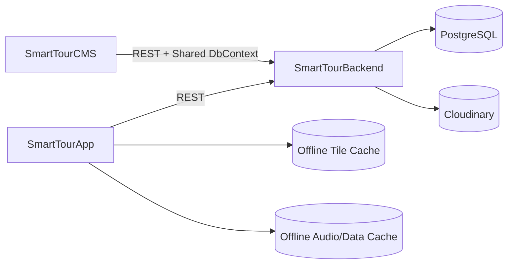

---

## 8. Thiết kế dữ liệu

Entity trọng tâm:

- `Poi`: thông tin điểm đến.
- `PoiTranslation`: tên/mô tả/script/audio theo ngôn ngữ.
- `Language`: danh mục ngôn ngữ.
- `Food`: món ăn theo POI.
- `PlayLog`: thống kê nghe.

Nguyên tắc mapping:

- 1 `Poi` có nhiều `PoiTranslation`.
- `AudioUrl` nằm tại `PoiTranslation` để ràng buộc chính xác theo ngôn ngữ.

---

## 9. API contract (thực tế triển khai)

### 9.1 POI

| Method | Endpoint | Mô tả |
| --- | --- | --- |
| GET | `/api/pois` | Lấy danh sách POI |
| GET | `/api/pois/{poiId}/tts-all` | Lấy tất cả script theo POI |
| POST | `/api/pois/playlog` | Gửi log nghe |
| GET | `/api/pois/stats` | Thống kê nghe tổng hợp |
| GET | `/api/pois/{poiId}/stats` | Thống kê nghe theo POI |

### 9.2 Audio

| Method | Endpoint | Mô tả |
| --- | --- | --- |
| GET | `/api/audio/poi/{poiId}` | Danh sách audio theo translations |
| POST | `/api/audio/poi/{poiId}/regenerate?onlyMissing=true` | Tạo lại audio cho POI |
| POST | `/api/audio/translation/{translationId}/generate` | Tạo audio cho 1 translation |

### 9.3 Mẫu request/response JSON (phục vụ chấm demo)

#### 9.3.1 `GET /api/pois` - Response mẫu

```json
{
  "success": true,
  "count": 2,
  "data": [
    {
      "id": 47,
      "name": "Chua Mot Cot",
      "description": "Di tich lich su noi tieng",
      "latitude": 21.0359,
      "longitude": 105.8332
    },
    {
      "id": 48,
      "name": "Ho Guom",
      "description": "Dia diem trung tam Ha Noi",
      "latitude": 21.0285,
      "longitude": 105.8542
    }
  ]
}
```

#### 9.3.2 `POST /api/pois/playlog` - Request/Response mẫu

Request:

```json
{
  "poiId": 47,
  "deviceId": "demo-device-001",
  "playedAt": "2026-04-09T08:30:00Z",
  "durationSec": 54,
  "langCode": "vi"
}
```

Response:

```json
{
  "success": true,
  "message": "Playlog recorded."
}
```

#### 9.3.3 `GET /api/audio/poi/{poiId}` - Response mẫu

```json
{
  "success": true,
  "poiId": 47,
  "total": 3,
  "withAudio": 2,
  "data": [
    {
      "translationId": 201,
      "languageCode": "vi",
      "languageName": "Vietnamese",
      "title": "Chua Mot Cot",
      "ttsScript": "Chao mung ban den Chua Mot Cot...",
      "audioUrl": "https://res.cloudinary.com/.../audio_vi.mp3"
    },
    {
      "translationId": 202,
      "languageCode": "en",
      "languageName": "English",
      "title": "One Pillar Pagoda",
      "ttsScript": "Welcome to One Pillar Pagoda...",
      "audioUrl": "https://res.cloudinary.com/.../audio_en.mp3"
    },
    {
      "translationId": 203,
      "languageCode": "ja",
      "languageName": "Japanese",
      "title": "Ichi-bashira no tera",
      "ttsScript": "....",
      "audioUrl": null
    }
  ]
}
```

#### 9.3.4 `POST /api/audio/poi/{poiId}/regenerate?onlyMissing=true` - Response mẫu

```json
{
  "success": true,
  "poiId": 47,
  "onlyMissing": true,
  "processed": 1,
  "succeeded": 1,
  "failed": 0,
  "message": "Regenerate completed."
}
```

#### 9.3.5 `POST /api/audio/translation/{translationId}/generate` - Response mẫu

```json
{
  "success": true,
  "translationId": 203,
  "audioUrl": "https://res.cloudinary.com/.../audio_203.mp3",
  "message": "Audio generated successfully."
}
```

### 9.4 Quy ước mã lỗi API (đề xuất chuẩn hóa)

| HTTP Code | Khi nào xảy ra | Gợi ý xử lý client |
| --- | --- | --- |
| 200 | Thành công | Hiển thị dữ liệu/kết quả |
| 400 | Request sai dữ liệu đầu vào | Hiển thị lỗi validate |
| 401/403 | Chưa đăng nhập/không đủ quyền | Chuyển về login hoặc báo quyền |
| 404 | Không tìm thấy POI/translation | Hiển thị trạng thái không có dữ liệu |
| 500 | Lỗi server/TTS/Cloudinary | Cho phép retry và hiển thị thông báo |

---

## 10. Yêu cầu phi chức năng (NFR)

- **Reliability**: CMS có retry DB khi khởi động, seed không chặn app run.
- **Performance**: generate translations/audio theo tác vụ song song.
- **Security**: không commit secrets; key nằm ở env.
- **Maintainability**: có endpoint regenerate phục hồi dữ liệu audio.
- **Observability**: log lỗi TTS/Cloudinary ở backend.
- **Offline Capability**: app vẫn sử dụng được các chức năng cốt lõi (xem map/POI, phát audio đã cache) khi mất mạng.
- **Sync Consistency**: dữ liệu phát sinh offline phải được đồng bộ lại an toàn khi online.

---

## 11. Bảo mật và cấu hình môi trường

### 11.1 Secrets bắt buộc

- `DB_CONNECTION_STRING`
- `CLOUDINARY_CLOUD_NAME`
- `CLOUDINARY_API_KEY`
- `CLOUDINARY_API_SECRET`
- `AZURE_SPEECH_KEY`
- `AZURE_SPEECH_REGION`

### 11.2 Chính sách bảo mật

- Dùng `.env` local, không commit.
- Giữ `appsettings.json` dạng placeholder.
- Rotate key nếu từng lộ trên commit cũ.

---

## 12. Tiêu chí nghiệm thu MVP

- CMS login và thao tác POI hoạt động.
- Tạo POI sinh đủ translations.
- API audio trả danh sách đúng theo POI.
- Regenerate cập nhật được `AudioUrl`.
- App phát audio URL hợp lệ.
- Thống kê nghe trả dữ liệu không lỗi.

---

## 13. Roadmap

### Milestone 1 (nộp đồ án)

- Chốt luồng POI/translation/audio.
- Ổn định config env theo team.
- Hoàn thiện API audio + playlog.

### Milestone 2 (sau nộp)

- Background job/queue cho audio generation.
- Retry có backoff cho provider TTS.
- Test tích hợp cho endpoints chính.

---

## 14. Rủi ro và phương án giảm thiểu

| Rủi ro | Tác động | Giảm thiểu |
| --- | --- | --- |
| TTS hết quota/lỗi provider | Thiếu audio | Dùng regenerate API + cảnh báo trạng thái |
| Sai env giữa các máy | App/API lỗi startup | `.env.example` + checklist setup |
| Lộ secret | Mất an toàn hệ thống | `.gitignore`, placeholder config, rotate key |
| DB cloud chập chờn | Startup fail | Retry DB ở CMS, seed trong try/catch |

---

## 15. Phụ lục tham chiếu code

- `SmartTourCMS/Controllers/PoiController.cs`
- `SmartTourCMS/Controllers/TranslationController.cs`
- `SmartTourCMS/Program.cs`
- `SmartTourBackend/Controllers/PoisController.cs`
- `SmartTourBackend/Controllers/AudioController.cs`
- `SmartTourBackend/Service/VoiceService.cs`
- `SmartTourBackend/Data/AppDbContext.cs`
- `SmartTourBackend/Program.cs`
- `SmartTourApp/` (màn hình map/audio, theo cấu trúc app)

---

## 16. Use Case model

### 16.1 Use case tổng quan

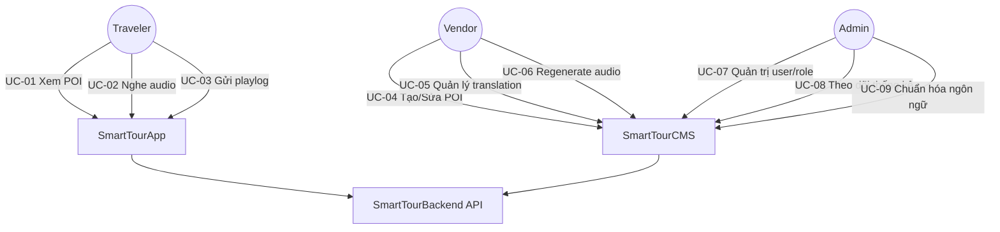

### 16.2 Use case chi tiết theo actor

| Actor | Mã UC | Tên Use Case | Tiền điều kiện | Hậu điều kiện |
| --- | --- | --- | --- | --- |
| Traveler | UC-01 | Xem danh sách POI | App có mạng | Danh sách POI hiển thị |
| Traveler | UC-02 | Nghe audio theo ngôn ngữ | Có `AudioUrl` hợp lệ | Audio được phát |
| Traveler | UC-03 | Gửi playlog | User nghe audio | Backend ghi nhận log |
| Vendor | UC-04 | Tạo POI mới | Đăng nhập Vendor | POI mới được lưu |
| Vendor | UC-05 | Quản lý bản dịch | POI tồn tại | Translation cập nhật |
| Vendor | UC-06 | Tạo lại audio | Có quyền POI | `AudioUrl` được cập nhật |
| Admin | UC-07 | Quản trị user/role | Đăng nhập Admin | Quyền truy cập được áp dụng |
| Admin | UC-08 | Xem thống kê nghe | Có dữ liệu playlog | Dashboard có số liệu |
| Admin | UC-09 | Quản lý ngôn ngữ | Có danh mục language | Danh mục ngôn ngữ chuẩn hóa |

### 16.3 Use case form mẫu (điển hình: UC-06 Regenerate audio)

- **Mục tiêu**: tạo lại audio cho các translation thiếu hoặc lỗi.
- **Actor chính**: Vendor/Admin.
- **Trigger**: nhấn nút regenerate trên CMS.
- **Luồng chính**:
  1. CMS gửi request đến endpoint regenerate.
  2. API tải danh sách translations của POI.
  3. API lọc các bản cần generate.
  4. VoiceService sinh audio + upload Cloudinary.
  5. API cập nhật `AudioUrl` và trả kết quả.
- **Luồng thay thế**:
  - Nếu thiếu key TTS: trả lỗi cấu hình.
  - Nếu Cloudinary lỗi: trả trạng thái thất bại từng bản ghi.
- **Business rules**:
  - Ưu tiên `TtsScript`, fallback `Description`.
  - Có tùy chọn `onlyMissing=true`.

### 16.4 Use case mở rộng cho Offline và QR

| Actor | Mã UC | Tên Use Case | Tiền điều kiện | Hậu điều kiện |
| --- | --- | --- | --- | --- |
| Traveler | UC-10 | Quét QR để vào app | App mở màn QR gate, camera được cấp quyền | Vào giao diện chính thành công |
| Traveler | UC-11 | Quét QR mở POI/Tour | QR hợp lệ dạng `smarttour://` hoặc URL trung gian | App điều hướng đúng màn POI/Tour |
| Traveler | UC-12 | Dùng map offline | Đã tải/có tile cache trước đó | Bản đồ vẫn hiển thị khi offline |
| Traveler | UC-13 | Nghe audio offline | POI đã có audio cache | Audio phát được khi mất mạng |
| Traveler | UC-14 | Đồng bộ lại khi online | Có dữ liệu phát sinh offline + mạng khôi phục | Dữ liệu được đẩy về backend |

### 16.5 Use case form mẫu (điển hình: UC-10 Quét QR để vào app)

- **Mục tiêu**: bắt buộc người dùng quét QR hợp lệ trước khi sử dụng app.
- **Actor chính**: Traveler.
- **Trigger**: mở ứng dụng SmartTour.
- **Luồng chính**:
  1. App hiển thị `QrGatePage`.
  2. Người dùng quét QR.
  3. App kiểm tra định dạng QR hợp lệ.
  4. App lưu phiên hợp lệ trong 7 ngày.
  5. App điều hướng vào `Home`.
- **Luồng thay thế**:
  - Không cấp camera: hiển thị yêu cầu cấp quyền.
  - QR sai định dạng: thông báo quét lại.
  - Scanner trả URL trung gian: app normalize về deep link.
- **Business rules**:
  - Phiên QR có hiệu lực 7 ngày.
  - Hết hạn hoặc bị xóa session trong settings thì bắt quét lại.

### 16.6 Use case map mở rộng (đủ chức năng App mới)

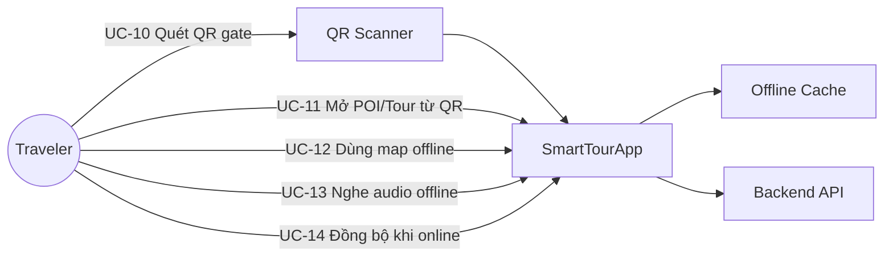

---

## 17. ERD model

### 17.1 ERD đầy đủ theo DB đang sử dụng

Nguồn tổng hợp: toàn bộ `DbSet<>` trong `SmartTourBackend/Data/AppDbContext.cs` + nhóm bảng Identity do kế thừa `IdentityDbContext<IdentityUser>`.

```mermaid
erDiagram
    %% Core POI domain
    POI ||--o{ POI_TRANSLATION : has
    LANGUAGE ||--o{ POI_TRANSLATION : defines
    POI ||--o{ FOOD : has
    POI ||--o{ PLAY_LOG : tracks
    ROUTE_SESSION ||--o{ ROUTE_SESSION_POI : contains
    POI ||--o{ ROUTE_SESSION_POI : links
    CATEGORY ||--o{ POI : classifies
    POI ||--o{ POI_IMAGE : has
    POI ||--o{ AUDIO_FILE : has
    LANGUAGE ||--o{ AUDIO_FILE : typed_by
    POI ||--o{ HEATMAP_ENTRY : heat_events
    POI ||--o{ QR_CODE : has
    POI ||--o{ IMAGE : has
    POI ||--o{ USER_LOCATION_LOG : location_events

    %% Tour domain
    TOUR ||--o{ TOUR_POI : includes
    POI ||--o{ TOUR_POI : appears_in
    TOUR ||--o{ TOUR_TRANSLATION : has

    %% Identity/Auth domain
    ASPNET_USERS ||--o{ ASPNET_USER_ROLES : has
    ASPNET_ROLES ||--o{ ASPNET_USER_ROLES : grants
    ASPNET_USERS ||--o{ ASPNET_USER_CLAIMS : has
    ASPNET_USERS ||--o{ ASPNET_USER_LOGINS : has
    ASPNET_USERS ||--o{ ASPNET_USER_TOKENS : has
    ASPNET_ROLES ||--o{ ASPNET_ROLE_CLAIMS : has

    POI {
      int Id PK
      string Name
      double Lat
      double Lng
      int Radius
      string Description
      string ImageUrl
      string AudioUrl
      string TtsScript
      int Priority
      bool IsActive
      int CategoryId FK
      string VendorId
      datetime CreatedAt
      datetime UpdatedAt
    }

    APP_SETTING {
      int Id PK
      string SettingKey
      string SettingValue
    }

    LANGUAGE {
      int Id PK
      string Code
      string Name
    }

    POI_TRANSLATION {
      int Id PK
      int PoiId FK
      int LanguageId FK
      string Title
      string Description
      string TtsScript
      string AudioUrl
    }

    FOOD {
      int Id PK
      int PoiId FK
      string Name
      string Description
      decimal Price
    }

    PLAY_LOG {
      int Id PK
      int PoiId FK
      string DeviceId
      datetime PlayedAt
      int DurationSec
      string LangCode
    }

    ROUTE_SESSION {
      int Id PK
      string DeviceId
      string PoiSequence
      int StopCount
      datetime StartedAt
      datetime EndedAt
      int DurationMinutes
      string Status
    }

    ROUTE_SESSION_POI {
      int Id PK
      int RouteSessionId FK
      int PoiId FK
      int OrderIndex
      string TriggerType
      datetime TriggeredAt
      int DwellSeconds
    }

    CATEGORY {
      int Id PK
      string Name
      string Description
      string IconUrl
      string ColorCode
    }

    POI_IMAGE {
      int Id PK
      int PoiId FK
      string ImageUrl
    }

    AUDIO_FILE {
      int Id PK
      int PoiId FK
      int LanguageId FK
      string FileUrl
      int Duration
      string AudioType
      string VendorId
    }

    IMAGE {
      int Id PK
      int PoiId FK
      string ImageUrl
      string Caption
    }

    USER_LOCATION_LOG {
      long Id PK
      int UserId
      decimal Latitude
      decimal Longitude
      datetime Timestamp
    }

    HEATMAP_ENTRY {
      int Id PK
      int PoiId FK
      string DeviceId
      datetime RecordedAt
      string TriggerType
      double Lat
      double Lng
    }

    QR_CODE {
      int Id PK
      int PoiId FK
      string QrToken
      string LocationName
    }

    TOUR {
      int Id PK
      string Name
      string Description
      datetime CreatedAt
      string CreatedBy
      string VendorId
    }

    TOUR_POI {
      int Id PK
      int TourId FK
      int PoiId FK
      int OrderIndex
    }

    TOUR_TRANSLATION {
      int Id PK
      int TourId FK
      string LanguageCode
      string Name
      string Description
    }

    ASPNET_USERS {
      string Id PK
      string UserName
      string Email
    }

    ASPNET_ROLES {
      string Id PK
      string Name
    }

    ASPNET_USER_ROLES {
      string UserId FK
      string RoleId FK
    }

    ASPNET_USER_CLAIMS {
      int Id PK
      string UserId FK
      string ClaimType
      string ClaimValue
    }

    ASPNET_ROLE_CLAIMS {
      int Id PK
      string RoleId FK
      string ClaimType
      string ClaimValue
    }

    ASPNET_USER_LOGINS {
      string LoginProvider PK
      string ProviderKey PK
      string UserId FK
    }

    ASPNET_USER_TOKENS {
      string UserId FK
      string LoginProvider PK
      string Name PK
      string Value
    }
```

### 17.2 Ràng buộc dữ liệu đề xuất

- `Language.Code` là unique.
- Cặp (`PoiId`, `LanguageId`) trong `PoiTranslation` là unique.
- `AudioUrl` cho phép null trong giai đoạn chưa generate.
- `PlayLog.PlayedAt` bắt buộc để thống kê theo thời gian.
- Cặp (`TourId`, `PoiId`) trong `TourPoi` là unique theo nghiệp vụ.
- `TourTranslation.LanguageCode` nên unique theo từng `TourId`.
- `CategoryId` trong `Poi` nên dùng FK mềm/cứng tùy chiến lược migration.
- `AppSetting.SettingKey` nên unique để tránh ghi đè cấu hình.
- Nhóm bảng `AspNet*` tuân theo khóa/chỉ mục mặc định của ASP.NET Identity.

### 17.3 Data quality rules

- Nếu `TtsScript` rỗng thì fallback `Description`.
- Nếu cả hai rỗng thì bỏ qua generate audio và gắn cảnh báo.
- Khi xóa `Poi`, cần cascade hoặc soft-delete nhất quán cho translation/food/playlog.
- `TourPoi.OrderIndex` cần liên tục để đảm bảo thứ tự tuyến.
- `RouteSessionPoi.TriggerType` chỉ nhận giá trị hợp lệ (`dwell`, `audio_manual`).
- `UserLocationLog` và `HeatmapEntry` cần policy dọn dữ liệu định kỳ để tránh phình DB.

---

## 18. Sequence, Activity, State models

### 18.1 Sequence - Tạo POI và sinh audio

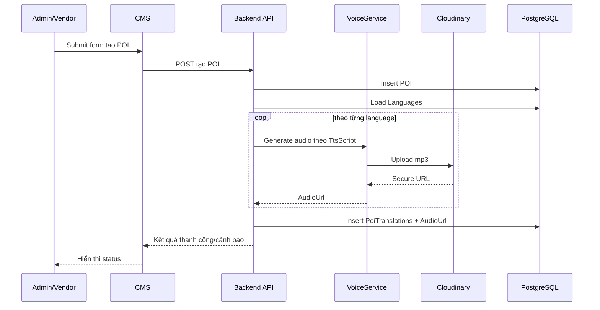

### 18.2 Activity - Regenerate audio

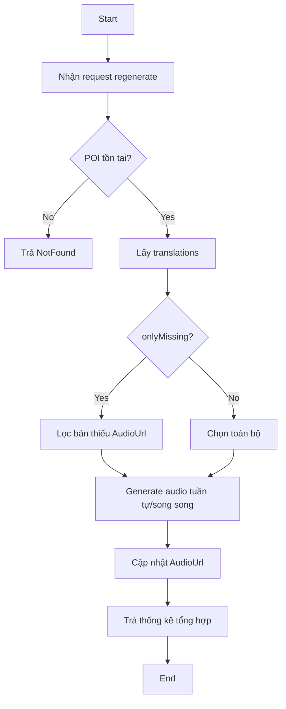

### 18.3 State model - Translation Audio

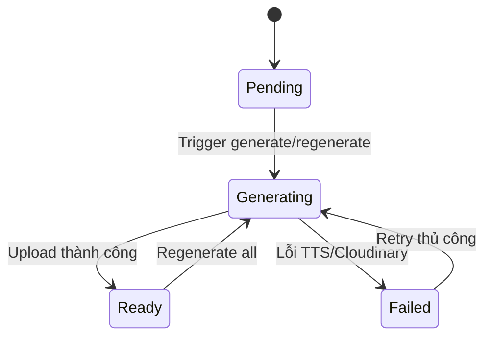

### 18.4 Sequence - QR Gate và vào Home

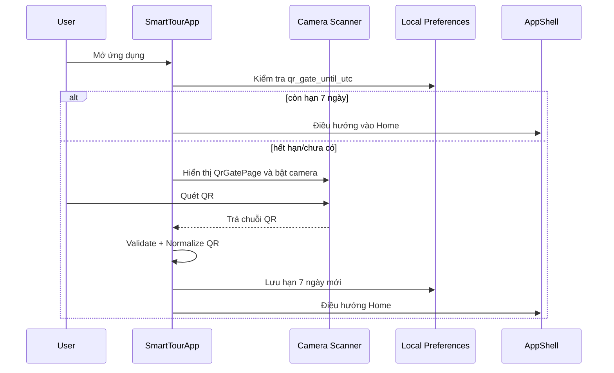

### 18.5 Sequence - Quét QR mở POI/Tour (Deep Link)

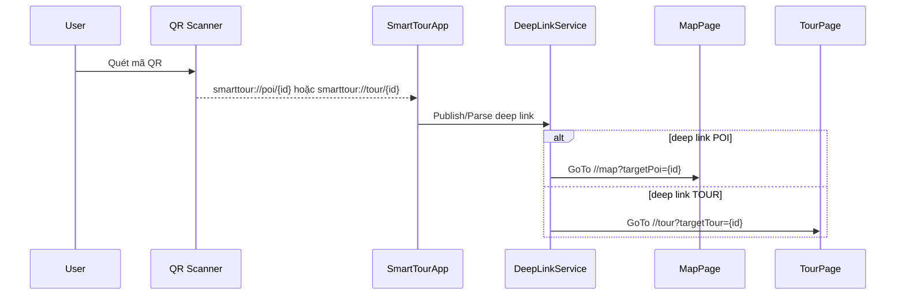

### 18.6 Sequence - Offline cache và sync khi online

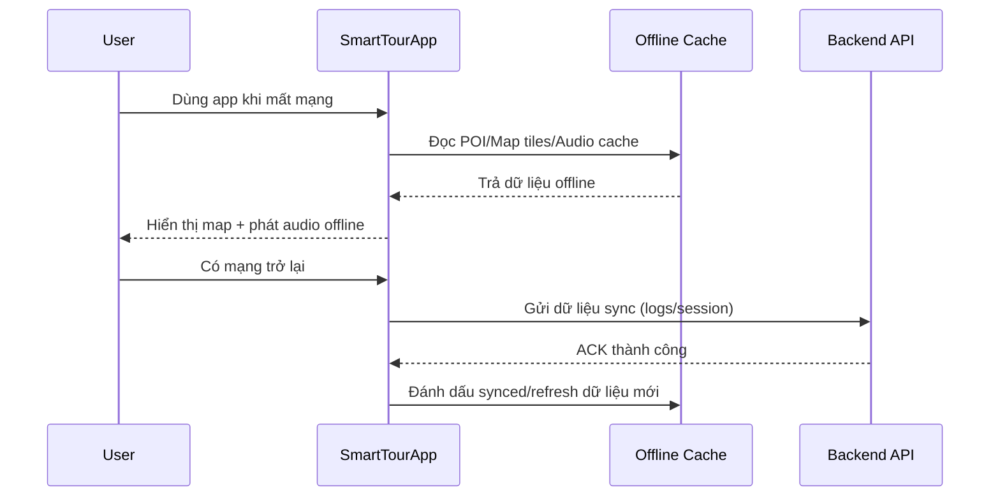

### 18.7 Activity - QR Gate (bắt buộc quét trước khi vào app)

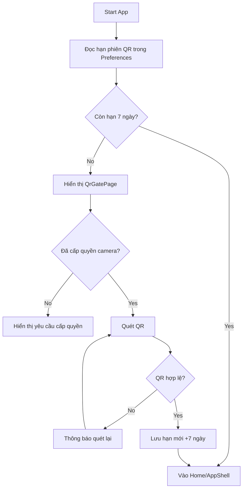

### 18.8 State model - QR Session (7 ngày)

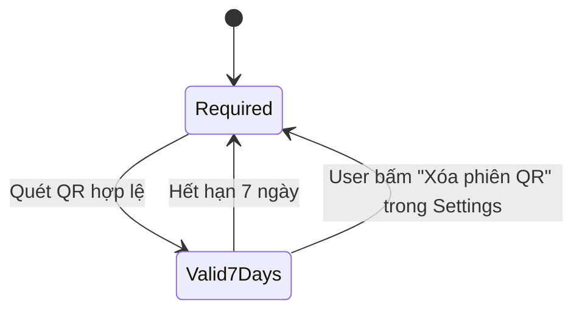

### 18.9 State model - Offline Sync

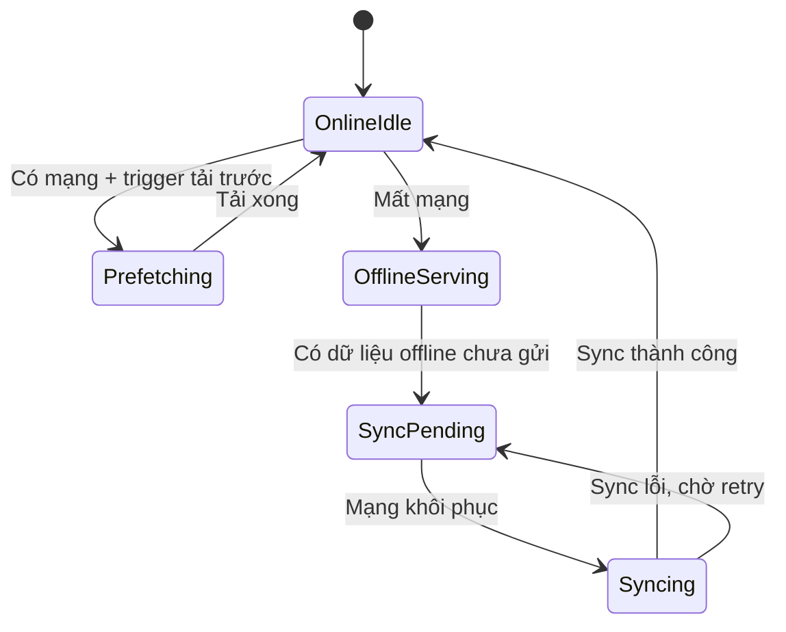

---

## 19. Deployment và vận hành

### 19.1 Mô hình triển khai đề xuất

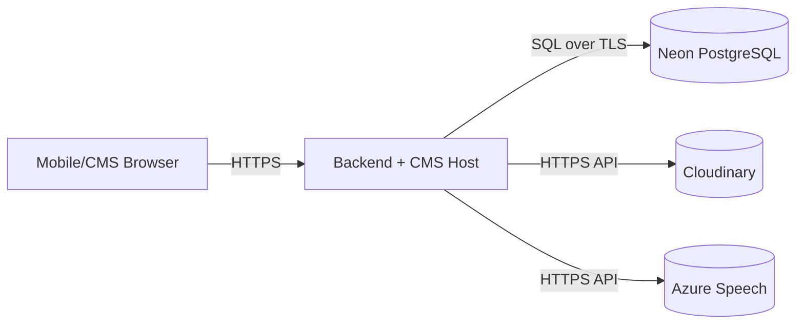

### 19.2 Checklist môi trường

- Cấu hình `.env` đầy đủ và đúng format `KEY=VALUE`.
- Cấu hình cổng CMS/API không trùng tiến trình đang chạy.
- Migrate DB trước khi test luồng tạo POI.
- Kiểm tra quyền network đến DB/TTS/Cloudinary.

### 19.3 Runbook sự cố nhanh

- **Không kết nối DB**: kiểm tra host, SSL mode, DNS.
- **Không sinh audio**: kiểm tra `AZURE_SPEECH_KEY/REGION`, quota, log VoiceService.
- **AudioUrl rỗng**: chạy regenerate với `onlyMissing=false` để backfill toàn bộ.

---

## 20. Ma trận truy vết yêu cầu

| Requirement | Module | API/Controller | Entity | Test case gợi ý |
| --- | --- | --- | --- | --- |
| FR-M01 | App | `PoisController` | `Poi` | TC-POI-01 |
| FR-M03 | App/Backend | `AudioController` | `PoiTranslation` | TC-AUDIO-01 |
| FR-C01 | CMS | `PoiController` | `Poi` | TC-CMS-POI-01 |
| FR-C03 | CMS | `TranslationController` | `PoiTranslation` | TC-CMS-TR-02 |
| FR-C04 | CMS/Backend | `AudioController` | `PoiTranslation` | TC-AUDIO-02 |
| FR-B04 | Backend | `PoisController` stats | `PlayLog` | TC-STATS-01 |

---

## 21. Kế hoạch kiểm thử và UAT

### 21.1 Functional test

- Test CRUD POI đầy đủ.
- Test sinh translation theo tất cả ngôn ngữ trong bảng.
- Test generate audio 1 bản và theo POI.
- Test playlog + stats theo POI.
- Test tải trước map tile và hiển thị đúng ở chế độ offline.
- Test cache audio và phát lại khi tắt mạng.
- Test đồng bộ lại dữ liệu sau khi online trở lại.

### 21.2 Non-functional test

- Smoke test khi DB có độ trễ cao.
- Test hồi phục khi TTS lỗi tạm thời.
- Test bảo mật: không có secret trong git status/commit.
- Test dung lượng cache map/audio (không vượt ngưỡng thiết bị mục tiêu).
- Test thời gian mở app lần 2 ở chế độ offline.

### 21.3 UAT checklist cho demo

- Đăng nhập CMS bằng tài khoản role hợp lệ.
- Tạo 1 POI mẫu + script.
- Xác nhận có audio ở ít nhất 2 ngôn ngữ.
- App gọi API và phát được audio.
- Dashboard stats hiển thị sau khi nghe thử.
- Bật chế độ máy bay: app vẫn mở map offline và phát được audio đã cache.

---

## 22. Kế hoạch dữ liệu mẫu demo

### 22.1 Dataset tối thiểu

- 10 POI thuộc 2 khu vực du lịch.
- 3 ngôn ngữ (`vi`, `en`, `fr` hoặc `ja`).
- 2-3 món ăn/POI.
- 50 playlog để minh họa dashboard.
- Bộ tile map cho ít nhất 1 khu vực demo offline.
- Mỗi POI demo có sẵn ít nhất 1 audio đã cache.

### 22.2 Kịch bản demo đề xuất

1. Admin tạo POI mới.
2. Hệ thống sinh translation + audio.
3. User app nghe audio.
4. Quay lại CMS xem thống kê.
5. Chuyển sang offline và chứng minh map/audio vẫn hoạt động.

### 22.3 Tiêu chuẩn dữ liệu demo

- Không chứa dữ liệu nhạy cảm thật.
- Có dữ liệu biên (thiếu audio, script dài) để demo xử lý lỗi.
- Tất cả URL demo phải truy cập được trong mạng lớp học.

---

## 23. Executive Summary (bản nộp)

### 23.1 Tóm tắt điều hành

SmartTour là hệ thống hướng dẫn tham quan thông minh, tập trung vào trải nghiệm nghe thuyết minh đa ngôn ngữ theo từng điểm đến (POI). Hệ thống bao gồm ứng dụng di động cho người dùng cuối, CMS cho quản trị nội dung và backend API làm lớp tích hợp dữ liệu, audio và thống kê.  

Mục tiêu của MVP là:

- Triển khai được quy trình đầy đủ: tạo POI -> sinh bản dịch -> sinh audio -> phát audio trên app.
- Đảm bảo khả năng vận hành nhóm đồ án: cấu hình env nhất quán, không lộ key, có cơ chế regenerate khi lỗi.
- Tạo nền tảng dễ mở rộng cho giai đoạn sau: queue audio, monitoring nâng cao, analytics chi tiết.

Giá trị cốt lõi:

- **Với người dùng**: trải nghiệm tham quan trực quan, nghe nội dung theo ngôn ngữ quen thuộc.
- **Với đơn vị quản lý nội dung**: cập nhật thông tin nhanh, có kiểm soát chất lượng audio.
- **Với nhóm triển khai**: kiến trúc rõ ràng theo module, có API contract và mô hình dữ liệu chuẩn hóa.

KPI chính ở giai đoạn MVP:

- API POI ổn định (`>=99%` thành công).
- Regenerate audio đạt tỷ lệ thành công `>=95%` khi cấu hình đầy đủ.
- App phát được audio URL hợp lệ ở các ngôn ngữ mục tiêu.

Tiêu chí thành công đồ án:

- Chạy demo end-to-end không gián đoạn.
- Có đủ artefact kỹ thuật: Use Case, ERD, luồng xử lý, kiểm thử.
- Có hướng dẫn vận hành, khắc phục lỗi và mở rộng sau MVP.

---

## 24. Use Case textual specification

### 24.1 UC-01: Xem danh sách POI

- **Primary actor**: Traveler
- **Scope**: SmartTourApp + Backend API
- **Preconditions**:
  - Ứng dụng có kết nối mạng.
  - Backend API hoạt động.
- **Trigger**: User mở màn hình danh sách/bản đồ POI.
- **Main flow**:
  1. App gọi `GET /api/pois`.
  2. Backend truy vấn dữ liệu POI.
  3. Backend trả danh sách POI.
  4. App render danh sách/map marker.
- **Postconditions**:
  - Danh sách POI hiển thị cho user.
- **Alternative flows**:
  - API lỗi: hiển thị thông báo và nút thử lại.
- **Non-functional notes**:
  - P95 thời gian phản hồi dưới 500ms (môi trường mục tiêu).

### 24.2 UC-02: Nghe audio theo ngôn ngữ

- **Primary actor**: Traveler
- **Scope**: SmartTourApp + Backend API + Cloudinary
- **Preconditions**:
  - POI có translation và `AudioUrl`.
  - Thiết bị có loa/tai nghe.
- **Trigger**: User chọn POI hoặc chạm nút phát.
- **Main flow**:
  1. App chọn translation theo ngôn ngữ ưu tiên.
  2. App lấy URL audio và phát.
  3. App gửi playlog về backend.
- **Postconditions**:
  - Audio được phát; log nghe được lưu.
- **Alternative flows**:
  - Không có audio: hiển thị fallback nội dung text.
  - URL lỗi: app thông báo không phát được.

### 24.3 UC-04: Tạo POI mới trên CMS

- **Primary actor**: Vendor/Admin
- **Scope**: CMS + Backend + DB + TTS + Cloudinary
- **Preconditions**:
  - Actor đã đăng nhập và có quyền.
  - Bảng `Languages` có dữ liệu.
  - Cấu hình env TTS/Cloudinary hợp lệ.
- **Trigger**: Gửi form tạo POI.
- **Main flow**:
  1. CMS validate dữ liệu đầu vào.
  2. Lưu POI cơ sở.
  3. Sinh `PoiTranslation` theo từng language.
  4. Sinh audio theo `TtsScript`/`Description`.
  5. Upload Cloudinary, lưu `AudioUrl`.
- **Postconditions**:
  - POI và translations được lưu.
  - Có audio ở phần lớn ngôn ngữ.
- **Exception flows**:
  - Thiếu key: tạo POI thành công nhưng cảnh báo thiếu audio.
  - Upload lỗi: lưu translation, đánh dấu cần regenerate.

### 24.4 UC-06: Regenerate audio

- **Primary actor**: Vendor/Admin
- **Scope**: CMS + Audio API + VoiceService
- **Preconditions**:
  - POI tồn tại.
  - Actor có quyền chỉnh sửa POI.
- **Trigger**: Nhấn nút regenerate.
- **Main flow**:
  1. CMS gọi endpoint regenerate.
  2. API chọn danh sách translation theo `onlyMissing`.
  3. Generate và upload audio.
  4. Cập nhật `AudioUrl`.
  5. Trả thống kê thành công/thất bại.
- **Postconditions**:
  - Tăng số lượng translation có audio hợp lệ.
- **Business rules**:
  - Ưu tiên `TtsScript`.
  - Cho phép regenerate toàn bộ hoặc chỉ bản thiếu.

### 24.5 UC-08: Xem thống kê nghe

- **Primary actor**: Admin
- **Scope**: CMS + Backend stats API
- **Preconditions**:
  - Có dữ liệu `PlayLog`.
- **Trigger**: Mở màn hình thống kê.
- **Main flow**:
  1. CMS gọi API stats.
  2. Backend tổng hợp theo POI/thời gian.
  3. CMS hiển thị kết quả.
- **Postconditions**:
  - Admin đánh giá được POI nào được nghe nhiều.

---

## 25. Data Dictionary (chi tiết cột dữ liệu)

### 25.1 Bảng `Poi`

| Cột | Kiểu dữ liệu | Null | Mô tả | Quy tắc |
| --- | --- | --- | --- | --- |
| `Id` | int | No | Khóa chính POI | Auto increment |
| `Name` | string | No | Tên POI | Độ dài theo model |
| `Description` | string | Yes | Mô tả mặc định | Dùng fallback khi thiếu script |
| `Latitude` | decimal | Yes | Vĩ độ | Chuẩn GPS |
| `Longitude` | decimal | Yes | Kinh độ | Chuẩn GPS |
| `CreatedAt` | datetime | Yes/No theo migration | Ngày tạo | UTC khuyến nghị |

### 25.2 Bảng `Language`

| Cột | Kiểu dữ liệu | Null | Mô tả | Quy tắc |
| --- | --- | --- | --- | --- |
| `Id` | int | No | Khóa chính language | Auto increment |
| `Code` | string | No | Mã ngôn ngữ (`vi`, `en`, ...) | Unique |
| `Name` | string | No | Tên ngôn ngữ | Theo danh mục |

### 25.3 Bảng `PoiTranslation`

| Cột | Kiểu dữ liệu | Null | Mô tả | Quy tắc |
| --- | --- | --- | --- | --- |
| `Id` | int | No | Khóa chính translation | Auto increment |
| `PoiId` | int | No | FK đến `Poi` | Bắt buộc tồn tại |
| `LanguageId` | int | No | FK đến `Language` | Bắt buộc tồn tại |
| `Title` | string | Yes | Tiêu đề bản dịch | Có thể fallback từ POI |
| `Description` | string | Yes | Nội dung mô tả bản dịch | Dùng khi không có script |
| `TtsScript` | string | Yes | Script ưu tiên để sinh audio | Ưu tiên cao nhất |
| `AudioUrl` | string | Yes | URL mp3 sau upload | Null nếu chưa tạo |
| `CreatedAt` | datetime | Yes/No theo migration | Thời điểm tạo | UTC khuyến nghị |

### 25.4 Bảng `Food`

| Cột | Kiểu dữ liệu | Null | Mô tả | Quy tắc |
| --- | --- | --- | --- | --- |
| `Id` | int | No | Khóa chính món ăn | Auto increment |
| `PoiId` | int | No | FK đến POI | 1 POI có nhiều món |
| `Name` | string | No | Tên món | Bắt buộc |
| `Description` | string | Yes | Mô tả món | Tùy chọn |
| `Price` | decimal | Yes | Giá tham khảo | >= 0 |

### 25.5 Bảng `PlayLog`

| Cột | Kiểu dữ liệu | Null | Mô tả | Quy tắc |
| --- | --- | --- | --- | --- |
| `Id` | int | No | Khóa chính log | Auto increment |
| `PoiId` | int | No | FK đến POI | Bắt buộc |
| `DeviceId` | string | Yes | Định danh thiết bị | Ẩn danh hóa khi cần |
| `PlayedAt` | datetime | No | Thời điểm phát | UTC |
| `DurationSec` | int | Yes | Thời lượng nghe | >= 0 |
| `LangCode` | string | Yes | Ngôn ngữ đã phát | Khớp danh mục language |

### 25.6 Bảng `RouteSession`

| Cột | Kiểu dữ liệu | Null | Mô tả | Quy tắc |
| --- | --- | --- | --- | --- |
| `Id` | int | No | Khóa chính session | Auto increment |
| `SessionCode` | string | Yes | Mã phiên lộ trình | Unique khuyến nghị |
| `StartedAt` | datetime | Yes | Bắt đầu phiên | UTC |
| `EndedAt` | datetime | Yes | Kết thúc phiên | >= StartedAt |

### 25.7 Bảng `RouteSessionPoi`

| Cột | Kiểu dữ liệu | Null | Mô tả | Quy tắc |
| --- | --- | --- | --- | --- |
| `Id` | int | No | Khóa chính | Auto increment |
| `RouteSessionId` | int | No | FK đến RouteSession | Bắt buộc |
| `PoiId` | int | No | FK đến Poi | Bắt buộc |
| `VisitOrder` | int | Yes | Thứ tự ghé thăm | >= 1 |
| `ArrivedAt` | datetime | Yes | Thời điểm đến | UTC |

---

## 26. Chuẩn trình bày báo cáo nộp

### 26.1 Quy chuẩn định dạng khuyến nghị

- Khổ giấy: A4.
- Font: Times New Roman.
- Cỡ chữ nội dung: 13.
- Dãn dòng: 1.3 đến 1.5.
- Căn lề: trái 3.5cm, phải 2cm, trên 2.5cm, dưới 2.5cm.
- Đánh số mục: đa cấp theo dạng `1`, `1.1`, `1.1.1`.

### 26.2 Cấu trúc hồ sơ nộp đề xuất

1. Trang bìa.
2. Nhận xét GVHD (nếu có).
3. Lời cảm ơn.
4. Mục lục.
5. Danh mục hình/bảng.
6. Executive Summary.
7. Nội dung PRD (tài liệu hiện tại).
8. Phụ lục kỹ thuật (API mẫu, ảnh giao diện, log test).

### 26.3 Quy chuẩn minh chứng

- Mỗi yêu cầu chính phải có ảnh/chứng cứ test tương ứng.
- Mỗi endpoint quan trọng cần có ví dụ request/response.
- Mỗi sơ đồ cần có mô tả ngắn về mục đích và ý nghĩa.

---

## 27. WBS và tiến độ triển khai (Gantt)

### 27.1 Work Breakdown Structure (WBS)

| WBS ID | Hạng mục | Mô tả đầu ra | Phụ thuộc |
| --- | --- | --- | --- |
| 1.0 | Khởi tạo dự án | Repo, solution, cấu hình base | - |
| 1.1 | Thiết kế dữ liệu | Entity + migration ban đầu | 1.0 |
| 1.2 | Tích hợp DB cloud | Kết nối PostgreSQL ổn định | 1.1 |
| 2.0 | Backend POI API | API POI và playlog hoạt động | 1.2 |
| 2.1 | Audio API | Get/generate/regenerate audio | 2.0 |
| 2.2 | Tích hợp VoiceService | TTS + upload Cloudinary | 2.1 |
| 3.0 | CMS quản trị POI | CRUD POI/translation | 2.0 |
| 3.1 | CMS nghe audio | Audio player ở trang translation | 3.0, 2.1 |
| 3.2 | CMS regenerate | Nút tạo lại audio + trạng thái | 3.1 |
| 4.0 | Mobile app tích hợp | Đọc POI + phát audio | 2.0, 2.1 |
| 4.1 | Offline audio | Cache audio + phát khi offline | 4.0 |
| 4.2 | Offline map | Tải/lưu tile + render offline | 4.0 |
| 4.3 | Offline sync | Đồng bộ dữ liệu khi online lại | 4.1, 4.2 |
| 5.0 | Kiểm thử/UAT | Test case, bug fix, demo script | 3.2, 4.0 |
| 6.0 | Đóng gói nộp | PRD + minh chứng + video demo | 5.0 |

### 27.2 Timeline đề xuất theo tuần

| Tuần | Trọng tâm | Kết quả mong đợi |
| --- | --- | --- |
| Tuần 1 | Kiến trúc + dữ liệu | DB schema, migration chạy |
| Tuần 2 | Backend POI/audio | API chính hoạt động |
| Tuần 3 | CMS chức năng cốt lõi | CRUD + translation + audio |
| Tuần 4 | Mobile tích hợp | App phát audio theo POI |
| Tuần 5 | Tối ưu + xử lý lỗi | Ổn định env, regenerate chuẩn |
| Tuần 6 | UAT + tài liệu | PRD hoàn chỉnh, demo end-to-end |

### 27.3 Gantt (minh họa)

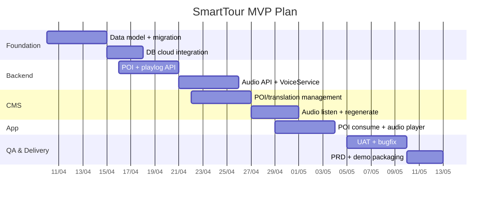

---

## 28. Kế hoạch chất lượng, release, rollback

### 28.1 Quality plan

- **Code quality**: build clean, không lỗi compile.
- **Config quality**: checklist `.env` trước mỗi buổi demo.
- **Data quality**: bắt buộc có tối thiểu 2 ngôn ngữ có audio hợp lệ/POI demo.
- **API quality**: endpoint trọng yếu có test thủ công bằng Postman hoặc Swagger.

### 28.2 Definition of Done (DoD) theo hạng mục

- **POI feature DoD**:
  - Tạo/sửa/xóa POI thành công.
  - Không làm hỏng danh sách POI/pagination.
- **Audio feature DoD**:
  - Generate và regenerate chạy thành công khi key hợp lệ.
  - Có thông báo rõ khi lỗi key/quota/network.
- **Stats feature DoD**:
  - Playlog được ghi nhận.
  - API stats trả đúng format và số liệu nhất quán.

### 28.3 Release plan

- **Release Candidate (RC1)**:
  - Chốt feature MVP.
  - Đóng băng schema trừ lỗi nghiêm trọng.
- **RC2 (hardening)**:
  - Sửa lỗi UAT.
  - Chuẩn hóa tài liệu hướng dẫn chạy.
- **Final Demo Release**:
  - Tag source.
  - Xác nhận checklist môi trường và dữ liệu demo.

### 28.4 Rollback plan (khi demo lỗi)

1. Dừng tiến trình đang chạy.
2. Quay về tag/commit ổn định gần nhất.
3. Khôi phục `.env` mẫu đã kiểm chứng.
4. Chạy migrate hoặc restore DB snapshot demo.
5. Kiểm tra nhanh 3 luồng: login CMS, list POI, play audio.

### 28.5 Go-live checklist (mức đồ án)

- Build thành công cả backend và CMS.
- Cổng chạy không xung đột.
- DB truy cập được từ máy demo.
- TTS + Cloudinary key còn hiệu lực.
- Có dữ liệu POI/translation/audio mẫu.
- Có phương án fallback text nếu audio lỗi.

---

## 29. Lịch sử phiên bản PRD

| Version | Ngày | Nội dung |
| --- | --- | --- |
| 1.0 | 2026-04-09 | Bản PRD SmartTour đầu tiên |
| 2.0 | 2026-04-09 | Nâng cấp format nộp đồ án: mục lục, journey, API contract, NFR, roadmap, risk matrix |
| 3.0 | 2026-04-09 | Mở rộng đầy đủ mô hình: Use Case, ERD, Sequence/Activity/State, deployment, traceability, test/UAT, dữ liệu demo |
| 3.1 | 2026-04-09 | Bản nộp mở rộng: Executive Summary, Use Case textual specification, Data Dictionary chi tiết |
| 4.0 | 2026-04-09 | Hoàn thiện bản nộp: chuẩn định dạng báo cáo, WBS/Gantt, quality/release/rollback plan; không gồm ma trận phân công thành viên |
| 4.1 | 2026-04-09 | Dọn mục lục/numbering và bổ sung mẫu request/response JSON + quy ước mã lỗi API |
| 4.2 | 2026-04-09 | Cập nhật theo commit mới: bổ sung offline map, offline audio, offline sync vào phạm vi, kiến trúc, NFR, test và WBS |
| 4.3 | 2026-04-09 | Mở rộng mô hình Use Case + Sequence cho QR gate, deep link, offline map/audio và sync online |
| 4.4 | 2026-04-09 | Bổ sung đầy đủ Activity + State models cho QR gate/session và offline sync lifecycle |

