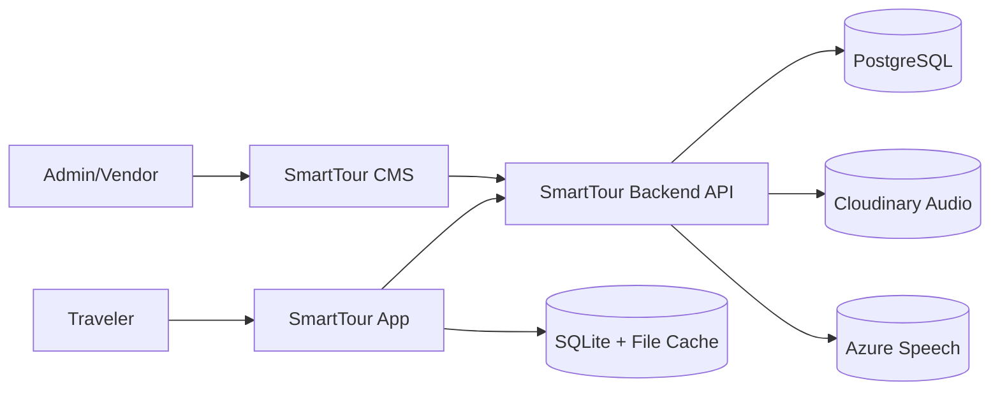
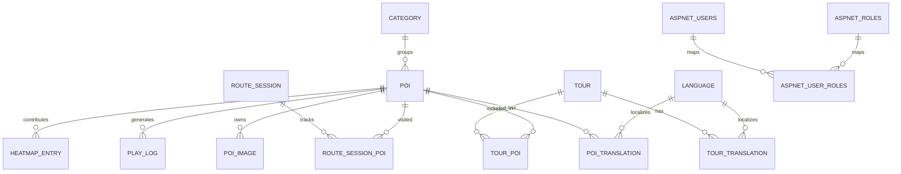
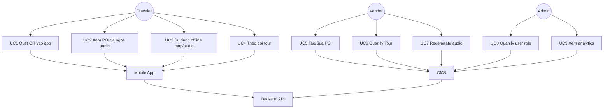
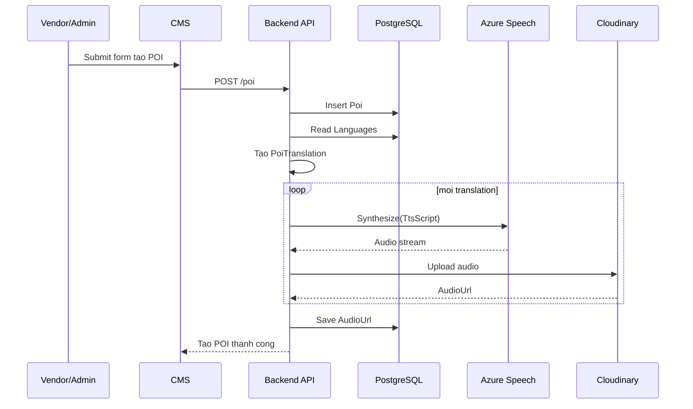
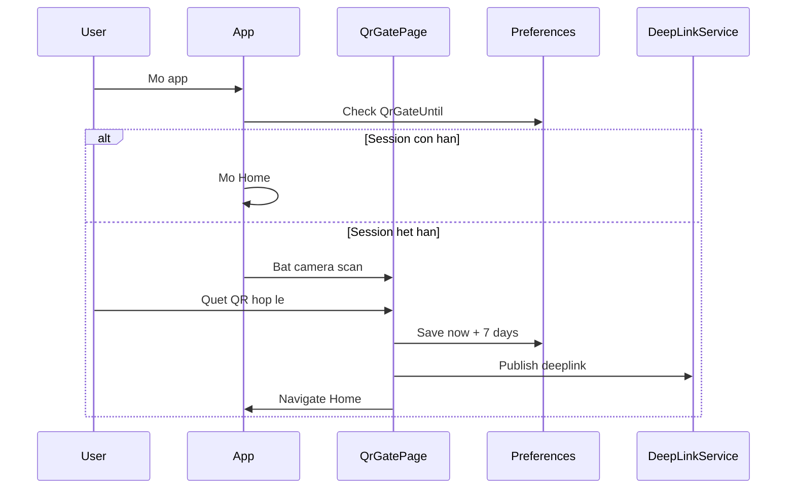
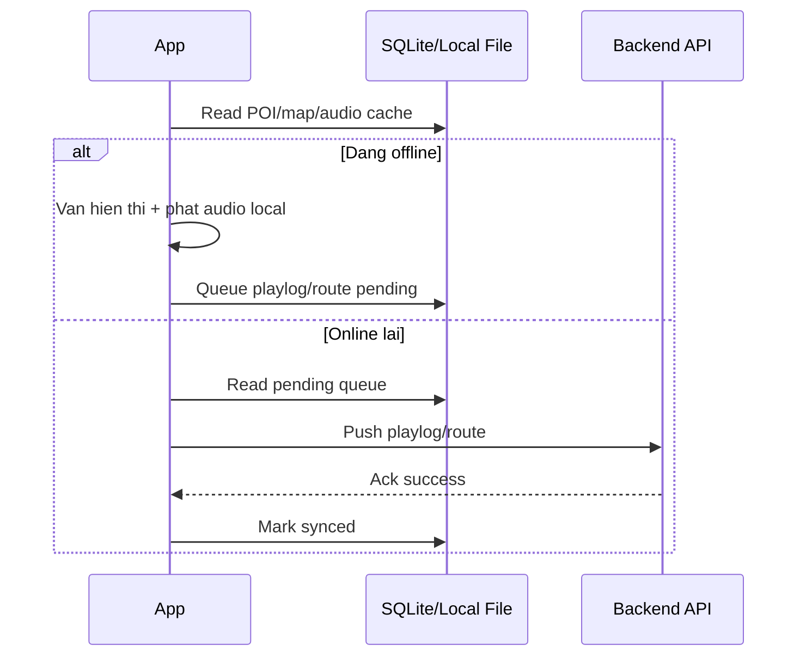
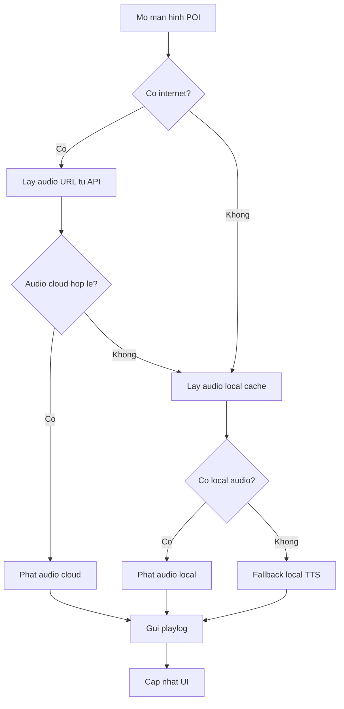
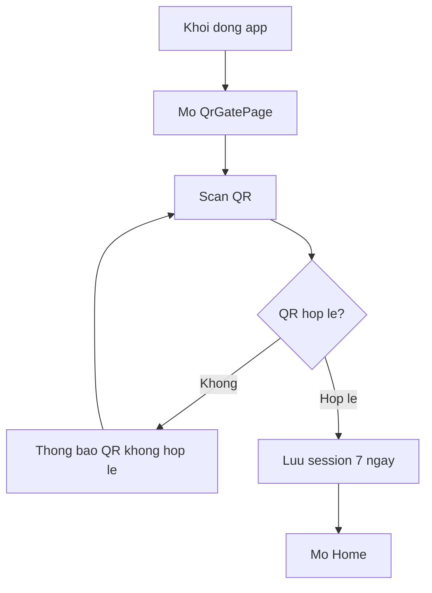
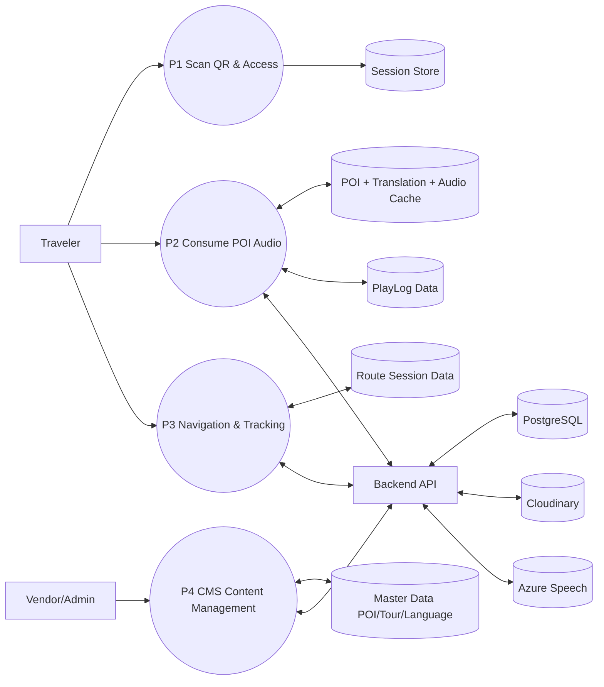

# PRD SmartTour (Bản trình bày ngắn, dễ thuyết trình)

| Thuộc tính | Giá trị |
| --- | --- |
| Phiên bản | 6.0 |
| Ngày cập nhật | 2026-04-09 |
| Mục tiêu tài liệu | Chỉ giữ các mục cốt lõi + mô hình vẽ đầy đủ chức năng |

## Mục lục nhanh
1. [Giới thiệu](#1-gioi-thieu)
2. [Mục tiêu sản phẩm](#2-muc-tieu-san-pham)
3. [Personas](#3-personas)
4. [Tính năng chi tiết](#4-tinh-nang-chi-tiet)
5. [User stories](#5-user-stories)
6. [Luồng người dùng chính](#6-luong-nguoi-dung-chinh)
7. [Kiến trúc hệ thống](#7-kien-truc-he-thong)
8. [CSDL](#8-csdl)
9. [Thiết kế analytics](#9-thiet-ke-analytics)
10. [Yêu cầu phi chức năng (NFR)](#10-yeu-cau-phi-chuc-nang-nfr)
11. [Sơ đồ Use Case](#11-so-do-use-case)
12. [Sequence diagram](#12-sequence-diagram)
13. [Activity diagram](#13-activity-diagram)
14. [Data Flow Diagram (DFD Level 1)](#14-data-flow-diagram-dfd-level-1)
15. [UI wireframe (MVP)](#15-ui-wireframe-mvp)
16. [API thực tế](#16-api-thuc-te)
17. [Bảo mật](#17-bao-mat)
18. [Roadmap](#18-roadmap)
19. [Nghiệm thu](#19-nghiem-thu)
20. [Future](#20-future)
21. [Danh mục tài liệu & mã tham chiếu](#21-danh-muc-tai-lieu--ma-tham-chieu)
22. [Lịch sử phiên bản PRD](#22-lich-su-phien-ban-prd)

---

## 1. Gioi thieu
SmartTour la he thong du lich thong minh gom 3 thanh phan:
- **Mobile App (MAUI):** xem ban do, POI, nghe audio huong dan.
- **CMS Web:** quan tri noi dung POI/Tour/Translation.
- **Backend API:** tra du lieu, tao audio, luu thong ke.

Muc tieu cua san pham la giup nguoi dung du lich tu tuc, co audio da ngon ngu, va van su dung duoc khi mat mang.

## 2. Muc tieu san pham
### 2.1 Muc tieu nghiep vu
- Tang trai nghiem tham quan bang audio theo tung dia diem.
- Chuan hoa noi dung du lich tren 1 he thong quan tri.
- Co so lieu hanh vi de cai tien chat luong tour.

### 2.2 Muc tieu ky thuat
- API on dinh cho ca app va CMS.
- Dung duoc online + offline (map/audio).
- Co co che regenerate audio khi loi/thieu.

## 3. Personas
- **Traveler:** can xem POI nhanh, nghe audio, di theo tuyen.
- **Vendor:** quan ly POI/Tour thuoc don vi minh.
- **Admin:** quan tri toan he thong, phan quyen, theo doi thong ke.

## 4. Tinh nang chi tiet
### 4.1 Mobile App
- Bat buoc quet QR khi vao app lan dau, session hieu luc 7 ngay.
- Xem POI theo map/list, nghe audio theo ngon ngu.
- Ho tro map offline, audio offline.
- Dong bo du lieu khi co mang tro lai.

### 4.2 CMS
- CRUD POI, Tour, Translation.
- Tu dong tao ban dich va audio khi tao POI.
- Regenerate audio theo POI hoac translation.
- Xuat QR cho tung POI/Tour (`smarttour://poi/{id}`, `smarttour://tour/{id}`).

### 4.3 Backend
- Cung cap API POI/Tour/Audio/Analytics.
- Xu ly route session, playlog, heatmap.
- Dong vai tro nguon du lieu chuan cho offline preload.

## 5. User stories
- US-01: La Traveler, toi muon quet QR de vao app nhanh.
- US-02: La Traveler, toi muon nghe thuyet minh POI theo ngon ngu cua toi.
- US-03: La Traveler, toi muon van xem map va nghe audio khi khong co mang.
- US-04: La Vendor, toi muon tao POI 1 lan va he thong tu sinh translation/audio.
- US-05: La Admin, toi muon xem thong ke de biet diem nao duoc nghe nhieu.
- US-06: La Admin/Vendor, toi muon regenerate audio khi file cu bi loi.

## 6. Luong nguoi dung chinh
### Journey A - Tao POI
1. Dang nhap CMS.
2. Tao POI (ten, mo ta, vi tri, media).
3. He thong sinh translation theo `Language`.
4. He thong tao audio va luu `AudioUrl`.

### Journey B - Nghe audio
1. Nguoi dung mo app, vao map/list.
2. Chon POI.
3. App lay audio URL theo translation.
4. Phat audio va gui playlog.

### Journey C - QR Gate + Deep Link
1. App mo vao trang quet QR.
2. QR hop le -> tao session 7 ngay.
3. Neu QR chua noi dung POI/Tour thi dieu huong den man hinh dich.

### Journey D - Offline
1. App preload du lieu map/audio.
2. Mat mang -> doc cache local.
3. Co mang lai -> sync route/playlog.

## 7. Kien truc he thong

## 8. CSDL
### 8.1 Bang nghiep vu chinh
- `Poi`, `PoiTranslation`, `Language`
- `Tour`, `TourPoi`, `TourTranslation`
- `PlayLog`, `HeatmapEntry`
- `RouteSession`, `RouteSessionPoi`
- `Category`, `PoiImage`, `Food`, `QrCode`

### 8.2 Bang Identity
- `AspNetUsers`, `AspNetRoles`, `AspNetUserRoles`
- `AspNetUserClaims`, `AspNetRoleClaims`
- `AspNetUserLogins`, `AspNetUserTokens`

### 8.3 ERD rut gon

## 9. Thiet ke analytics
Chi so theo doi:
- Luot nghe theo POI (`PlayLog`).
- Mat do quan tam theo khu vuc (`HeatmapEntry`).
- Lo trinh pho bien (`RouteSession`, `RouteSessionPoi`).

Dashboard de xuat:
- Top 10 POI duoc nghe nhieu nhat.
- Ban do nhiet theo gio/ngay.
- Tuyen duoc di nhieu nhat.

## 10. Yeu cau phi chuc nang (NFR)
- **Hieu nang:** API response cho truy van thong thuong < 2s.
- **Do san sang:** app khong crash khi quet QR lien tuc.
- **Bao mat:** secrets luu env, khong commit key that.
- **Offline:** map/audio dung duoc khi khong mang.
- **Dong bo:** playlog/route se day len khi online.

## 11. So do Use Case

## 12. Sequence diagram
### 12.1 Tao POI -> sinh translation + audio

### 12.2 Quet QR gate + vao home

### 12.3 Offline sync

## 13. Activity diagram
### 13.1 Activity - Nghe audio POI

### 13.2 Activity - QR gate

## 14. Data Flow Diagram (DFD Level 1)

## 15. UI wireframe (MVP)
### 15.1 App screens
- **LoadingPage:** kiem tra session QR.
- **QrGatePage:** camera scan + thong bao trang thai.
- **HomePage:** entry vao map/list/tour/settings.
- **MapPage:** map + marker POI + goi y gan nhat.
- **PoiDetailPage:** thong tin + nut play/pause audio.
- **TourPage:** danh sach tour, mo rong tour theo deeplink.
- **SettingsPage:** xoa session QR 7 ngay.

### 15.2 CMS screens
- **POI/Index:** danh sach, QR cho tung POI.
- **POI/Create/Edit:** mo ta, translation, audio.
- **Tour/Details:** danh sach POI trong tour + QR tour.
- **Translation/Details:** nghe audio theo ngon ngu.
- **Heatmap/Index:** xem mat do truy cap.

## 16. API thuc te
### 16.1 Nhom POI
- `GET /api/pois`
- `GET /api/pois/{poiId}/tts-all`
- `POST /api/pois/playlog`

### 16.2 Nhom Audio
- `GET /api/audio/poi/{poiId}`
- `POST /api/audio/poi/{poiId}/regenerate`
- `POST /api/audio/translation/{translationId}/generate`

### 16.3 Nhom Tour/Route/Heatmap
- `GET /api/tours`
- `GET /api/tours/{id}`
- `POST /api/routes/session`
- `GET /api/routes/popular`
- `POST /api/heatmap/entry`
- `GET /api/heatmap`

## 17. Bao mat
- Xac thuc + phan quyen bang Identity (Admin, Vendor).
- Quan ly secrets qua env (`DB`, `Cloudinary`, `Azure Speech`).
- Khong public key trong source code.
- Validate QR input va chi chap nhan schema duoc phep.

## 18. Roadmap
- **P1 (Da xong):** CRUD POI/Tour + translation + audio.
- **P2 (Da xong):** QR gate, deep link POI/Tour.
- **P3 (Da xong):** offline map/audio + sync.
- **P4 (Ke tiep):** toi uu analytics dashboard va bo loc nang cao.

## 19. Nghiem thu
Tieu chi nghiem thu muc chinh:
- Tao POI xong co translation va audio.
- API tours tra ve danh sach POI day du.
- QR scan hop le vao duoc HomePage.
- Session QR co hieu luc 7 ngay.
- Offline map/audio dung duoc trong demo.

## 20. Future
- Goi y hanh trinh ca nhan hoa.
- Tai truoc goi du lieu theo khu vuc.
- Chatbot huong dan du lich.
- A/B testing noi dung audio.

## 21. Danh muc tai lieu & ma tham chieu
- Source code: `SmartTourApp/`, `SmartTourCMS/`, `SmartTourBackend/`, `SmartTour.Shared/`
- PRD file: `PRD_SmartTour.md`
- File huong dan bao cao: `HUONG_DAN_BAO_CAO_WEB.md`, `HUONG_DAN_BAO_CAO_APP.md`

## 22. Lich su phien ban PRD
| Version | Date | Noi dung |
| --- | --- | --- |
| 5.0 | 2026-04-09 | Ban rut gon de doc nhanh |
| 6.0 | 2026-04-09 | Chuan hoa dung 22 muc + bo sung day du mo hinh chuc nang |
