# PRD (Product Requirements Document) - SmartTour

| Thuộc tính | Giá trị |
| --- | --- |
| **Phiên bản tài liệu** | **7.1** |
| **Ngày cập nhật** | **2026-04-17** |
| **Trạng thái** | Đồng bộ với mã nguồn trong repo (đã bổ sung các chức năng mới) |
| **Mục đích** | Mô tả yêu cầu sản phẩm; bám sát chức năng đã triển khai và chuẩn hóa tài liệu để báo cáo đồ án. |

### Mục lục nhanh
1. [Giới thiệu](#1-giới-thiệu)
2. [Mục tiêu sản phẩm](#2-mục-tiêu-sản-phẩm)
3. [Personas](#3-personas-và-nhu-cầu)
4. [Tính năng chi tiết](#4-tính-năng-và-yêu-cầu-chức-năng)
5. [User stories](#5-user-stories)
6. [Luồng người dùng chính](#6-luồng-người-dùng-chính)
7. [Kiến trúc hệ thống](#7-kiến-trúc-hệ-thống-system-architecture-overview)
8. [CSDL](#8-tổng-quan-cơ-sở-dữ-liệu-database-overview)
9. [Thiết kế analytics](#9-thiết-kế-analytics)
10. [Yêu cầu phi chức năng (NFR)](#10-yêu-cầu-phi-chức-năng-nfr)
11. [Sơ đồ Use Case](#11-sơ-đồ-use-case)
12. [Sequence diagram](#12-sequence-diagram)
13. [Activity diagram](#13-activity-diagram)
14. [Data Flow Diagram (DFD Level 1)](#14-data-flow-diagram-dfd-level-1)
15. [UI wireframe (MVP)](#15-ui-wireframe-mvp)
16. [API thực tế](#16-api-overview-đã-triển-khai-trong-repo)
17. [Bảo mật](#17-bảo-mật-và-phân-quyền)
18. [Roadmap](#18-kế-hoạch-triển-khai-roadmap-và-trạng-thái)
19. [Nghiệm thu](#19-tiêu-chí-nghiệm-thu-mvp)
20. [Future](#20-future-improvements)
21. **[Danh mục tài liệu & mã tham chiếu](#21-danh-mục-tài-liệu-và-tham-chiếu-mã-nguồn)**
22. **[Lịch sử phiên bản PRD](#22-lịch-sử-phiên-bản-prd)**

---

## 1. Giới thiệu
### 1.1 Mục tiêu tài liệu
Tài liệu mô tả yêu cầu sản phẩm SmartTour theo phạm vi MVP bám sát mã nguồn hiện tại, phục vụ báo cáo đồ án và bàn giao kỹ thuật.

### 1.2 Tổng quan dự án
SmartTour là hệ thống du lịch thông minh gồm 3 thành phần:
- **Mobile App (.NET MAUI):** bản đồ, POI, audio đa ngôn ngữ, offline map/audio, QR gate.
- **CMS Web (ASP.NET Core MVC):** quản trị POI/Food/Translation, tạo audio, thống kê.
- **Backend API (ASP.NET Core + EF Core):** cung cấp dữ liệu, xử lý audio, lưu analytics.

Mục tiêu cốt lõi: giúp khách du lịch tự khám phá địa điểm bằng nội dung số đa ngôn ngữ, vận hành ổn định cả khi online lẫn offline.

### 1.3 Phạm vi phiên bản
- **In scope:** QR gate, bản đồ POI, audio đa ngôn ngữ, offline map/audio, analytics, device presence, premium MoMo.
- **Out of scope:** loyalty, recommendation AI realtime, hệ thống thanh toán đa cổng ngoài MoMo.

## 2. Mục tiêu sản phẩm
### 2.1 Mục tiêu nghiệp vụ
- Số hóa hướng dẫn tham quan bằng POI + audio.
- Chuẩn hóa quy trình quản lý nội dung tập trung.
- Tăng mức độ tương tác người dùng thông qua bản đồ và audio.
- Theo dõi hành vi để cải tiến nội dung bằng dữ liệu thực tế.

### 2.2 Mục tiêu kỹ thuật
- API nhất quán cho CMS và App.
- Dữ liệu POI/Food có bản dịch theo ngôn ngữ, đồng bộ audio theo translation.
- Hỗ trợ bắt buộc quét QR khi vào hệ thống, kèm cơ chế phiên 7 ngày.
- Hỗ trợ hoạt động offline map/audio và đồng bộ lại khi online.

## 3. Personas và nhu cầu
- **Traveler (Khách du lịch):** cần truy cập nhanh, xem bản đồ, nghe audio theo ngôn ngữ của mình, không bị gián đoạn khi mất mạng.
- **Vendor (Đơn vị nội dung):** tạo và quản lý POI/Food trong phạm vi phụ trách, theo dõi nội dung và audio.
- **Admin (Quản trị hệ thống):** kiểm soát người dùng, phân quyền, giám sát chất lượng dữ liệu và analytics.

## 4. Tính năng và yêu cầu chức năng
### 4.1 Mobile App
- Đăng nhập luồng vào app qua **QR Gate** (quét QR hợp lệ mới vào hệ thống).
- Lưu phiên quét QR 7 ngày, hết hạn thì quét lại.
- Hỗ trợ deep link POI: `smarttour://poi/{id}`.
- Xem POI theo map/list, xem chi tiết và nghe audio theo translation.
- Theo dõi route, gửi log nghe, thống kê hành vi.
- Chạy offline với cache map tile và audio local.
- Đồng bộ dữ liệu pending sau khi có mạng.

### 4.2 CMS
- CRUD POI đầy đủ (thông tin, mô tả, tọa độ, ảnh, danh mục).
- Tự sinh translation theo bảng `Languages` khi tạo POI.
- Sinh audio theo từng translation (từ `TtsScript`/`Description`).
- Regenerate audio theo POI hoặc từng translation.
- Màn hình translation để nghe kiểm thử audio từng ngôn ngữ.
- Dashboard Heatmap và route phổ biến.
- Dashboard thiết bị online theo thời gian thực (đếm + bảng chi tiết thiết bị).
- Nâng cấp POI lên Premium qua MoMo (tạo link/QR, nhận callback/IPN).

### 4.3 Backend API
- Cụm API POI/Food/Translation.
- Cụm API Audio: xem, sinh, sinh lại.
- Cụm API analytics: playlog, heatmap, route session.
- Cụm API Presence: heartbeat/offline cho trạng thái thiết bị.
- Cụm API Premium: tạo giao dịch MoMo, xác nhận trạng thái thanh toán.
- Tích hợp Azure Speech để tổng hợp giọng nói.
- Tích hợp Cloudinary để lưu audio và trả URL.

## 5. User stories
- **US-01:** Là Traveler, tôi muốn quét QR để mở app trực tiếp và vào nhanh màn hình chính.
- **US-02:** Là Traveler, tôi muốn nghe thuyết minh theo ngôn ngữ đang chọn.
- **US-03:** Là Traveler, tôi muốn app vẫn dùng được khi mất mạng.
- **US-04:** Là Traveler, tôi muốn quét mã của POI và đi thẳng đến nội dung đó.
- **US-05:** Là Vendor, tôi muốn tạo POI một lần và hệ thống tự tạo translation + audio.
- **US-06:** Là Vendor, tôi muốn regenerate audio cho bản dịch bị thiếu/lỗi.
- **US-07:** Là Admin, tôi muốn xem heatmap và route để đánh giá mức độ quan tâm.
- **US-08:** Là Admin, tôi muốn phân quyền rõ ràng cho người vận hành.
- **US-09:** Là Admin/Vendor, tôi muốn nâng cấp POI lên Premium bằng MoMo để tăng mức hiển thị.
- **US-10:** Là Admin, tôi muốn thấy danh sách thiết bị online/offline theo thời gian thực để theo dõi vận hành app.

## 6. Luồng người dùng chính
### Journey 1: Tạo POI và tự động sinh audio
1. Vendor/Admin tạo POI trên CMS.
2. Backend lấy danh sách ngôn ngữ, tạo `PoiTranslation`.
3. Hệ thống gọi TTS để tạo file âm thanh cho từng bản dịch.
4. Upload audio lên Cloudinary, lưu `AudioUrl`.
5. CMS hiển thị trạng thái tạo thành công.

### Journey 2: Nghe audio POI
1. Traveler mở app, chọn POI trên map/list.
2. App lấy translation đúng ngôn ngữ.
3. App phát audio cloud hoặc audio local cache.
4. App gửi playlog về backend.

### Journey 3: QR Gate + Deep Link
1. App khởi động, kiểm tra phiên QR còn hạn hay không.
2. Nếu hết hạn: mở trang quét QR.
3. Quét hợp lệ: lưu phiên 7 ngày.
4. Nếu QR chứa deep link POI: điều hướng đúng màn hình đích.

### Journey 4: Offline và đồng bộ lại
1. App tải trước map tile + audio.
2. Khi offline: đọc dữ liệu local.
3. Log phát audio/route được queue lại.
4. Khi online: đẩy pending queue lên API.

### Journey 5: Theo dõi thiết bị online
1. App mở và gửi heartbeat định kỳ.
2. Backend cập nhật `DevicePresence.LastSeenUtc` + thông tin thiết bị.
3. CMS Dashboard gọi API trạng thái thiết bị theo chu kỳ ngắn.
4. Khi app ngủ/tắt, app gửi offline để web cập nhật trạng thái nhanh.

### Journey 6: Nâng cấp Premium qua MoMo
1. Vendor/Admin chọn POI và gói tuần/tháng/năm trên CMS.
2. CMS tạo đơn, ký request và gửi MoMo để lấy `payUrl`.
3. Người dùng thanh toán qua QR/link.
4. MoMo gọi IPN, hệ thống xác thực chữ ký.
5. Nếu thành công, đơn sang `paid` và cập nhật thời hạn Premium của POI.

## 7. Kiến trúc hệ thống (System Architecture Overview)
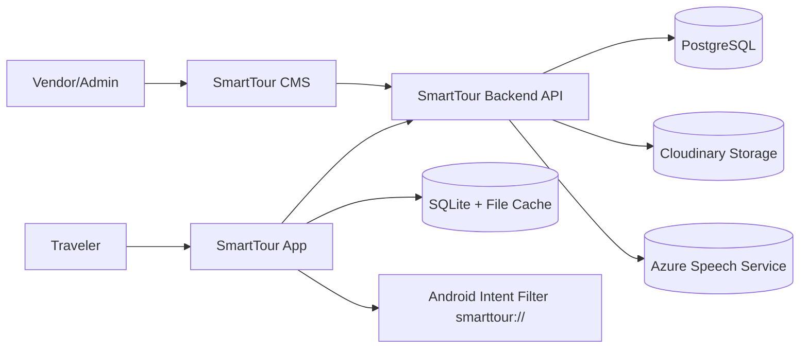

## 8. Tổng quan cơ sở dữ liệu (Database Overview)
### 8.1 Nhóm bảng nghiệp vụ
- `Poi`
- `PoiTranslation`
- `PoiImage`
- `Language`
- `Food`
- `FoodTranslation`
- `PlayLog`
- `HeatmapEntry`
- `RouteSession`
- `RouteSessionPoi`

### 8.2 Nhóm bảng Identity
- `AspNetUsers`
- `AspNetRoles`
- `AspNetUserRoles`
- `AspNetUserClaims`
- `AspNetRoleClaims`
- `AspNetUserLogins`
- `AspNetUserTokens`

### 8.3 ERD chi tiết theo DB đang dùng thực tế
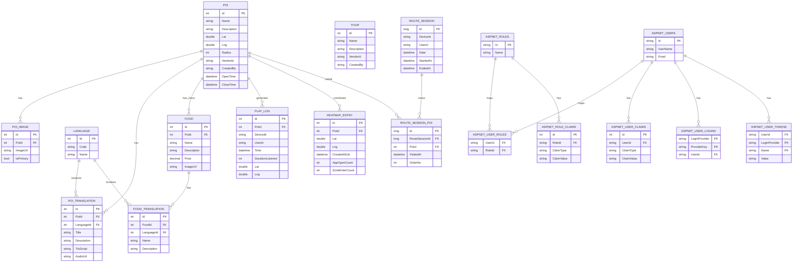

### 8.4 Đặc tả CRUD chi tiết theo bảng
| Bảng | Thêm (Create) | Sửa (Update) | Xóa (Delete) | Ai thao tác | Ghi chú |
| --- | --- | --- | --- | --- | --- |
| `Poi` | Tạo POI mới | Sửa thông tin/tọa độ/mô tả | Xóa POI | Admin, Vendor | Xóa POI cần xử lý bảng con |
| `PoiImage` | Upload ảnh mới | Đổi ảnh chính | Xóa ảnh | Admin, Vendor | Bắt buộc còn >=1 ảnh nếu quy định |
| `PoiTranslation` | Tự sinh theo `Language` | Sửa `Title`, `Description`, `TtsScript` | Xóa bản dịch theo ngôn ngữ | Admin, Vendor | Xóa translation nên xóa luôn audio liên quan |
| `Language` | Thêm ngôn ngữ | Đổi tên/trạng thái | Ngừng dùng (soft delete) | Admin | Không nên hard delete |
| `Food` | Tạo món ăn theo POI | Sửa tên/mô tả/giá/ảnh | Xóa | Admin, Vendor | Không có tọa độ riêng |
| `FoodTranslation` | Tạo bản dịch tên + mô tả | Sửa nội dung dịch | Xóa bản dịch theo ngôn ngữ | Admin, Vendor | Dùng cho app đa ngôn ngữ |
| `PlayLog` | Ghi log nghe | Không sửa | Không xóa thủ công | System | Dữ liệu thống kê |
| `HeatmapEntry` | Ghi điểm nhiệt | Không sửa | Không xóa thủ công | System | Dữ liệu thống kê |
| `RouteSession` | Tạo phiên route | Cập nhật thời gian kết thúc | Không xóa thủ công | System | Đồng bộ từ app |
| `RouteSessionPoi` | Ghi điểm đi qua | Không sửa | Không xóa thủ công | System | Chi tiết route |
| `AspNetUsers` | Tạo user | Sửa profile/trạng thái | Khóa hoặc xóa user | Admin | Nên khóa thay vì hard delete |
| `AspNetRoles` | Tạo role | Sửa tên role | Xóa role | Admin | Chỉ xóa khi role không còn gán |
| `AspNetUserRoles` | Gán role cho user | Đổi role | Thu hồi role | Admin | Quản trị phân quyền |

### 8.5 Quy tắc xóa dữ liệu (Delete Policy)
- **Xóa POI:** bắt buộc xóa/gỡ dữ liệu phụ thuộc (`PoiImage`, `PoiTranslation`, `Food`, `FoodTranslation`) trước khi xóa bản ghi `Poi`.
- **Xóa Language:** ưu tiên chuyển trạng thái `IsActive=false`, không hard delete để tránh mồ côi translation.
- **Xóa User:** ưu tiên khóa tài khoản thay vì xóa cứng để giữ lịch sử thao tác.
- **Analytics (`PlayLog`, `HeatmapEntry`, `RouteSession*`):** không cho xóa thủ công trong luồng vận hành thường ngày.

## 9. Thiết kế analytics
### 9.1 Chỉ số theo dõi
- Lượt nghe theo POI, theo ngôn ngữ, theo khung giờ.
- Điểm nóng truy cập theo tọa độ (heatmap).
- Lộ trình phổ biến theo route session.
- Tỷ lệ dùng offline và đồng bộ thành công.

### 9.2 Nguồn dữ liệu
- `PlayLog` cho hành vi nghe audio.
- `HeatmapEntry` cho mật độ quan tâm khu vực.
- `RouteSession` + `RouteSessionPoi` cho hành trình.

### 9.3 Dashboard đề xuất
- Top POI theo ngày/tuần/tháng.
- Biểu đồ ngôn ngữ được nghe nhiều nhất.
- Heatmap theo mốc thời gian.
- Top POI/Food có mức tương tác cao.

## 10. Yêu cầu phi chức năng (NFR)
- **Hiệu năng API:** truy vấn phổ biến < 2 giây.
- **Độ ổn định app:** không ANR khi quét QR liên tục.
- **Khả dụng offline:** map/audio dùng được khi không có mạng.
- **Đồng bộ:** retry queue an toàn khi mạng chập chờn.
- **Bảo mật:** secrets lưu env, phân quyền theo role.
- **Khả năng mở rộng:** thêm ngôn ngữ mới không cần đổi kiến trúc.

## 11. Sơ đồ Use Case
### 11.1 Use Case tổng quan (bám sát code hiện tại, có include/extend)
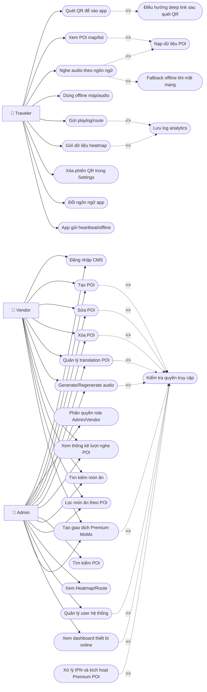

### 11.2 Use Case nhóm CMS (chi tiết theo vai trò)
```mermaid
flowchart TB
    V["👤 Vendor"]
    AD["👤 Admin"]

    C1([Create POI])
    C2([Update POI])
    C3([Delete POI])
    C4([Manage Translation])
    C5([Generate Audio])
    C6([Regenerate Audio])
    C7([Search Food])
    C8([Filter Food by POI])
    C9([View Play Logs])
    C10([View Heatmap/Route])
    C11([Manage Users])
    C12([Create Food])
    C13([Read Food])
    C14([Update Food])
    C15([Delete Food])
    C16([View Online Devices])
    C17([Create Premium Payment (MoMo)])
    C18([Handle MoMo Return/IPN])

    V --> C1
    V --> C2
    V --> C3
    V --> C4
    V --> C5
    V --> C6
    V --> C7
    V --> C8
    V --> C9
    V --> C12
    V --> C13
    V --> C14
    V --> C15
    V --> C17

    AD --> C1
    AD --> C2
    AD --> C3
    AD --> C4
    AD --> C5
    AD --> C6
    AD --> C7
    AD --> C8
    AD --> C9
    AD --> C10
    AD --> C11
    AD --> C12
    AD --> C13
    AD --> C14
    AD --> C15
    AD --> C16
    AD --> C17
    AD --> C18
```

## 12. Sequence diagram
### 12.1 Đăng nhập và phân quyền (Admin)
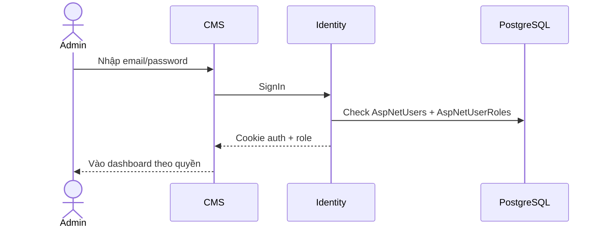

### 12.2 Tạo POI (Admin/Vendor)
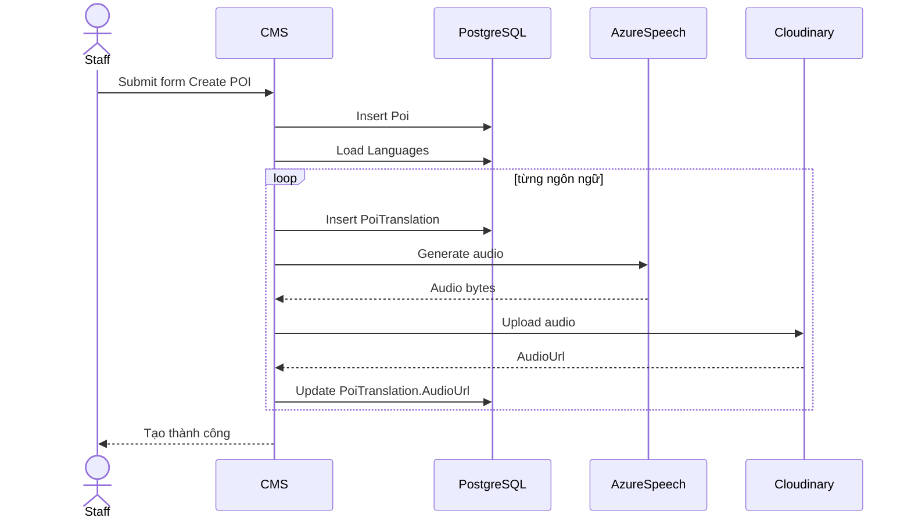

### 12.3 Sửa POI (Admin/Vendor)
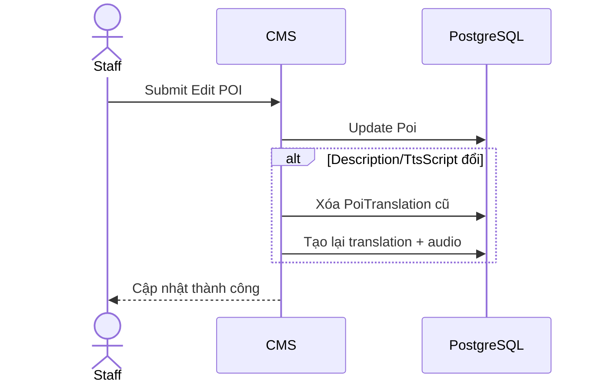

### 12.4 Xóa POI (Admin/Vendor)
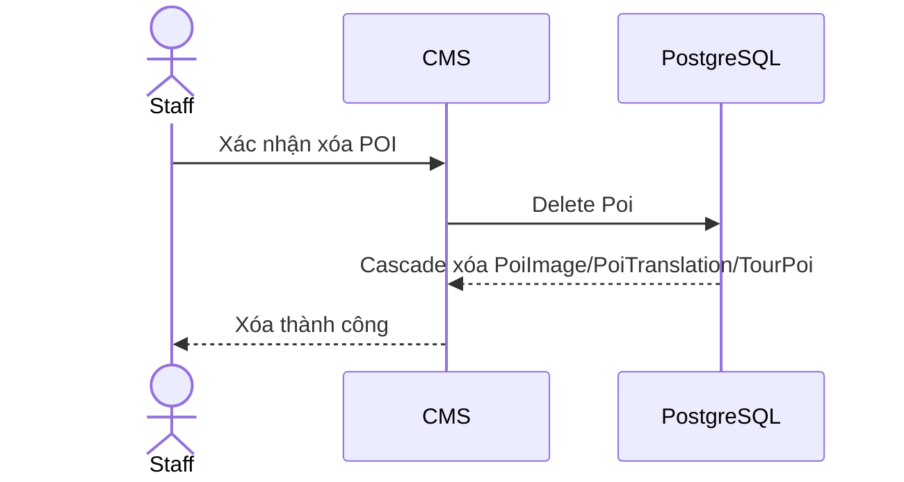

### 12.5 Quản lý translation POI
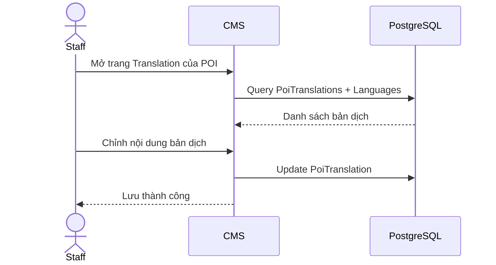

### 12.6 Generate/Regenerate audio
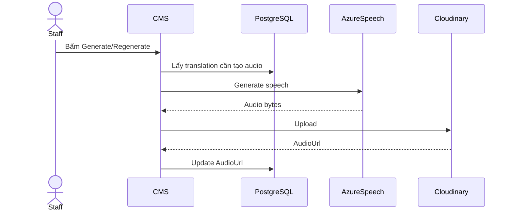

### 12.7 Xem lượt nghe POI (Admin/Vendor)


### 12.8 Tìm kiếm POI (Admin)
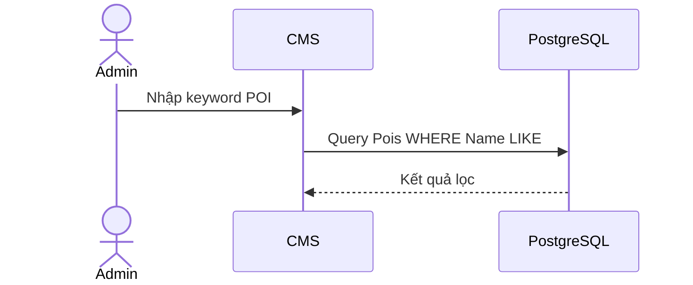

### 12.9 Tìm kiếm thức ăn (Admin/Vendor)
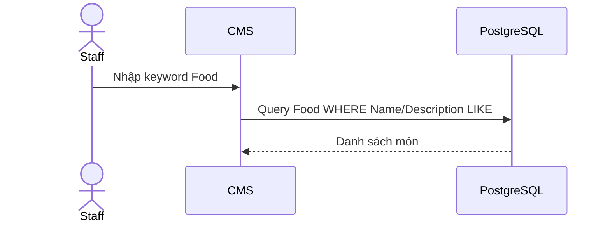

### 12.10 Lọc thức ăn theo POI (Admin/Vendor)
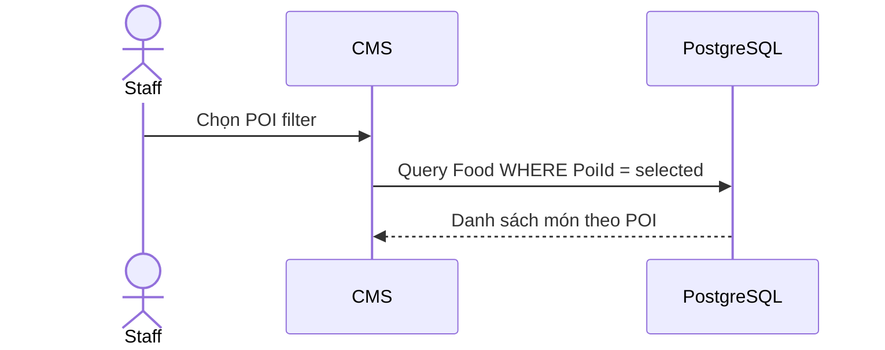

### 12.11 Xem Heatmap và Route (Admin)
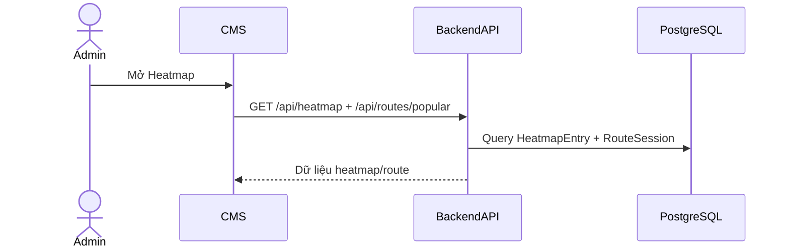

### 12.12 Quản lý user hệ thống (Admin)
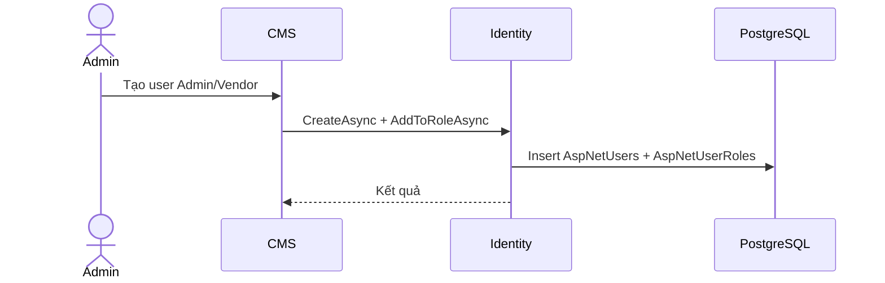

### 12.13 Quét QR để vào app (Traveler)
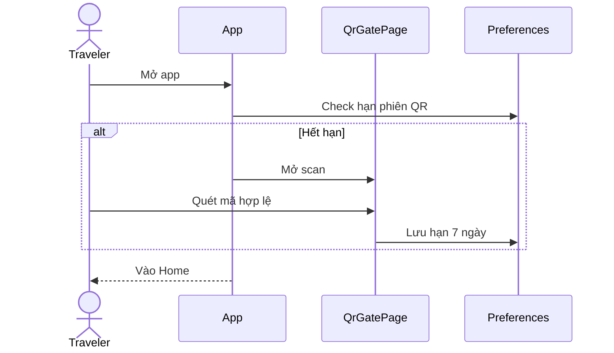

### 12.14 Xem POI trên map/list (Traveler)


### 12.15 Nghe audio theo ngôn ngữ (Traveler)
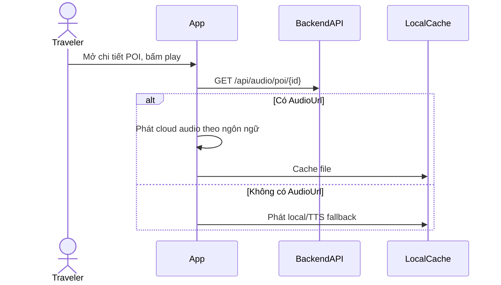

### 12.16 Dùng offline map/audio (Traveler)
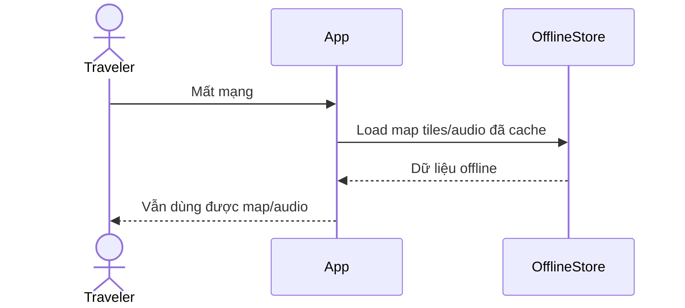

### 12.17 Gửi playlog và route (Traveler)
```mermaid
sequenceDiagram
    actor T as Traveler
    participant APP as App
    participant API as BackendAPI
    participant DB as PostgreSQL
    T->>APP: Nghe audio/di chuyển
    APP->>API: POST /api/pois/playlog
    APP->>API: POST /api/routes/session
    API->>DB: Insert PlayLog/RouteSession
```

### 12.18 Create Food (Admin/Vendor)
```mermaid
sequenceDiagram
    actor U as Staff
    participant CMS as CMS
    participant DB as PostgreSQL
    U->>CMS: Nhập form tạo Food
    CMS->>DB: Insert Food
    CMS->>DB: Insert/Upsert FoodTranslation
    CMS-->>U: Tạo thành công
```

### 12.19 Read Food (Admin/Vendor)
```mermaid
sequenceDiagram
    actor U as Staff
    participant CMS as CMS
    participant DB as PostgreSQL
    U->>CMS: Mở màn hình Food
    CMS->>DB: Query Food + Poi
    DB-->>CMS: Danh sách Food
```

### 12.20 Update Food (Admin/Vendor)
```mermaid
sequenceDiagram
    actor U as Staff
    participant CMS as CMS
    participant DB as PostgreSQL
    U->>CMS: Sửa thông tin Food
    CMS->>DB: Update Food
    CMS->>DB: Upsert FoodTranslation
    CMS-->>U: Cập nhật thành công
```

### 12.21 Delete Food (Admin/Vendor)
```mermaid
sequenceDiagram
    actor U as Staff
    participant CMS as CMS
    participant DB as PostgreSQL
    U->>CMS: Bấm xóa Food
    CMS->>DB: Delete FoodTranslation theo FoodId
    CMS->>DB: Delete Food
    CMS-->>U: Xóa thành công
```

### 12.22 Xóa phiên QR trong Settings (Traveler)
```mermaid
sequenceDiagram
    actor T as Traveler
    participant APP as SettingsPage
    participant PREF as Preferences
    T->>APP: Bấm xóa phiên QR
    APP->>PREF: Clear QrGateUntil
    APP-->>T: Lần mở sau bắt buộc quét lại
```

### 12.23 Đổi ngôn ngữ app (Traveler)
```mermaid
sequenceDiagram
    actor T as Traveler
    participant APP as SettingsPage
    participant PREF as Preferences
    participant REPO as PoiRepository
    T->>APP: Chọn ngôn ngữ mới
    APP->>PREF: Save lang
    APP->>REPO: Clear cache POI
    APP-->>T: Reload UI theo ngôn ngữ mới
```

### 12.24 Theo dõi thiết bị online trên CMS (Admin)
```mermaid
sequenceDiagram
    actor U as Admin
    participant CMS as CMS
    participant API as BackendAPI
    participant DB as PostgreSQL
    U->>CMS: Mở Dashboard
    CMS->>API: GET /api/cms-dashboard/device-status
    API->>DB: Query DevicePresences + tính IsActive theo LastSeenUtc
    API-->>CMS: Online count + danh sách thiết bị
    loop mỗi 3 giây
      CMS->>API: Refresh device-status
      API-->>CMS: Dữ liệu mới
    end
```

### 12.25 App gửi heartbeat/offline (Traveler)
```mermaid
sequenceDiagram
    actor T as Traveler
    participant APP as App
    participant API as BackendAPI
    participant DB as PostgreSQL
    T->>APP: Mở app
    APP->>API: POST /api/presence/heartbeat
    API->>DB: Upsert DevicePresence + LastSeenUtc
    loop mỗi 10 giây
      APP->>API: POST /api/presence/heartbeat
      API->>DB: Update LastSeenUtc
    end
    T->>APP: Tắt app/OnSleep
    APP->>API: POST /api/presence/offline
    API->>DB: Set LastSeenUtc cũ để mark offline
```

### 12.26 Tạo thanh toán Premium MoMo (Admin/Vendor)
```mermaid
sequenceDiagram
    actor U as Staff
    participant CMS as PremiumController
    participant DB as PostgreSQL
    participant MOMO as MoMoGateway
    U->>CMS: Chọn POI + gói, bấm Tạo QR/Link
    CMS->>DB: Insert VendorPremiumOrder (pending)
    CMS->>CMS: Ký chữ ký request MoMo
    CMS->>MOMO: POST /v2/gateway/api/create
    MOMO-->>CMS: resultCode + payUrl
    alt Thành công
      CMS-->>U: Trả trang checkout + QR/link
    else Thất bại
      CMS->>DB: Update VendorPremiumOrder.failed + LastError
      CMS-->>U: Hiển thị lỗi tạo giao dịch
    end
```

### 12.27 Nhận IPN MoMo và kích hoạt Premium POI
```mermaid
sequenceDiagram
    participant MOMO as MoMoGateway
    participant CMS as PremiumController
    participant DB as PostgreSQL
    MOMO->>CMS: POST /payment/momo-ipn
    CMS->>CMS: Verify signature
    alt Chữ ký hợp lệ và resultCode=0
      CMS->>DB: Update VendorPremiumOrder.paid
      CMS->>DB: Update Poi.IsPremium + PremiumExpiresAt
      CMS-->>MOMO: Ack ok
    else Sai chữ ký hoặc fail
      CMS->>DB: Update order failed + LastError
      CMS-->>MOMO: Ack signature invalid/fail
    end
```

## 13. Activity diagram
### 13.1 Đăng nhập và phân quyền (Admin)
```mermaid
flowchart TD
    A[Nhap tai khoan] --> B[Xac thuc Identity]
    B --> C{Dung thong tin}
    C -- Không --> A
    C -- Có --> D[Load role]
    D --> E[Dieu huong dashboard theo role]
```

### 13.2 Tạo POI
```mermaid
flowchart TD
    A[Vào form Create] --> B[Nhập thông tin POI]
    B --> C{Hợp lệ?}
    C -- Không --> B
    C -- Có --> D[Lưu POI]
    D --> E[Sinh translation + audio]
    E --> F[Kết thúc]
```

### 13.3 Sửa POI
```mermaid
flowchart TD
    A[Mở Edit] --> B[Sửa trường dữ liệu]
    B --> C{Dữ liệu hợp lệ?}
    C -- Không --> B
    C -- Có --> D[Update POI]
    D --> E{Mô tả đổi?}
    E -- Có --> F[Tạo lại translation/audio]
    E -- Không --> G[Giữ nguyên translation]
    F --> H[Kết thúc]
    G --> H
```

### 13.4 Xóa POI
```mermaid
flowchart TD
    A[Bấm xóa] --> B[Xác nhận]
    B --> C{Có quyền?}
    C -- Không --> D[Từ chối]
    C -- Có --> E[Delete POI]
    E --> F[Cascade xóa bản ghi liên quan]
    F --> G[Kết thúc]
```

### 13.5 Quản lý Translation
```mermaid
flowchart TD
    A[Mở trang Translation] --> B[Chọn ngôn ngữ]
    B --> C[Sửa Title/Description/TtsScript]
    C --> D[Save]
    D --> E[Kết thúc]
```

### 13.6 Generate/Regenerate audio
```mermaid
flowchart TD
    A[Bấm Generate/Regenerate] --> B[Lấy translation]
    B --> C[Gọi Azure Speech]
    C --> D[Upload Cloudinary]
    D --> E[Update AudioUrl]
    E --> F[Kết thúc]
```

### 13.7 Xem lượt nghe POI
```mermaid
flowchart TD
    A[Mở dashboard] --> B[Gọi API thống kê]
    B --> C[Lọc dữ liệu theo role]
    C --> D[Vẽ chart/table]
    D --> E[Kết thúc]
```

### 13.8 Tìm kiếm POI
```mermaid
flowchart TD
    A[Nhập từ khóa] --> B[Query POI theo tên]
    B --> C[Hiển thị kết quả]
    C --> D[Kết thúc]
```

### 13.9 Tìm kiếm thức ăn
```mermaid
flowchart TD
    A[Nhập từ khóa món ăn] --> B[Query Food Name/Description]
    B --> C[Render danh sách]
    C --> D[Kết thúc]
```

### 13.10 Lọc thức ăn theo POI
```mermaid
flowchart TD
    A[Chọn POI trong filter] --> B[Query Food theo PoiId]
    B --> C[Hiển thị danh sách lọc]
    C --> D[Kết thúc]
```

### 13.11 Xem Heatmap/Route
```mermaid
flowchart TD
    A[Admin mở Heatmap] --> B[Gọi API heatmap/route]
    B --> C[Nhận dữ liệu]
    C --> D[Vẽ map + chỉ số]
    D --> E[Kết thúc]
```

### 13.12 Quản lý user hệ thống
```mermaid
flowchart TD
    A[Admin mở User module] --> B{Tạo/Sửa role?}
    B -- Tạo --> C[Create user + assign role]
    B -- Sửa --> D[Update role/trạng thái]
    C --> E[Kết thúc]
    D --> E
```

### 13.13 Quét QR để vào app
```mermaid
flowchart TD
    A[App start] --> B{Phiên QR còn hạn?}
    B -- Có --> C[Vào Home]
    B -- Không --> D[Mở scanner]
    D --> E{QR hợp lệ?}
    E -- Không --> D
    E -- Có --> F[Lưu hạn 7 ngày]
    F --> C
```

### 13.14 Xem POI trên map/list
```mermaid
flowchart TD
    A[Mở Home/Map] --> B[Tải danh sách POI]
    B --> C[Render marker/list]
    C --> D[Chọn POI]
    D --> E[Kết thúc]
```

### 13.15 Nghe audio theo ngôn ngữ
```mermaid
flowchart TD
    A[Chọn POI] --> B[Lấy tracks theo ngôn ngữ]
    B --> C{Có audio cloud?}
    C -- Có --> D[Play cloud]
    C -- Không --> E[Play local/TTS fallback]
    D --> F[Kết thúc]
    E --> F
```

### 13.16 Dùng offline map/audio
```mermaid
flowchart TD
    A[Mất mạng] --> B[Đọc cache map/audio]
    B --> C[Hoạt động offline]
    C --> D[Kết thúc]
```

### 13.17 Gửi playlog/route
```mermaid
flowchart TD
    A[Nghe audio/di chuyển] --> B[Ghi dữ liệu]
    B --> C{Online?}
    C -- Có --> D[Gửi API ngay]
    C -- Không --> E[Queue pending]
    D --> F[Kết thúc]
    E --> F
```

### 13.18 Create Food
```mermaid
flowchart TD
    A[Mo form Create Food] --> B[Nhap du lieu]
    B --> C{Hop le}
    C -- Khong --> B
    C -- Co --> D[Luu Food + FoodTranslation]
    D --> E[Ket thuc]
```

### 13.19 Read Food
```mermaid
flowchart TD
    A[Mo trang Food] --> B[Query danh sach]
    B --> C[Hien thi bang Food]
    C --> D[Ket thuc]
```

### 13.20 Update Food
```mermaid
flowchart TD
    A[Mo Edit Food] --> B[Sua thong tin]
    B --> C{Hop le}
    C -- Khong --> B
    C -- Co --> D[Update Food + translation]
    D --> E[Ket thuc]
```

### 13.21 Delete Food
```mermaid
flowchart TD
    A[Bam xoa Food] --> B[Xac nhan]
    B --> C[Delete translation]
    C --> D[Delete Food]
    D --> E[Ket thuc]
```

### 13.22 Xóa phiên QR trong Settings
```mermaid
flowchart TD
    A[Vao Settings] --> B[Bam xoa phien QR]
    B --> C[Clear QrGateUntil]
    C --> D[Ket thuc]
```

### 13.23 Đổi ngôn ngữ app
```mermaid
flowchart TD
    A[Vao Settings] --> B[Chon ngon ngu]
    B --> C[Luu setting lang]
    C --> D[Clear cache]
    D --> E[Reload UI]
```

### 13.24 Theo dõi thiết bị online trên Dashboard
```mermaid
flowchart TD
    A[Admin mở Dashboard] --> B[Gọi API device-status]
    B --> C[Tính online theo LastSeenUtc]
    C --> D[Render số online + bảng thiết bị]
    D --> E[Tự refresh định kỳ]
    E --> F[Kết thúc]
```

### 13.25 Heartbeat/offline từ App
```mermaid
flowchart TD
    A[App khởi động] --> B[Gửi heartbeat]
    B --> C[Cập nhật LastSeenUtc]
    C --> D[Lặp heartbeat 10 giây]
    D --> E[App sleep/thoát]
    E --> F[Gửi offline]
    F --> G[Dashboard hiển thị offline]
```

### 13.26 Tạo thanh toán Premium MoMo
```mermaid
flowchart TD
    A[Vào màn Premium] --> B[Chọn POI và gói]
    B --> C[Tạo order pending]
    C --> D[Ký request MoMo]
    D --> E{MoMo trả payUrl?}
    E -- Có --> F[Hiển thị QR/Link]
    E -- Không --> G[Lưu lỗi và báo thất bại]
    F --> H[Kết thúc]
    G --> H
```

### 13.27 Nhận IPN và gia hạn Premium POI
```mermaid
flowchart TD
    A[MoMo gửi IPN] --> B[Verify signature]
    B --> C{Hợp lệ và thành công?}
    C -- Không --> D[Đánh dấu order failed]
    C -- Có --> E[Đánh dấu order paid]
    E --> F[Cập nhật PremiumExpiresAt cho POI]
    D --> G[Kết thúc]
    F --> G
```

## 14. Data Flow Diagram (DFD Level 1)
```mermaid
flowchart LR
    Traveler[Traveler]
    Vendor[Vendor/Admin]

    P1((P1 Xác thực vào app bằng QR))
    P2((P2 Tiêu thụ nội dung POI))
    P3((P3 Ghi nhận analytics))
    P4((P4 Quản trị nội dung CMS))
    P5((P5 Tạo/Sinh lại audio))
    P6((P6 Đồng bộ dữ liệu offline))
    P7((P7 Quản lý Food))

    D1[(D1 Session QR 7 ngày)]
    D2[(D2 Master Data POI/Food/Language)]
    D3[(D3 Audio URLs + Media)]
    D4[(D4 PlayLog/Heatmap/Route)]
    D5[(D5 Local cache map/audio)]
    D6[(D6 Master Data Food)]

    EXT1[(Azure Speech)]
    EXT2[(Cloudinary)]
    EXT3[(PostgreSQL)]

    Traveler --> P1
    Traveler --> P2
    Traveler --> P3
    Traveler --> P6
    Vendor --> P4
    Vendor --> P5
    Vendor --> P7

    P1 <--> D1
    P2 <--> D2
    P2 <--> D3
    P2 <--> D5
    P3 <--> D4
    P4 <--> D2
    P5 <--> D3
    P6 <--> D4
    P6 <--> D5
    P7 <--> D6

    P4 <--> EXT3
    P5 <--> EXT1
    P5 <--> EXT2
    P3 <--> EXT3
    P2 <--> EXT3
    P7 <--> EXT3
```

## 15. UI wireframe (MVP)
### 15.1 App Mobile
- **LoadingPage:** kiểm tra phiên QR và điều hướng đầu vào.
- **QrGatePage:** camera scan QR, thông báo hợp lệ/không hợp lệ.
- **HomePage:** vào nhanh map và cài đặt.
- **MapPage:** bản đồ + marker POI + vị trí hiện tại.
- **PoiListPage:** danh sách POI có lọc/sắp xếp.
- **PoiDetailPage:** nội dung POI, bản dịch, play/pause audio.
- **SettingsPage:** nút xóa phiên QR 7 ngày để test.

### 15.2 CMS Web
- **Login/Role UI:** đăng nhập, phân quyền.
- **POI/Index:** danh sách POI, thao tác sửa/xóa/tạo lại audio.
- **POI/Create/Edit:** thông tin chính, mô tả, tọa độ, ảnh.
- **Food/Index & Food/Create/Edit:** CRUD điểm ăn uống, vị trí, mô tả, ảnh.
- **Translation/Details:** xem bản dịch và nghe audio từng ngôn ngữ.
- **Heatmap/Index:** bản đồ nhiệt và số liệu quan tâm.

## 16. API overview (đã triển khai trong repo)
### 16.1 POI
- `GET /api/pois`
- `GET /api/pois/{poiId}`
- `GET /api/pois/{poiId}/tts-all`
- `POST /api/pois/playlog`
- `GET /api/pois/stats`

### 16.2 Audio
- `GET /api/audio/poi/{poiId}`
- `POST /api/audio/poi/{poiId}/regenerate`
- `POST /api/audio/translation/{translationId}/generate`

### 16.3 Route/Heatmap
- `POST /api/routes/session`
- `GET /api/routes/popular`
- `POST /api/heatmap/entry`
- `GET /api/heatmap`

### 16.4 Food
- `GET /api/foods`
- `GET /api/foods/menu/{poiId}?lang={code}` (app lấy menu theo POI và ngôn ngữ)

### 16.5 Presence
- `POST /api/presence/heartbeat`
- `POST /api/presence/offline`
- `GET /api/cms-dashboard/device-status`

### 16.6 Premium/MoMo
- `GET /Premium`
- `POST /Premium/CreatePayment`
- `GET /payment/return`
- `POST /payment/momo-ipn`

## 17. Bảo mật và phân quyền
- Dùng Identity để xác thực và phân quyền role `Admin`, `Vendor`.
- Không commit key thật (`Cloudinary`, `Azure Speech`, DB).
- Dùng `.env`/biến môi trường theo từng máy.
- Validate dữ liệu đầu vào cho API (QR payload, ids, content).
- Hạn chế truy cập API nhạy cảm bằng role và policy.

## 18. Kế hoạch triển khai (Roadmap) và trạng thái
- **P1 (Hoàn thành):** nền tảng CRUD POI/Food/Translation.
- **P2 (Hoàn thành):** sinh audio tự động + regenerate.
- **P3 (Hoàn thành):** QR gate + deep link POI.
- **P4 (Hoàn thành):** offline map/audio + sync.
- **P5 (Kế tiếp):** tối ưu dashboard analytics và bộ lọc báo cáo.

## 19. Tiêu chí nghiệm thu MVP
Checklist nghiệm thu theo chức năng:
- [ ] Tạo POI sinh đủ translation theo `Languages`.
- [ ] Audio được tạo và lưu `AudioUrl` cho từng translation.
- [ ] `GET /api/pois` trả đủ danh sách POI và dữ liệu liên quan.
- [ ] QR hợp lệ mở app và vào HomePage ổn định.
- [ ] Session QR có hiệu lực 7 ngày, có thể xóa từ Settings.
- [ ] App không ANR khi quét QR.
- [ ] Offline map/audio chạy được khi tắt mạng.
- [ ] Pending queue được sync lại khi có mạng.
- [ ] CRUD Food hoạt động đủ thêm/sửa/xóa trên CMS.
- [ ] Dashboard hiển thị số thiết bị online và đổi trạng thái nhanh khi app tắt/mở.
- [ ] Tạo link/QR MoMo thành công cho POI premium.
- [ ] IPN hợp lệ cập nhật đơn `paid` và gia hạn Premium cho POI.

## 20. Future improvements
- Gợi ý lịch trình cá nhân hóa theo sở thích.
- Tải trước gói dữ liệu thông minh theo khu vực sắp đến.
- Đề xuất ngôn ngữ/voice profile theo người dùng.
- Chấm điểm chất lượng POI dựa trên analytics.

## 21. Danh mục tài liệu và tham chiếu mã nguồn
| Loại | Đường dẫn / ghi chú |
| --- | --- |
| PRD (tài liệu này) | `PRD_SmartTour.md` (root repo) |
| Backend API | `SmartTourBackend/Controllers/*.cs`, `SmartTourBackend/Program.cs`, `SmartTourBackend/Data/AppDbContext.cs` |
| CMS Web | `SmartTourCMS/Controllers/*.cs`, `SmartTourCMS/Views/**`, `SmartTourCMS/Program.cs` |
| App MAUI | `SmartTourApp/Pages/*.xaml*`, `SmartTourApp/Services/*.cs`, `SmartTourApp/MauiProgram.cs` |
| Shared Models | `SmartTour.Shared/SmartTour.Shared/Models/*.cs` |
| Migration / SQL | `SmartTourBackend/Migrations/*.cs` |
| Sơ đồ ERD | Mermaid ERD tại mục `8.3` |
| Use Case / Sequence / Activity | Mermaid tại mục `11`, `12`, `13` |

## 22. Lịch sử phiên bản PRD
| Phiên bản | Ngày | Nội dung cập nhật |
| --- | --- | --- |
| 5.0 | 2026-04-09 | Bản rút gọn để thuyết trình nhanh |
| 6.0 | 2026-04-09 | Chuẩn hóa 22 mục |
| 6.1 | 2026-04-09 | Khôi phục tiếng Việt có dấu + mở rộng đầy đủ mô hình ERD/Use Case/Sequence/Activity/DFD |
| 6.2 | 2026-04-09 | Bổ sung đầy đủ mô hình chức năng Food: CRUD ở Use Case, Sequence, Activity, DFD, UI, API và nghiệm thu |
| 7.0 | 2026-04-16 | Cập nhật lại UML bám sát code hiện tại: Use Case có include/extend + actor icon, tách Sequence/Activity theo từng chức năng, vẽ lại ERD theo bảng đang dùng |
| 7.1 | 2026-04-17 | Bổ sung chức năng mới còn thiếu: Device Presence (online/offline), Premium MoMo (create payment + IPN), cập nhật Use Case + Sequence + Activity + API + Checklist nghiệm thu |
